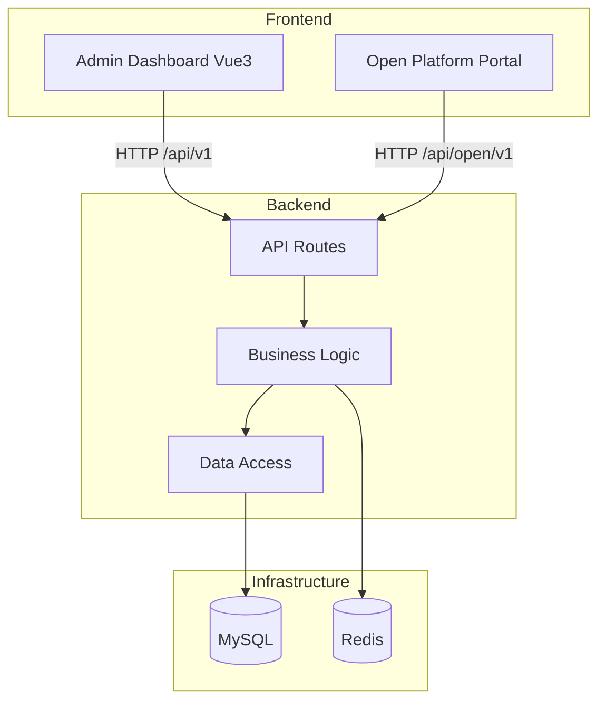
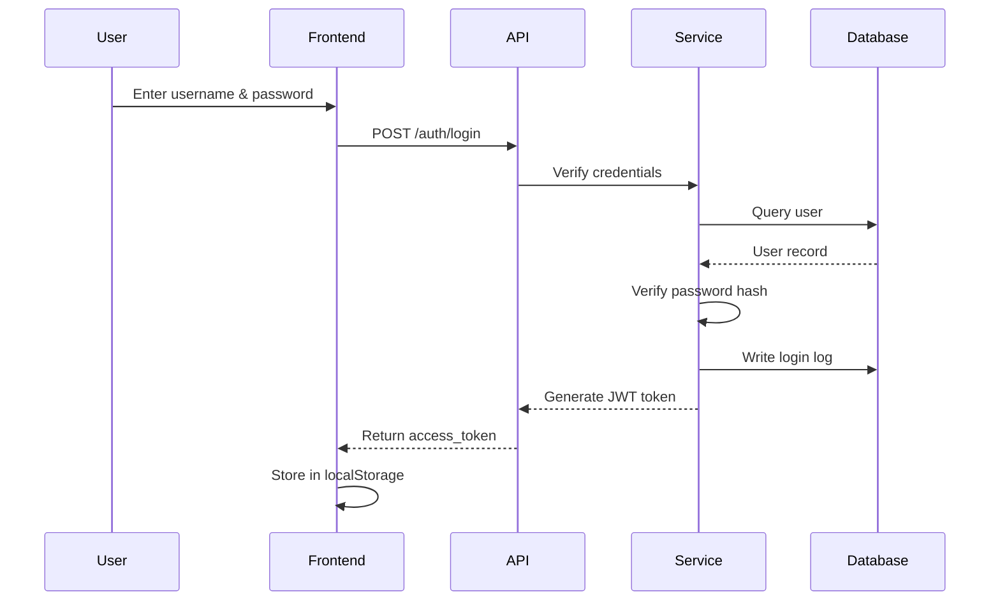

[中文](README.md) | English

# HanJiang — Full-Stack Rapid Development Platform

## Project Introduction

HanJiang is a full-stack rapid development platform built on FastAPI + Vue 3 + TypeScript, deeply packaging the common capabilities of enterprise-grade web applications so developers can focus on business logic.

**Key Features:**
- Frontend-backend separation: FastAPI + Vue 3 + Element Plus, full-stack TypeScript
- Built-in JWT auth + RBAC + audit logging + login logs, out-of-the-box
- Auto-register permissions via `@permission` decorator, synced to DB on startup
- Open platform HanJiang-1 HMAC signature, supporting plain and signed modes
- Layered architecture: API routes → Business logic → Data access
- Production-grade security (constant-time comparison, replay protection, password hashing)
- Built-in dashboard (user/role/app stats + login trend + audit trend + ECharts)
- Great developer experience (Swagger docs, Alembic migrations, unified error handling)

**Use Cases:**
- Enterprise internal admin systems
- SaaS product backend foundation
- Open platform / API service gateway
- Full-stack project boilerplate

## Quick Start

### Backend

```bash
cd server
uv run x-HanJiang
```

See [server/README.md](server/README.md) for details.

### Frontend

```bash
cd web/admin
npm install
npm run dev
```

Open http://localhost:5173. See [web/admin/README.md](web/admin/README.md) for details.

## Project Structure

```
x-HanJiang/
├── server/                  # Backend (FastAPI)
│   ├── src/
│   │   ├── api/              # Routes (v1 user + open/v1 open platform)
│   │   ├── constants/        # Constants & enums (ModuleCode, BaseEnum)
│   │   ├── core/             # Core (config/middleware/exceptions/security)
│   │   ├── infras/           # Infrastructure (database)
│   │   ├── models/           # SQLAlchemy data models
│   │   ├── repositories/     # Data access layer
│   │   ├── schemas/          # Pydantic schemas
│   │   ├── services/         # Business logic layer
│   │   ├── utils/             # Utilities
│   │   └── main.py           # Application entry
│   ├── alembic/              # Database migrations
│   ├── config/               # Configuration
│   ├── logs/                 # Log output
│   └── pyproject.toml
├── web/                      # Frontend
│   ├── admin/                # Admin dashboard (Vue3 + TS + Element Plus + ECharts)
│   └── open/                 # Open platform portal (TBD)
├── docker-compose.yml         # Docker orchestration
├── CHANGELOG.md              # Changelog
└── README.md
```

## System Architecture

### Layered Architecture



### Core Flow: User Login



### Permission Auto-Registration

```mermaid
flowchart LR
    A[@permission Decorator on Routes] --> B[collect_permissions_from_app on Startup]
    B --> C[Scan app.routes for Permission Metadata]
    C --> D[Upsert to permissions Table]
    D --> E[In DB but not in Routes → is_deprecated=True]
```

## Tech Stack

| Category | Technology |
|---|---|
| **Backend Language** | Python 3.11+ |
| **Backend Framework** | FastAPI |
| **ORM** | SQLAlchemy 2.0 |
| **Migration** | Alembic |
| **Frontend Framework** | Vue 3 + TypeScript |
| **Build Tool** | Vite 6 |
| **UI Library** | Element Plus |
| **State Management** | Pinia |
| **Charts** | ECharts + vue-echarts |
| **Database** | MySQL |
| **Cache** | Redis |
| **Logging** | Loguru |
| **Auth** | JWT + HMAC Signature |
| **Deployment** | Docker / docker-compose |

## API Documentation

Once the backend is running:

- **Swagger UI**: http://localhost:8000/docs
- **ReDoc**: http://localhost:8000/redoc
- **OpenAPI JSON**: http://localhost:8000/openapi.json

### Core Endpoints

| Module | Endpoint | Description |
|---|---|---|
| Auth | `POST /api/v1/auth/login` | User login |
| Auth | `GET /api/v1/auth/me` | Current user info |
| Users | `GET /api/v1/users` | User list (multi-role) |
| Users | `POST /api/v1/users` | Create user |
| Users | `POST /api/v1/users/{id}/update` | Update user |
| Roles | `GET /api/v1/roles` | Role list |
| Roles | `GET /api/v1/roles/{id}/permissions` | Role permissions |
| Roles | `POST /api/v1/roles/{id}/permissions` | Bind permission |
| Permissions | `GET /api/v1/permissions` | Permission list |
| Audit Logs | `GET /api/v1/audit/logs` | Business audit log list |
| Login Logs | `GET /api/v1/audit/login-logs` | Login log list |
| Dashboard | `GET /api/v1/dashboard/stats` | Dashboard stats |
| Open API | `GET /api/open/v1/users` | Open platform user query |
| Open API | `GET /api/open/v1/apps/me` | Current app info |

### Authorization

- **User endpoints**: JWT Bearer Token + `@permission` decorator auto-registration + role/permission check
- **Open platform endpoints**: AppId + AppKey (plain) or HanJiang-1 HMAC signature

## Storage

### Database

- **Type**: MySQL 8.0+
- **Config**: via `.env` (`MYSQL_HOST`, `MYSQL_PORT`, `MYSQL_DATABASE`, etc.)
- **Migrations**: Alembic

### Cache

- **Type**: Redis
- **Usage**: rate limiting, session cache
- **Config**: via `.env` (`REDIS_HOST`, `REDIS_PORT`)

### File Storage

Two modes, switch via `STORAGE_PROVIDER` in `.env`:

| Mode | Config | Use Case |
|---|---|---|
| `local` | `STORAGE_LOCAL_BASE_DIR=static` | Local dev, small deployments |
| `s3` | `STORAGE_S3_ENDPOINT_URL` etc. | Production, object storage (Qiniu/AWS S3/MinIO) |

## License

This project is licensed under the [MIT License](LICENSE).

## References

- [FastAPI Docs](https://fastapi.tiangolo.com/)
- [SQLAlchemy Docs](https://docs.sqlalchemy.org/)
- [Vue 3 Docs](https://vuejs.org/)
- [Vite Docs](https://vitejs.dev/)
- [Element Plus Docs](https://element-plus.org/)
- [ECharts Docs](https://echarts.apache.org/)
- [Loguru Docs](https://loguru.readthedocs.io/)
- [Docker Docs](https://docs.docker.com/)

## Contact

- **Author**: John Young (夜雨诗来)
- **Email**: john.young@foxmail.com
- **Gitee**: https://gitee.com/cross-lang/x-HanJiang
- **GitHub**: https://github.com/cross-lang/x-HanJiang
- **Project**: https://github.com/cross-lang/x-HanJiang
