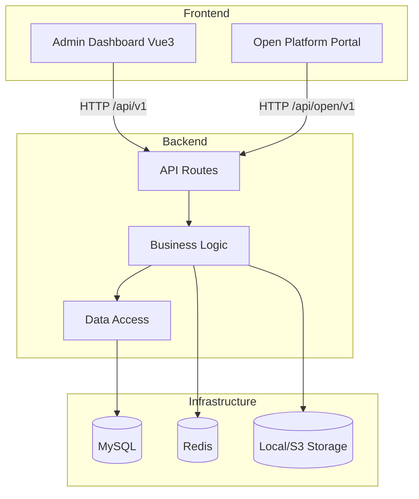
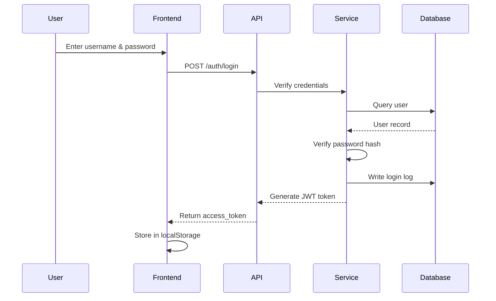
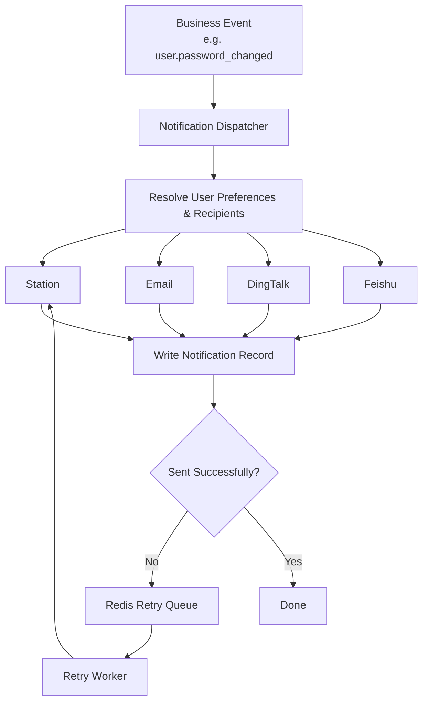
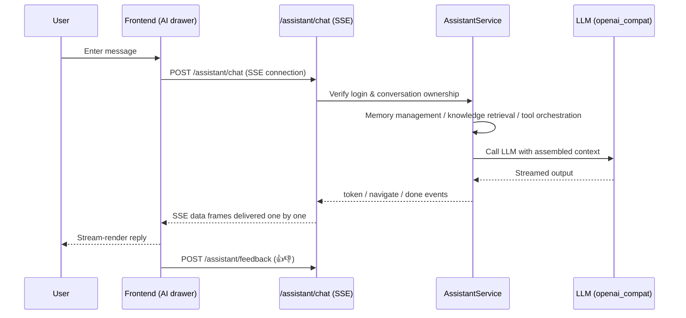

[中文](README.md) | English

# HanJiang — Full-Stack Rapid Development Platform

## Project Introduction

HanJiang is a full-stack rapid development platform built on FastAPI + Vue 3 + TypeScript, deeply packaging the common capabilities of enterprise-grade web applications so developers can focus on business logic.

**Key Features:**

- Frontend-backend separation: FastAPI + Vue 3 + Element Plus, full-stack TypeScript
- Built-in JWT auth + RBAC + audit logging + login logs, out-of-the-box
- Auto-register permissions via `@permission` decorator, synced to DB on startup
- Open platform HanJiang-1 HMAC signature, supporting plain and signed modes, with built-in app management (AppId/AppKey lifecycle, scope authorization, key rotation)
- Event-driven multi-channel notification system (station / email / DingTalk / Feishu / SMS) with per-user preferences and automatic retry
- System notice broadcast: publish normal / maintenance notices to all users, station message broadcast + multi-channel push per user configs
- Layered architecture: API routes → Business logic → Data access
- Production-grade security (constant-time comparison, replay protection, password hashing, email verification code for sensitive operations)
- Built-in dashboard (user/role/app stats + login trend + audit trend + ECharts)
- File management (local / S3-compatible storage), global search, profile center, system alerts, announcement management (homepage board / banner)
- AI assistant: SSE streaming chat (token / navigate / done events), conversation management, memory compaction, knowledge retrieval and tool orchestration; openai_compat protocol works with DeepSeek / Volcano Ark / Qwen / vLLM and more
- Great developer experience (Swagger docs, Alembic migrations, unified error handling, GitHub Actions CI)

**Use Cases:**

- Enterprise internal admin systems
- SaaS product backend foundation
- Open platform / API gateway
- Full-stack project boilerplate

## Quick Start

### Backend

```bash
cd server
uv run x-HanJiang
```

See [server/README.md](server/README.md) for details.

### Frontend

```bash
cd web/admin
npm install
npm run dev
```

Open http://localhost:5173. See [web/admin/README.md](web/admin/README.md) for details.

## Project Structure

```
x-HanJiang/
├── server/                  # Backend (FastAPI)
│   ├── src/
│   │   ├── api/              # Routes (v1 user + open/v1 open platform)
│   │   ├── assistant/        # AI assistant (chat orchestration/memory/retrieval/tools)
│   │   ├── constants/        # Constants & enums (ModuleCode, BaseEnum)
│   │   ├── core/             # Core (config/middleware/exceptions/security)
│   │   ├── infras/           # Infrastructure (database/cache/storage/notification channels/LLM)
│   │   ├── models/           # SQLAlchemy data models (models/entities)
│   │   ├── notification/     # Notification subsystem (dispatcher/templates/retry)
│   │   ├── repositories/     # Data access layer
│   │   ├── scheduling/       # Scheduled tasks (notification retry worker)
│   │   ├── schemas/          # Pydantic schemas
│   │   ├── services/         # Business logic layer
│   │   ├── utils/            # Utilities
│   │   └── main.py           # Application entry
│   ├── alembic/              # Database migrations
│   ├── config/               # Configuration
│   ├── docs/                 # Project docs (DDL SQL, Postman collection)
│   ├── examples/             # Usage examples
│   ├── logs/                 # Log output
│   ├── scripts/              # Engineering scripts
│   ├── static/               # Local file storage directory
│   ├── tests/                # Unit tests
│   └── pyproject.toml
├── web/                      # Frontend
│   ├── admin/                # Admin dashboard (Vue3 + TS + Element Plus + ECharts)
│   └── open/                 # Open platform portal (TBD)
├── docker-compose.yml        # Docker orchestration
└── README.md
```

## System Architecture

### Layered Architecture


```mermaid
graph TB
    subgraph Frontend
        A[Admin Dashboard Vue3]
        B[Open Platform Portal]
    end

    subgraph Backend
        C[API Routes]
        D[Business Logic]
        E[Data Access]
    end

    subgraph Infrastructure
        F[(MySQL)]
        G[(Redis)]
        H[(Local/S3 Storage)]
    end

    A -->|HTTP /api/v1| C
    B -->|HTTP /api/open/v1| C
    C --> D
    D --> E
    E --> F
    D --> G
    D --> H
```

### Core Flow: User Login


```mermaid
sequenceDiagram
    participant U as User
    participant F as Frontend
    participant A as API
    participant S as Service
    participant DB as Database

    U->>F: Enter username & password
    F->>A: POST /auth/login
    A->>S: Verify credentials
    S->>DB: Query user
    DB-->>S: User record
    S->>S: Verify password hash
    S->>DB: Write login log
    S-->>A: Generate JWT token
    A-->>F: Return access_token
    F->>F: Store in localStorage
```

### Permission Auto-Registration

```mermaid
flowchart LR
    A[@permission Decorator on Routes] --> B[collect_permissions_from_app on Startup]
    B --> C[Scan app.routes for Permission Metadata]
    C --> D[Upsert to permissions Table]
    D --> E[In DB but not in Routes → is_deprecated=True]
```

### Notification Dispatch Flow


```mermaid
flowchart TD
    A[Business Event<br/>e.g. user.password_changed] --> B[Notification Dispatcher]
    B --> C[Resolve User Preferences & Recipients]
    C --> D[Station]
    C --> E[Email]
    C --> F[DingTalk]
    C --> G[Feishu]
    D --> H[Write Notification Record]
    E --> H
    F --> H
    G --> H
    H --> I{Sent Successfully?}
    I -->|No| J[Redis Retry Queue]
    J --> K[Retry Worker]
    K --> D
    I -->|Yes| L[Done]
```

### AI Assistant Conversation Flow


```mermaid
sequenceDiagram
    participant U as User
    participant F as Frontend (AI drawer)
    participant A as /assistant/chat (SSE)
    participant S as AssistantService
    participant L as LLM (openai_compat)

    U->>F: Enter message
    F->>A: POST /assistant/chat (SSE connection)
    A->>S: Verify login & conversation ownership
    S->>S: Memory management / knowledge retrieval / tool orchestration
    S->>L: Call LLM with assembled context
    L-->>S: Streamed output
    S-->>A: token / navigate / done events
    A-->>F: SSE data frames delivered one by one
    F-->>U: Stream-render reply
    F->>A: POST /assistant/feedback (👍👎)
```

## Tech Stack

| Category | Technology |
|---|---|
| **Backend Language** | Python 3.11+ |
| **Backend Framework** | FastAPI |
| **ORM** | SQLAlchemy 2.0 |
| **Migration** | Alembic |
| **Frontend Framework** | Vue 3 + TypeScript |
| **Build Tool** | Vite 6 |
| **UI Library** | Element Plus |
| **State Management** | Pinia |
| **Charts** | ECharts 6 + vue-echarts |
| **Database** | MySQL |
| **Cache** | Redis |
| **Logging** | Loguru |
| **Auth** | JWT + HMAC Signature |
| **AI Integration** | OpenAI SDK (openai_compat protocol; DeepSeek / Volcano Ark / Qwen / vLLM etc.) |
| **Package Manager** | uv |
| **Deployment** | Docker / docker-compose |

## API Documentation

Once the backend is running:

- **Swagger UI**: http://localhost:8000/docs
- **ReDoc**: http://localhost:8000/redoc
- **OpenAPI JSON**: http://localhost:8000/openapi.json

## License

This project is licensed under the [MIT License](LICENSE).

## Contact

- **Author**: John Young (夜雨诗来)
- **Email**: john.young@foxmail.com
- **Gitee**: https://gitee.com/cross-lang/x-HanJiang
- **GitHub**: https://github.com/cross-lang/x-HanJiang
- **Project**: https://github.com/cross-lang/x-HanJiang
