<div align="center">


# HanJiang — Full-Stack Rapid Development Platform

An **out-of-the-box** enterprise full-stack platform built on **FastAPI + Vue 3**, so you can spin up an enterprise-grade admin system in five minutes.

**One codebase covering three scenarios: Admin Console / Open API / Developer Portal.**

[中文](README.md) | English


</div>

## 💡 Introduction

HanJiang is an out-of-the-box enterprise full-stack rapid development platform: a deeply-encapsulated FastAPI backend (three-layer architecture + dependency injection), two Vue 3 frontends, and one-command Docker Compose deployment (unified nginx entry). It covers three scenarios in one codebase: internal administration, public API exposure, and a developer portal.

| You need                       | HanJiang | Bare FastAPI DIY | Generic template |
| ------------------------------ | -------- | ---------------- | ---------------- |
| Ready-made admin system        | ✅        | ⚠️ Build it      | ❌ UI only        |
| High-performance async backend | ✅        | ✅ DIY            | ❌ No backend     |
| RBAC menu/button permissions   | ✅        | ⚠️ Build it      | ❌                |
| AI assistant (SSE / tools)     | ✅        | ❌                | ❌                |
| Open platform HMAC auth        | ✅        | ❌                | ❌                |
| Multi-channel notifications    | ✅        | ❌                | ❌                |
| Audit logs + login logs        | ✅        | ❌                | ❌                |
| One-command Docker deployment  | ✅        | ⚠️               | ⚠️               |

### ✨ Core Capabilities

- **Admin Console (web/admin + `/api/admin/v1`)**: JWT auth + RBAC model with declarative `@permission` decorators auto-synced to the database at startup; users / roles / permissions, audit & login logs, files, announcements, system notifications, global search, dashboard, AI assistant, and more
- **Open API (`/api/open/v1`)**: gateway APIs for external applications with HanJiang-1 HMAC signature auth (plain / signed modes), AppId/AppKey lifecycle, scope grants and key rotation, approval workflow, and replay protection
- **Developer Portal (web/open_portal + `/api/open-portal/v1`)**: a standalone portal for developers with registration / login (stateful sessions), application application & approval tracking, scope requests, capability docs (18 APIs with request / response / signature examples), inbox messages, and profile center
- **AI Assistant**: SSE streaming chat (token / navigate / done events), conversation management, a four-layer memory system (system prompt / long-term memory / rolling summary / recent messages), built-in navigation and read-only query tools; `openai_compat` protocol works with DeepSeek / Volcengine Ark / Qwen / vLLM, etc.
- **Notification System**: event-driven multi-channel delivery (inbox / email / DingTalk / Feishu) with template interpolation, per-user preferences, and automatic retries
- **Observability**: business audit logs, login logs, operation trends, system alerts
- **Engineering**: layered architecture (API → Service → Repository), unified exception handling, Swagger docs, Alembic migrations, GitHub Actions CI

## 📸 Screenshots

### Admin Console

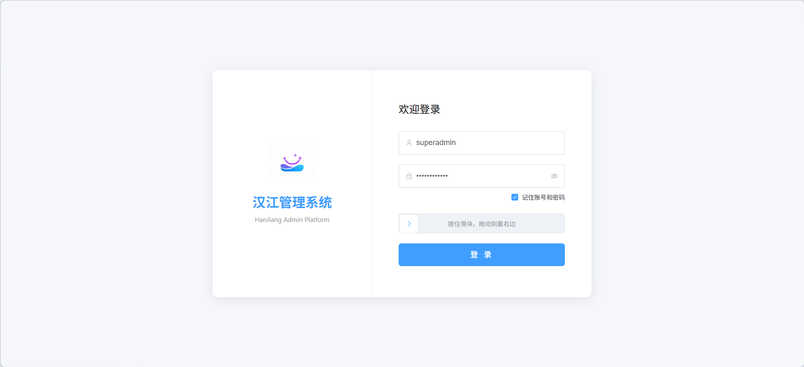

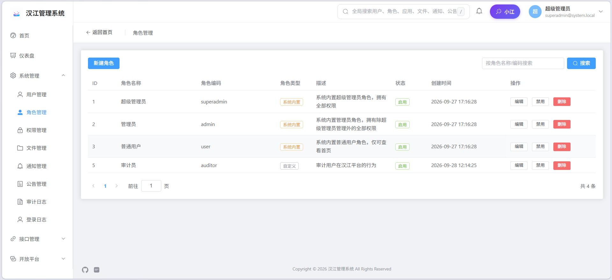
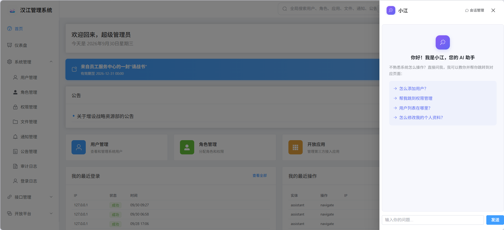
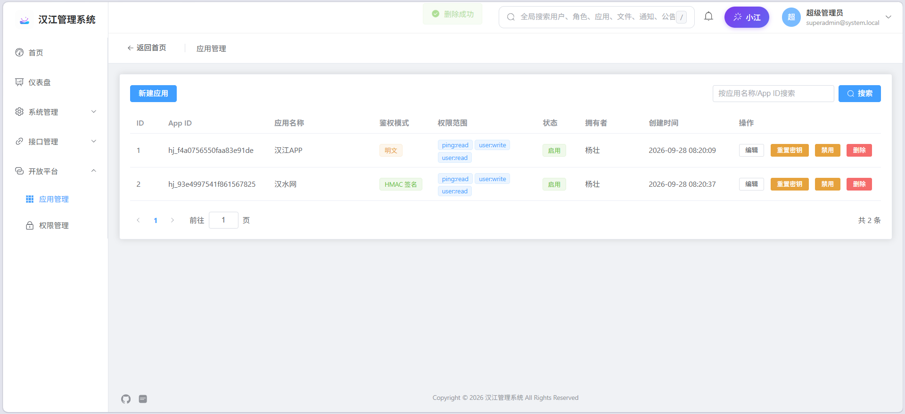

### Developer Portal

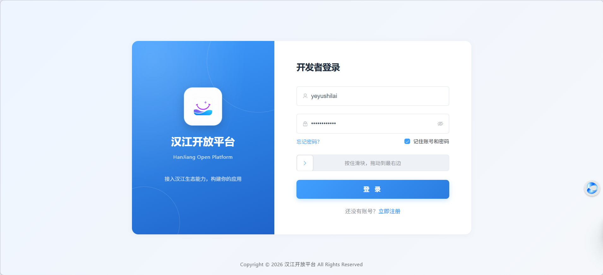
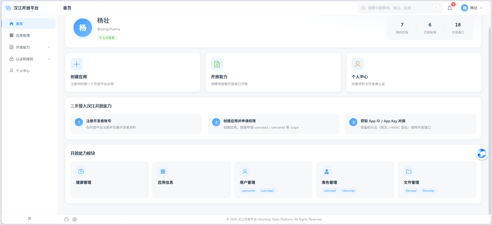
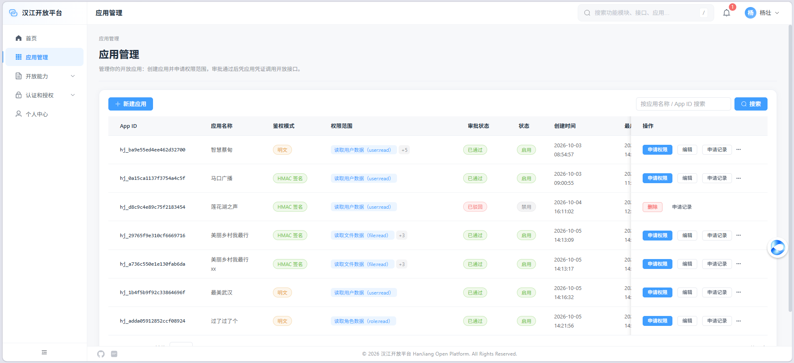
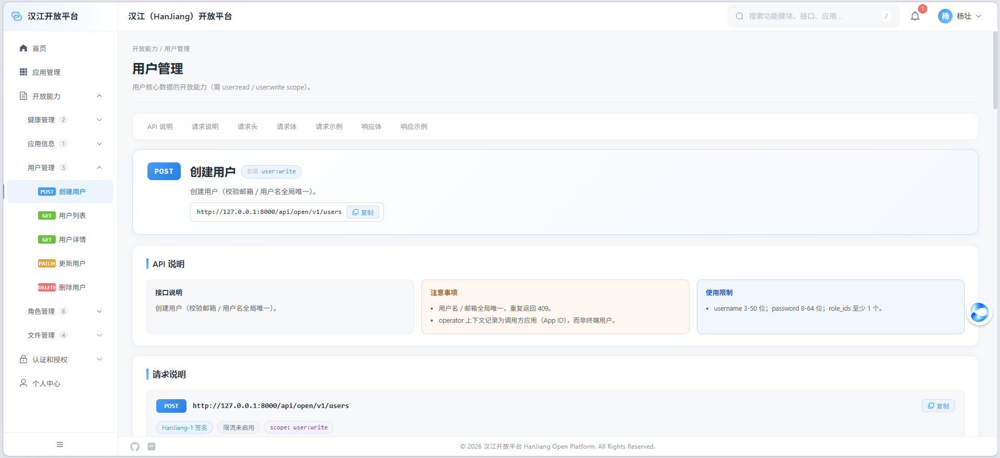
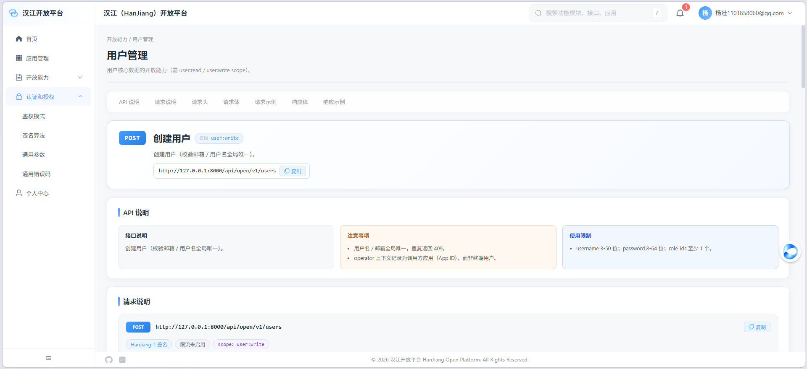
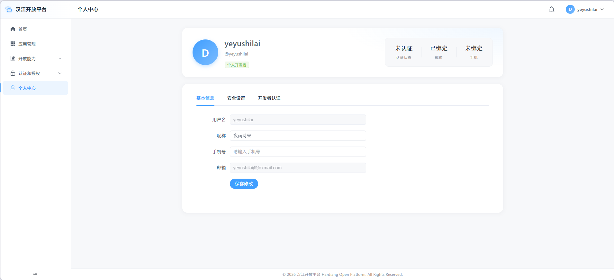

## 🍪 Online Demo

| Frontend | URL | Account |
|----|------|------|
| 🌐 Developer Portal | `http://121.40.147.234/open-portal/` | `yeyushilai` / `admin@123456` |
| 💻 Admin Console | `http://121.40.147.234/admin/` | `superadmin` / `admin@123456` |

## 🚀 Quick Start

### 🖥️ Backend

```bash
cd server
uv run x-HanJiang --reload
```

See [server/README.md](server/README.md) for configuration.

### 🌐 Admin Console Frontend (web/admin)

```bash
cd web/admin
npm install
npm run dev
```

Open <http://localhost:5173>. See [web/admin/README.md](web/admin/README.md).

### 🌐 Open Portal Frontend (web/open_portal)

```bash
cd web/open_portal
npm install
npm run dev
```

Open <http://localhost:5174>. See [web/open_portal/README.md](web/open_portal/README.md).

## 📁 Project Structure

```
x-HanJiang/
├── server/                     # Backend (FastAPI, three API suites)
│   ├── src/
│   │   ├── api/                # API routing layer
│   │   │   ├── admin/          #   Admin APIs (/api/admin/v1, JWT + RBAC)
│   │   │   ├── open/           #   Open APIs (/api/open/v1, AppId/AppKey + HMAC + scope)
│   │   │   └── open_portal/    #   Portal APIs (/api/open-portal/v1, developer session JWT)
│   │   ├── assistant/          # AI assistant (agent loop / memories/ / tools/ / protocol defense)
│   │   ├── core/               # Core support (config / middleware / exceptions / security / seed)
│   │   ├── infras/             # Infrastructure (database / cache / storage / notification / LLM)
│   │   ├── models/             # SQLAlchemy ORM entities
│   │   ├── notification/       # Notification subsystem (dispatcher / templates / retry)
│   │   ├── repositories/       # Data access layer
│   │   ├── schemas/            # Pydantic request/response DTOs
│   │   ├── services/           # Business logic layer
│   │   ├── templates/          # Prompt templates (AI assistant)
│   │   └── main.py             # Application entrypoint
│   ├── alembic/                # Database migrations (0001~0033)
│   ├── tests/                  # Unit tests (mirrors src/ layout)
│   └── pyproject.toml          # Dependency declaration (uv lock file)
├── web/
│   ├── Dockerfile              # Frontend multi-stage build (npm build → Nginx hosting)
│   ├── nginx.conf              # Production unified entry (/ admin, /portal/ portal, /api/ proxy)
│   ├── admin/                  # Admin frontend (Vue3 + TS + Element Plus, dev port 5173)
│   └── open_portal/            # Developer portal frontend (Vue3 + TS + Element Plus, dev port 5174)
├── docs/                       # Deployment guides (Alibaba Cloud ECS / Lightweight Server, bilingual)
├── me/                         # Brand assets and screenshots
├── docker-compose.yml          # Single-host orchestration: nginx (port 80) + app + mysql + redis
└── LICENSE                     # MIT license
```

## 🏗️ System Architecture

### 🏗️ Layered Architecture

```mermaid
flowchart TB
  U[Browser / External Apps] -->|HTTP :80| NG[Unified nginx entry<br/>/ admin · /portal/ portal · /api/ reverse proxy]

  subgraph Backend[FastAPI backend (app container)]
    NG -->|"/api/admin/v1"| A1["Admin APIs<br/>JWT + RBAC"]
    NG -->|"/api/open/v1"| A2["Open API gateway<br/>AppId/AppKey + HMAC + scope"]
    NG -->|"/api/open-portal/v1"| A3["Portal APIs<br/>developer session JWT"]
    A1 --> SVC[Service layer<br/>users · roles · audit · notifications · announcements · files · AI]
    A2 --> SVC
    A3 --> SVC
    SVC --> REPO[Data access layer<br/>Repository pattern]
  end

  REPO --> DB[(MySQL)]
  SVC --> RD[(Redis<br/>sessions · rate limit · retry queue)]
  SVC --> ST[Object storage<br/>local / S3-compatible]
  SVC --> LLM[LLM API<br/>openai_compat]
```

### 🔄 Journey of a Request (single-host Docker)

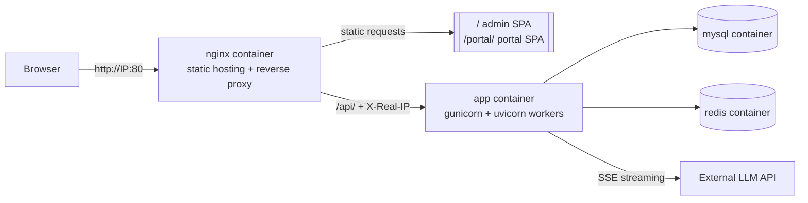
```mermaid
flowchart LR
  C[Browser] -->|"http://IP:80"| N[nginx container<br/>static hosting + reverse proxy]
  N -->|"static requests"| DISK[["/ admin SPA<br/>/portal/ portal SPA"]]
  N -->|"/api/ + X-Real-IP"| A[app container<br/>gunicorn + uvicorn workers]
  A --> M[(mysql container)]
  A --> R[(redis container)]
  A -->|"SSE streaming"| LLM[External LLM API]
```

### 🧩 Key Components

| Component | Location | Responsibility |
|------|------|------|
| Admin frontend | `web/admin` | Enterprise admin UI (17 route pages: users / roles / permissions / audit / notifications / announcements / AI assistant, etc.) |
| Portal frontend | `web/open_portal` | Developer self-service portal (register / apps / capability docs / inbox) |
| Backend | `server` | Three API suites + business orchestration; see [server/README.en.md](server/README.en.md) |
| Unified entry | `web/nginx.conf` | Production static hosting + `/api/` proxy + SSE passthrough + X-Real-IP injection |
| Orchestration | `docker-compose.yml` | Single-host nginx / app / mysql / redis with health checks and data volumes |

## 🛠️ Tech Stack

| Category | Technologies |
| -- | ---------------------------------------------------------- |
| Backend | Python 3.11+ / FastAPI / SQLAlchemy 2.0 / Alembic |
| Frontend | Vue 3 + TypeScript / Vite / Element Plus / Pinia / ECharts |
| Storage | MySQL / Redis |
| Auth | JWT (user / developer) + HMAC signatures (Open API) |
| AI | OpenAI SDK (openai\_compat protocol) |
| Engineering | uv / Ruff / mypy / pytest / ESLint / Prettier / Loguru |
| Deployment | Docker / docker-compose / Nginx |

## 🔌 API Documentation

Once the backend is running (replace `localhost:8000` with your deployment address for Docker; nginx already proxies `/docs`):

- **Swagger UI**: <http://localhost:8000/docs>
- **ReDoc**: <http://localhost:8000/redoc>
- **OpenAPI JSON**: <http://localhost:8000/openapi.json>

For the three API suites and the full endpoint catalog (100+ endpoints), see [server/README.en.md](server/README.en.md#-api-documentation).

##  License

This project is licensed under the [MIT License](LICENSE).

## 📚 References

| Technology | Documentation |
|------|----------|
| FastAPI | https://fastapi.tiangolo.com/ |
| Vue 3 | https://vuejs.org/ |
| Element Plus | https://element-plus.org/ |
| SQLAlchemy | https://docs.sqlalchemy.org/ |
| uv | https://docs.astral.sh/uv/ |
| Vite | https://vite.dev/ |
| Docker | https://docs.docker.com/ |

## 📮 Contact

- **Author**: John Young (夜雨诗来)
- **Email**: <john.young@foxmail.com>
- **Gitee**: <https://gitee.com/yeyushilai>
- **GitHub**: <https://github.com/yeyushilai>
- **Project**: <https://github.com/cross-lang/x-HanJiang>
