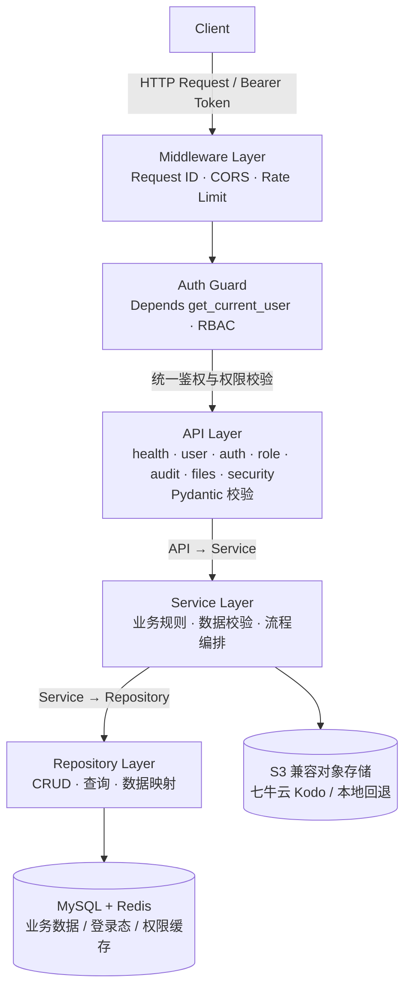
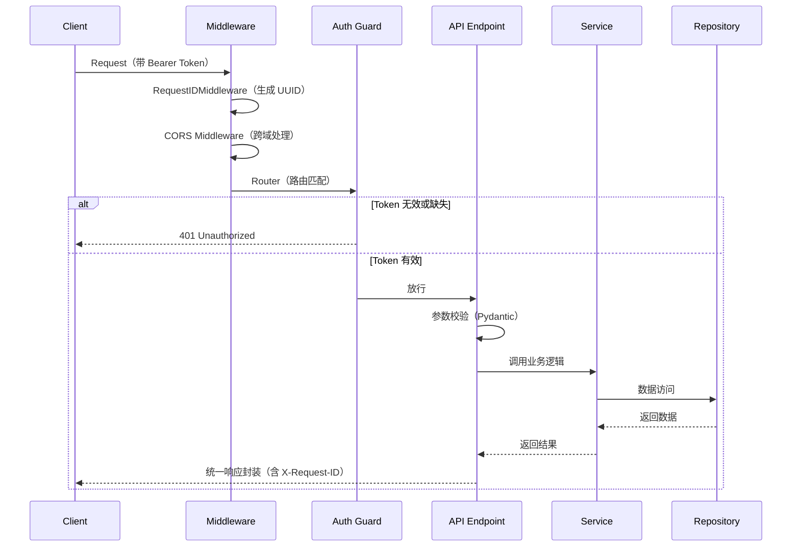

# 寒江（HanJiang）

**一个基于 FastAPI 框架深度封装的生产级 Python Web 项目**

[English](README.en.md) | 中文

---

## 项目简介

寒江（HanJiang）是一个基于 FastAPI 框架深度封装的生产级 Python Web 项目，遵循行业最佳工程实践，提供标准化、模块化、高可扩展、高可维护的后端服务基础架构。开箱即用，支持快速搭建企业级 RESTful API 服务，适配多环境部署。

当前项目已实现用户管理、角色管理、权限管理、登录认证、登录日志、业务审计和对象存储上传等核心业务能力。

## 核心特征

- **标准三层架构** — API 接口层 → 业务逻辑层（Service）→ 数据访问层（Repository），层间依赖严格单向
- **依赖注入容器** — DI 能力，支持自动装配、单例/多例模式、装饰器注册
- **双配置体系** — 支持 `.env` 环境变量 + `config.yaml` 配置文件双来源，多环境自动切换
- **统一响应格式** — 所有接口返回 `{ code, message, data, timestamp, request_id }` 标准结构
- **全局异常处理** — 自定义异常层级（业务异常 4xx / 系统异常 5xx），全局异常中间件
- **统一鉴权** — 所有业务接口（除登录、刷新、健康检查外）均需 `Authorization: Bearer <token>`，缺失或无效令牌返回 401
- **接口级 RBAC** — 提供 `require_role` / `require_permission` 守卫，权限查询结果支持 Redis 缓存
- **结构化日志** — 基于 loguru，支持请求 ID 追踪、文件+控制台双输出、日志轮转
- **业务审计** — 用户、角色、权限等写操作记录操作者、时间、IP 和变更前后数据
- **文件存储** — 支持七牛云 Kodo 等 S3 兼容对象存储，未配置时回退本地存储
- **账号安全** — 提供 MFA/TOTP 基础能力
- **种子数据自动初始化** — 应用启动时自动检测并创建内置超级管理员角色与 `superadmin` 用户，幂等
- **Docker 部署** — 提供标准 Dockerfile 和 docker-compose.yml，支持 Gunicorn + Uvicorn 高性能部署
- **数据库支持** — 集成 SQLAlchemy ORM，支持 MySQL 数据库，开箱即用

## 项目结构

```
x-HanJiang/
├── config/                  # 配置文件
│   ├── config.yaml          # 默认配置
│   ├── config.prod.yaml     # 生产环境覆盖配置
│   └── .env.example         # 环境变量模板
├── docs/                    # 项目文档
│   └── hanjiang.sql         # 数据库表结构定义（6 张表）
├── src/                     # 核心业务代码
│   ├── api/                 # API 接口层（路由、依赖注入）
│   │   ├── v1/              # 版本化路由
│   │   │   ├── health.py    # 健康检查 / 版本
│   │   │   ├── user.py      # 用户管理
│   │   │   ├── auth.py      # 认证（登录/刷新/当前用户/登出）
│   │   │   ├── role.py      # 角色管理 + 角色权限查询
│   │   │   ├── login_log.py # 登录日志
│   │   │   ├── audit.py     # 业务审计日志
│   │   │   ├── files.py     # 文件上传
│   │   │   └── security.py  # MFA/TOTP
│   │   ├── dependencies.py  # DI 依赖函数（service/repository/current_user）
│   │   ├── response.py      # 统一响应封装
│   │   └── router.py        # 路由聚合
│   ├── constants/           # 业务常量与枚举
│   ├── core/                # 核心支撑（配置、日志、异常、DI、中间件、令牌、种子）
│   ├── infras/              # 基础设施层（数据库、缓存）
│   ├── models/              # 数据模型
│   │   └── entities/        # SQLAlchemy ORM 实体（6 张表）
│   ├── schemas/             # API 请求/响应 DTO（Pydantic BaseModel）
│   ├── repositories/        # 数据访问层（含审计日志 Repository）
│   ├── services/            # 业务逻辑层（认证、RBAC、审计、文件、MFA 等）
│   └── main.py              # 应用入口
├── tests/                   # 测试代码
├── Dockerfile               # Docker 镜像构建
├── docker-compose.yml       # Docker 编排
├── pyproject.toml          # 项目依赖和元信息
└── LICENSE                 # MIT 许可证
```

## 数据模型

数据库共 6 张表（定义见 `docs/hanjiang.sql`）：

| 表名 | 说明 | 关键字段 |
|------|------|----------|
| `users` | 用户表 | id, username, email, password_hash, phone, avatar_url, role_id, status(active/inactive/locked), last_login_at, last_login_ip, created_at, updated_at, deleted_at |
| `roles` | 角色表 | id, role_name, role_code, description, role_type(system/custom), status(enabled/disabled), created_at, updated_at, deleted_at |
| `permissions` | 权限表 | id, perm_code, perm_name, module, operation(view/create/edit/delete/export/import), description, sort_order |
| `role_permissions` | 角色权限关联表 | id, role_id, permission_id |
| `login_logs` | 登录日志表 | id, user_id, login_type(password/sso), ip_address, status(success/failed), created_at |
| `audit_logs` | 业务审计日志表 | entity_type, entity_id, action, operator_id, before_data, after_data, ip_address, created_at |


## 系统架构

### 分层架构图



### 请求处理流程



## API 接口清单

所有业务接口前缀为 `/api/v1`。

### 健康检查（公开）

| 方法 | 路径 | 说明 |
|------|------|------|
| GET | `/api/v1/health` | 健康检查（数据库/缓存连通状态） |
| GET | `/api/v1/version` | 版本信息 |

### 认证（登录/刷新公开，其余需鉴权）

| 方法 | 路径 | 说明 | 鉴权 |
|------|------|------|------|
| POST | `/api/v1/auth/login` | 用户名/邮箱 + 密码登录 | 公开 |
| POST | `/api/v1/auth/refresh` | 刷新令牌 | 公开 |
| GET | `/api/v1/auth/me` | 当前登录用户信息 | 需鉴权 |
| POST | `/api/v1/auth/logout` | 退出登录（清除 Redis 登录态） | 需鉴权 |

### 用户管理（需鉴权）

| 方法 | 路径 | 说明 |
|------|------|------|
| POST | `/api/v1/users` | 创建用户 |
| GET | `/api/v1/users` | 用户列表（分页/关键字/状态过滤） |
| GET | `/api/v1/users/{id}` | 用户详情 |
| GET | `/api/v1/users/export` | 导出用户（CSV） |
| POST | `/api/v1/users/{id}/update` | 更新用户 |
| POST | `/api/v1/users/{id}/delete` | 删除用户（软删除） |

### 角色管理（需鉴权）

| 方法 | 路径 | 说明 |
|------|------|------|
| POST | `/api/v1/roles` | 创建角色 |
| GET | `/api/v1/roles` | 角色列表（分页/关键字/类型/状态过滤） |
| GET | `/api/v1/roles/{id}` | 角色详情 |
| POST | `/api/v1/roles/{id}/update` | 更新角色 |
| POST | `/api/v1/roles/{id}/delete` | 删除角色（软删除） |
| GET | `/api/v1/roles/{id}/permissions` | 角色权限列表（含权限详情） |

### 权限控制

接口可以通过 `require_role("role_code")` 或 `require_permission("perm_code")` 声明访问要求。`super_admin` 默认绕过角色限制，普通用户的权限判断结果按用户和权限编码缓存于 Redis。

### 业务审计（需鉴权）

| 方法 | 路径 | 说明 |
|------|------|------|
| GET | `/api/v1/audit/logs` | 按实体、动作、操作人和时间范围查询业务变更 |

### 文件上传（需鉴权）

| 方法 | 路径 | 说明 |
|------|------|------|
| POST | `/api/v1/files/upload` | 上传文件；配置对象存储后写入千牛云，否则回退本地 `uploads` 目录 |

### MFA/TOTP（需鉴权）

| 方法 | 路径 | 说明 |
|------|------|------|
| GET | `/api/v1/security/mfa/setup` | 生成 MFA 密钥和 OTPAuth 地址 |
| POST | `/api/v1/security/mfa/verify` | 校验 TOTP 验证码 |

### 登录日志（需鉴权）

| 方法 | 路径 | 说明 |
|------|------|------|
| GET | `/api/v1/login-logs` | 登录日志列表（分页/用户/结果/方式/时间范围过滤） |
| GET | `/api/v1/login-logs/{id}` | 登录日志详情 |

## 快速开始

### 环境要求

| 工具 | 版本要求 |
|------|----------|
| Python | >= 3.11 |
| uv | latest（推荐） |

**Windows 环境：**
```powershell
# 安装 uv
powershell -ExecutionPolicy ByPass -c "irm https://astral.sh/uv/install.ps1 | iex"
```

**Linux / macOS 环境：**
```bash
curl -LsSf https://astral.sh/uv/install.sh | sh
```

### 项目克隆

```bash
git clone https://github.com/cross-lang/x-HanJiang.git
cd x-HanJiang
```

### 依赖安装

```bash
# 安装所有依赖（生产 + 开发）
uv sync

# 仅安装生产依赖
uv sync --no-dev
```

### 配置文件

编辑 `config/config.yaml`，配置数据库连接、Redis 与认证密钥：

```yaml
database:
  url: "mysql://<user>:<password>@<host>:<port>/<db>"
  pool_size: 5

redis:
  url: "redis://:<password>@<host>:<port>/<db>"

auth:
  secret_key: "<至少 32 字符随机字符串>"
  algorithm: "HS256"
  access_token_expire_minutes: 10080
  refresh_token_expire_days: 30

object_storage:
  endpoint_url: "https://<qiniu-s3-endpoint>"
  bucket: "x-hanjiang"
  region: "<bucket-region>"
  prefix: "uploads"
  public_url: ""
  use_ssl: true
```

> **生产环境**：建议通过环境变量覆盖敏感配置（如 `AUTH_SECRET_KEY`、`DATABASE_URL`、`REDIS_URL`、`OBJECT_STORAGE_ACCESS_KEY`、`OBJECT_STORAGE_SECRET_KEY`），避免将密钥写入版本库。配置优先级：**环境变量 > 环境特定 YAML > 默认 YAML > 代码默认值**。

> **注意**：Redis 密码若包含 `@`、`:` 等特殊字符，在 `redis://` URL 中需做百分号编码（如 `@` → `%40`）。

> **对象存储**：七牛云 Kodo 使用 S3 兼容接口。请根据存储区域配置 `OBJECT_STORAGE_ENDPOINT_URL` 和 `OBJECT_STORAGE_REGION`，并通过环境变量注入 AK/SK。桶名按当前部署约定为 `x-hanjiang`。私有桶不要配置 `OBJECT_STORAGE_PUBLIC_URL`，对外下载时应使用预签名 URL。

### 服务启动

#### 方式一：本地开发启动（热重载）

```bash
# 使用 uv（推荐）
uv run uvicorn src.main:app --reload

# 或使用 Python 模块方式
uv run python -m src.main
```

#### 方式二：Docker 启动

```bash
docker-compose up --build
```

服务启动后访问：
- API 文档（Swagger）：http://localhost:8000/docs
- 健康检查：http://localhost:8000/api/v1/health

### 种子数据

应用启动时（`lifespan`）会自动检测并初始化系统内置种子数据，**幂等**（已存在则跳过）：

1. **超级管理员角色** — `role_code=super_admin`，`role_type=system`
2. **超级管理员用户** — 用户名 `superadmin`，密码 `admin@123456`，绑定上述角色

> 首次部署后可直接使用 `superadmin / admin@123456` 登录。生产环境请务必修改该密码。

## 接口调用示例

### 1. 登录获取令牌

```bash
curl -X POST http://localhost:8000/api/v1/auth/login \
  -H "Content-Type: application/json" \
  -d '{"username": "superadmin", "password": "admin@123456"}'
```

响应（节选）：
```json
{
  "code": 200,
  "message": "success",
  "data": {
    "access_token": "eyJhbGciOi...",
    "refresh_token": "eyJhbGciOi...",
    "token_type": "bearer"
  },
  "timestamp": "2026-09-10T14:00:00+00:00",
  "request_id": "uuid"
}
```

### 2. 携带令牌访问受保护接口

```bash
curl http://localhost:8000/api/v1/users \
  -H "Authorization: Bearer <access_token>"
```

### 3. 未携带令牌（返回 401）

```bash
curl http://localhost:8000/api/v1/users
# → 401 {"code": 401, "message": "认证失败：请先登录", ...}
```

### 4. 查询角色权限

```bash
curl http://localhost:8000/api/v1/roles/1/permissions \
  -H "Authorization: Bearer <access_token>"
```

### 5. 上传文件

```bash
curl -X POST http://localhost:8000/api/v1/files/upload \
  -H "Authorization: Bearer <access_token>" \
  -F "file=@./example.pdf" \
  -F "folder=documents"
```

### 6. 查询业务审计日志

```bash
curl "http://localhost:8000/api/v1/audit/logs?entity_type=user&action=update" \
  -H "Authorization: Bearer <access_token>"
```

### 7. 配置接口级权限

```python
from fastapi import Depends

from src.api.dependencies import require_permission


@router.post("/admin-only", dependencies=[Depends(require_permission("user:create"))])
async def admin_only_endpoint():
    return {"message": "allowed"}
```

## 统一响应格式

所有接口响应统一包装为以下结构：

```json
{
  "code": 200,
  "message": "success",
  "data": { },
  "timestamp": "2026-09-10T14:00:00+00:00",
  "request_id": "uuid"
}
```

- `code`：业务状态码，与 HTTP 状态码保持一致
- `message`：提示信息
- `data`：业务数据（错误时可能含 `details`）
- `timestamp`：ISO 8601 时间戳
- `request_id`：请求追踪 ID（同时出现在响应头 `X-Request-ID`）

## 常用命令

```bash
# 运行测试（含覆盖率）
uv run pytest tests/ -v --cov=src --cov-report=term-missing

# 代码格式化
uv run ruff format src/ tests/

# 代码检查
uv run ruff check src/ tests/

# 类型检查
uv run mypy src/

# 初始化数据库表（应用启动时也会自动建表）
uv run python -c "from src.infras.mysql import init_db; init_db()"
```

> **数据库表管理**：当前通过 `init_db()` 自动建表（`Base.metadata.create_all`）。生产环境建议使用 Alembic 管理表结构变更。

## 技术栈

| 分类 | 技术 | 说明 |
|------|------|------|
| Web 框架 | FastAPI | 高性能异步 Python Web 框架 |
| ASGI 服务器 | Uvicorn | 轻量级 ASGI 服务器 |
| 进程管理 | Gunicorn | 生产级进程管理器 |
| ORM | SQLAlchemy | Python SQL 工具包和对象关系映射 |
| 数据库驱动 | PyMySQL | MySQL 驱动程序 |
| 缓存 | Redis | 令牌与登录态存储 |
| 对象存储 | boto3 | 七牛云 Kodo 等 S3 兼容服务 |
| 数据校验 | Pydantic v2 | 数据模型和校验框架 |
| 配置管理 | pydantic-settings | 基于 Pydantic 的配置管理 |
| 日志 | Loguru | 现代化 Python 日志库 |
| 限流 | SlowAPI | 请求限流中间件 |
| 包管理 | uv | 高速 Python 包管理器 |
| 容器化 | Docker | 应用容器化部署 |
| 测试 | pytest | Python 测试框架 |

## 生产部署注意事项

- 生产环境必须配置真实的 `AUTH_SECRET_KEY`、数据库、Redis 和对象存储凭证。
- 千牛云桶的公开访问域名应配置到 `OBJECT_STORAGE_PUBLIC_URL`；私有桶不要填写公开域名，应进一步接入预签名 URL。
- 业务写操作会记录到 `audit_logs`，包含操作人、时间、实体、动作以及变更前后数据。
- 当前 MFA 是 TOTP 基础能力，用户密钥的持久化、启用状态和恢复码管理需要业务侧继续接入用户安全字段或独立安全表。

## 许可证

本项目基于 [MIT License](LICENSE) 开源。

## 参考资料

- [FastAPI 官方文档](https://fastapi.tiangolo.com/)
- [Pydantic 官方文档](https://docs.pydantic.dev/)
- [SQLAlchemy 官方文档](https://docs.sqlalchemy.org/)
- [uv 官方文档](https://docs.astral.sh/uv/)
- [Uvicorn 官方文档](https://www.uvicorn.org/)
