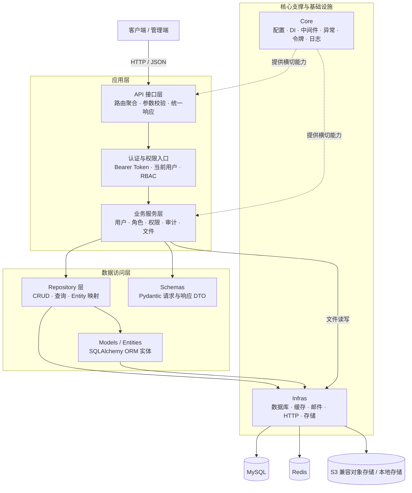
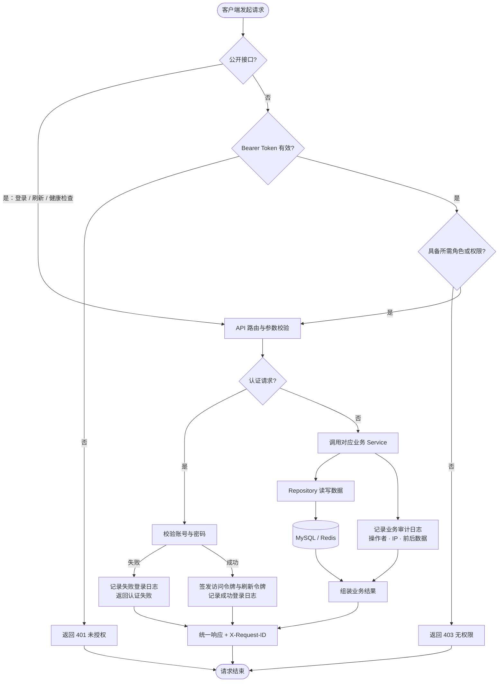
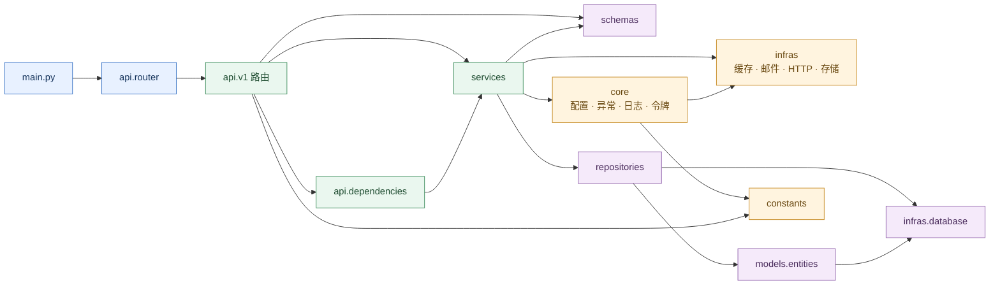

# 汉江（HanJiang）

[English](README.en.md) | 中文

---

## 项目简介

`汉江（HanJiang）`是一个基于 FastAPI 框架深度封装的 Python Web 应用框架，遵循行业最佳工程实践，提供标准化、模块化、高可扩展、高可维护的后端服务基础架构。

项目开箱即用，具备标准三层架构（API → Service → Repository）、FastAPI 原生依赖注入、双配置体系、统一鉴权与 RBAC 权限控制、结构化日志、业务审计、S3 兼容对象存储、种子数据自动初始化等能力，支持快速搭建企业级 RESTful API 服务，适配本地开发、测试与多环境生产部署。

## 快速开始

### 1. 环境要求

| 工具 | 版本要求 |
|------|----------|
| Python | >= 3.11 |
| uv | latest（推荐） |
| MySQL | >= 8.0 |
| Redis | >= 7.0 |

**Windows 环境：**
```powershell
powershell -ExecutionPolicy ByPass -c "irm https://astral.sh/uv/install.ps1 | iex"
```

**Linux 环境：**
```bash
curl -LsSf https://astral.sh/uv/install.sh | sh
```

**macOS 环境：**
```bash
curl -LsSf https://astral.sh/uv/install.sh | sh
```

### 2. 项目代码克隆

```bash
git clone https://github.com/cross-lang/x-HanJiang.git
cd x-HanJiang
```

### 3. 依赖同步安装

```bash
# 安装所有依赖（生产 + 开发）
uv sync

# 仅安装生产依赖
uv sync --no-dev
```

### 4. 环境配置

项目支持 `.env` 环境变量和 `config.yaml` 配置文件两种方式，配置优先级：**环境变量 > 环境特定 YAML（config.{env}.yaml）> 默认 YAML（config.yaml）> 代码默认值**。

**方式一：使用 `.env` 文件（推荐）**
```bash
cp .env.example .env
```

**方式二：使用 `config.yaml` 文件**
```bash
cp config.yaml.example config.yaml
```

**核心配置参数说明：**

| 参数 | 环境变量 | 说明 |
|------|----------|------|
| `APP_ENV` | `APP_ENV` | 运行环境：`development` / `testing` / `production` |
| `SERVER_HOST` | `server.host` | 监听地址，默认 `0.0.0.0` |
| `SERVER_PORT` | `server.port` | 监听端口，默认 `8000` |
| `AUTH_SECRET_KEY` | `auth.secret_key` | JWT 签名密钥，生产环境必须覆盖为 >= 32 字符的随机字符串 |
| `MYSQL_HOST` | `database.host` | MySQL 主机地址 |
| `MYSQL_PORT` | `database.port` | MySQL 端口，默认 `3306` |
| `MYSQL_USER` | `database.user` | MySQL 用户名 |
| `MYSQL_PASSWORD` | `database.password` | MySQL 密码 |
| `MYSQL_DATABASE` | `database.database` | MySQL 数据库名，默认 `hanjiang` |
| `REDIS_HOST` | `redis.host` | Redis 主机地址 |
| `REDIS_PORT` | `redis.port` | Redis 端口，默认 `6379` |
| `REDIS_PASSWORD` | `redis.password` | Redis 密码 |
| `STORAGE_PROVIDER` | `storage.provider` | 存储后端：`local`（本地文件系统）/ `s3`（S3 兼容对象存储） |

> **生产环境**：建议通过环境变量注入 `AUTH_SECRET_KEY`、数据库密码、Redis 密码等敏感配置，避免将密钥写入版本库。

> **密钥生成**：
> ```bash
> python -c "from src.core.security import generate_secret_key; print(generate_secret_key())"
> ```

### 5. 服务启动

#### 方式一：本地开发热重载启动（推荐）

```bash
# 使用 CLI 命令启动（热重载）
uv run x-HanJiang --reload

# 或使用 uvicorn 直接启动
uv run uvicorn src.main:app --reload --host 0.0.0.0 --port 8000
```

#### 方式二：Docker 容器部署

```bash
docker-compose up --build
```

> Docker 部署需提前创建 `.env` 文件并配置 `AUTH_SECRET_KEY`、`MYSQL_PASSWORD`、`REDIS_PASSWORD` 等必填环境变量。

服务启动后访问：
- Swagger 交互式文档：http://localhost:8000/docs
- ReDoc 只读文档：http://localhost:8000/redoc
- 健康检查：http://localhost:8000/api/v1/health

### 6. 常用工程命令

```bash
# 运行单元测试（含覆盖率报告）
uv run pytest tests/ -v --cov=src --cov-report=term-missing

# 代码格式化
uv run ruff format src/ tests/

# 静态代码检查
uv run ruff check src/ tests/

# 类型检查
uv run mypy src/

# 初始化数据库表（应用启动时也会自动建表）
uv run python -c "from src.infras.database import init_db; init_db()"
```

### 7. 使用方法示例

**登录获取令牌：**
```bash
curl -X POST http://localhost:8000/api/v1/auth/login \
  -H "Content-Type: application/json" \
  -d '{"username": "superadmin", "password": "admin@123456"}'
```

**携带令牌访问受保护接口：**
```bash
curl http://localhost:8000/api/v1/users \
  -H "Authorization: Bearer <access_token>"
```

**上传文件：**
```bash
curl -X POST http://localhost:8000/api/v1/files/upload \
  -H "Authorization: Bearer <access_token>" \
  -F "file=@./example.pdf" \
  -F "folder=documents"
```

**查询角色权限：**
```bash
curl http://localhost:8000/api/v1/roles/1/permissions \
  -H "Authorization: Bearer <access_token>"
```

> 首次部署后可使用默认超级管理员账号登录：`superadmin` / `admin@123456`，生产环境请务必修改该密码。

## 项目结构

```
x-HanJiang/
├── .env.example              # 环境变量模板
├── config.yaml.example       # YAML 配置文件模板
├── alembic/                  # 数据库迁移管理
│   ├── env.py                # Alembic 环境配置
│   └── versions/             # 迁移版本脚本
├── docs/                     # 项目文档
│   └── hanjiang.sql          # 数据库表结构定义（6 张表）
├── examples/                 # 使用示例
├── logs/                     # 运行日志输出目录
├── scripts/                  # 工程脚本
│   ├── init_db.py            # 数据库初始化脚本
│   └── export_openapi.py     # OpenAPI 规范导出脚本
├── src/                      # 核心业务代码
│   ├── main.py               # 应用入口（工厂函数、生命周期管理）
│   ├── api/                  # API 接口层
│   │   ├── v1/               # v1 版本路由模块
│   │   │   ├── health.py     # 健康检查与版本信息
│   │   │   ├── user.py       # 用户管理 CRUD
│   │   │   ├── auth.py       # 认证（登录/刷新/当前用户/登出）
│   │   │   ├── role.py       # 角色管理与权限查询
│   │   │   ├── audit.py      # 业务审计日志查询
│   │   │   ├── file.py       # 文件上传
│   │   │   └── login_log.py  # 登录日志查询
│   │   ├── dependencies.py   # DI 依赖函数（Service/Repository/当前用户）
│   │   ├── response.py       # 统一响应封装
│   │   └── router.py         # 路由聚合注册
│   ├── constants/            # 业务常量与枚举
│   │   ├── base.py           # 可描述枚举基类
│   │   └── constants.py      # 全局常量定义
│   ├── core/                 # 核心支撑模块
│   │   ├── config.py         # 配置加载与解析
│   │   ├── exceptions.py     # 自定义异常与全局异常处理
│   │   ├── logger.py         # 日志初始化（loguru）
│   │   ├── middleware.py     # 中间件（请求ID、日志、CORS、限流）
│   │   ├── security.py       # 密码哈希与密钥生成
│   │   ├── seed.py           # 种子数据自动初始化
│   │   ├── session.py        # 数据库会话管理
│   │   └── tokens.py         # JWT 令牌签发与验证
│   ├── infras/               # 基础设施层
│   │   ├── database.py       # 数据库连接池与会话工厂（SQLAlchemy）
│   │   ├── cache.py          # 缓存提供者（Redis）
│   │   ├── email.py          # 邮件发送
│   │   ├── http.py           # HTTP 客户端
│   │   └── storage.py        # 存储抽象层（本地文件 / S3 兼容）
│   ├── models/               # 数据模型
│   │   └── entities/         # SQLAlchemy ORM 实体（6 张表）
│   ├── repositories/         # 数据访问层（Repository 模式）
│   ├── schemas/              # API 请求/响应 DTO（Pydantic BaseModel）
│   ├── services/             # 业务逻辑层（Service 模式）
│   └── utils/                # 工具函数
├── tests/                    # 测试代码
├── Dockerfile                # Docker 镜像构建（多阶段构建）
├── docker-compose.yml        # Docker 编排（App + MySQL + Redis）
├── pyproject.toml            # 项目依赖与元信息
├── uv.toml                   # uv 包管理器配置
└── LICENSE                   # MIT 许可证
```

## 系统架构

### 系统分层架构



### 核心业务流程



### 模块依赖关系



## 技术栈

| 分类 | 技术 | 说明 |
|------|------|------|
| **开发语言** | Python 3.11+ | 强类型、异步友好的现代 Python |
| **Web 框架** | FastAPI | 高性能异步 Python Web 框架 |
| **ASGI 服务器** | Uvicorn | 轻量级 ASGI 服务器 |
| **进程管理** | Gunicorn | 生产级 WSGI/ASGI 进程管理器 |
| **数据存储** | MySQL 8.0 | 关系型数据库 |
| **ORM** | SQLAlchemy 2.0 | Python SQL 工具包与对象关系映射 |
| **数据库驱动** | PyMySQL | 纯 Python MySQL 驱动 |
| **数据库迁移** | Alembic | SQLAlchemy 数据库迁移工具 |
| **缓存** | Redis 7 | 令牌与登录态存储 |
| **对象存储** | boto3 | S3 兼容对象存储（七牛 Kodo / AWS S3 / MinIO） |
| **数据校验** | Pydantic v2 | 数据模型与校验框架 |
| **配置管理** | pydantic-settings | 基于 Pydantic 的配置管理 |
| **日志** | Loguru | 现代化 Python 日志库 |
| **限流** | SlowAPI | 请求限流中间件 |
| **密码哈希** | bcrypt | 安全密码哈希 |
| **JWT** | PyJWT | JSON Web Token 签发与验证 |
| **HTTP 客户端** | httpx | 异步 HTTP 客户端 |
| **包管理器** | uv | 高性能 Python 包管理器 |
| **代码检查** | Ruff | 高性能 Python 代码检查与格式化工具 |
| **类型检查** | mypy | Python 静态类型检查器 |
| **测试框架** | pytest | Python 测试框架 |
| **容器化** | Docker | 容器化部署 |
| **容器编排** | Docker Compose | 多容器编排与管理 |

## API 文档说明

项目基于 FastAPI 自动生成 OpenAPI 规范，提供以下接口文档能力：

| 文档类型 | 访问地址 | 说明 |
|----------|----------|------|
| Swagger 交互式文档 | http://localhost:8000/docs | 支持在线调试、参数填写、请求发送 |
| ReDoc 只读文档 | http://localhost:8000/redoc | 结构清晰的只读 API 文档 |
| OpenAPI JSON 规范 | http://localhost:8000/openapi.json | 标准 OpenAPI 3.x 规范文件，可导入 Postman 等工具 |

### API 接口清单

所有业务接口前缀为 `/api/v1`。

**健康检查（公开）：**

| 方法 | 路径 | 说明 |
|------|------|------|
| GET | `/api/v1/health` | 健康检查（数据库/缓存连通状态） |
| GET | `/api/v1/version` | 版本信息 |

**认证（登录/刷新公开，其余需鉴权）：**

| 方法 | 路径 | 说明 | 鉴权 |
|------|------|------|------|
| POST | `/api/v1/auth/login` | 用户名/邮箱 + 密码登录 | 公开 |
| POST | `/api/v1/auth/refresh` | 刷新令牌 | 公开 |
| GET | `/api/v1/auth/me` | 当前登录用户信息 | 需鉴权 |
| POST | `/api/v1/auth/logout` | 退出登录（清除 Redis 登录态） | 需鉴权 |

**用户管理（需鉴权）：**

| 方法 | 路径 | 说明 |
|------|------|------|
| POST | `/api/v1/users` | 创建用户 |
| GET | `/api/v1/users` | 用户列表（分页/关键字/状态过滤） |
| GET | `/api/v1/users/{id}` | 用户详情 |
| GET | `/api/v1/users/export` | 导出用户（CSV） |
| POST | `/api/v1/users/{id}/update` | 更新用户 |
| POST | `/api/v1/users/{id}/delete` | 删除用户（软删除） |

**角色管理（需鉴权）：**

| 方法 | 路径 | 说明 |
|------|------|------|
| POST | `/api/v1/roles` | 创建角色 |
| GET | `/api/v1/roles` | 角色列表（分页/关键字/类型/状态过滤） |
| GET | `/api/v1/roles/{id}` | 角色详情 |
| POST | `/api/v1/roles/{id}/update` | 更新角色 |
| POST | `/api/v1/roles/{id}/delete` | 删除角色（软删除） |
| GET | `/api/v1/roles/{id}/permissions` | 角色权限列表（含权限详情） |

**业务审计日志（需鉴权）：**

| 方法 | 路径 | 说明 |
|------|------|------|
| GET | `/api/v1/audit/logs` | 按实体、动作、操作人和时间范围查询业务变更 |

**文件上传（需鉴权）：**

| 方法 | 路径 | 说明 |
|------|------|------|
| POST | `/api/v1/files/upload` | 上传文件；配置对象存储后写入云端，否则回退本地存储 |

**登录日志（需鉴权）：**

| 方法 | 路径 | 说明 |
|------|------|------|
| GET | `/api/v1/login-logs` | 登录日志列表（分页/用户/结果/方式/时间范围过滤） |
| GET | `/api/v1/login-logs/{id}` | 登录日志详情 |

### 权限控制说明

- 所有业务接口（除登录、刷新、健康检查外）均需 `Authorization: Bearer <token>` 请求头
- 接口可通过 `require_role("role_code")` 或 `require_permission("perm_code")` 声明访问要求
- `super_admin` 角色默认绕过角色限制
- 普通用户的权限判断结果按用户和权限编码缓存于 Redis

## 存储配置说明

项目提供统一存储抽象层，通过 `storage.provider` 配置项切换存储后端，业务代码零改动。

### 本地文件存储

适用于开发环境和小规模部署，文件存储在服务器本地文件系统。

```yaml
storage:
  provider: "local"
  local:
    base_dir: "static"
```

| 参数 | 说明 | 默认值 |
|------|------|--------|
| `provider` | 存储后端标识 | `local` |
| `local.base_dir` | 本地存储根目录 | `static` |

### S3 兼容对象存储

适用于生产环境，支持七牛云 Kodo、AWS S3、MinIO 等 S3 兼容服务。

```yaml
storage:
  provider: "s3"
  s3:
    endpoint_url: "https://s3.cn-south-1.qiniucs.com"
    access_key: "<your-access-key>"
    secret_key: "<your-secret-key>"
    bucket: "x-hanjiang"
    region: "cn-south-1"
    prefix: "uploads"
    public_url: ""
    use_ssl: true
```

| 参数 | 说明 | 默认值 |
|------|------|--------|
| `provider` | 存储后端标识 | `s3` |
| `s3.endpoint_url` | S3 兼容服务地址 | — |
| `s3.access_key` | 访问密钥 | — |
| `s3.secret_key` | 秘密密钥 | — |
| `s3.bucket` | 存储桶名称 | `x-hanjiang` |
| `s3.region` | 存储区域 | `cn-south-1` |
| `s3.prefix` | 对象键前缀 | `uploads` |
| `s3.public_url` | 公开访问域名（可选，含协议头） | — |
| `s3.use_ssl` | 是否启用 SSL | `true` |

> **注意事项**：生产环境建议通过环境变量注入 `access_key` 和 `secret_key`，避免将密钥写入版本库。配置示例中七牛云 Kodo 华南区域地址为 `https://s3.cn-south-1.qiniucs.com`，其他 S3 兼容服务请替换为对应 endpoint。

## 许可证

本项目基于 [MIT License](LICENSE) 开源。

## 参考资料

| 技术 | 官方文档 |
|------|----------|
| Python | https://www.python.org/ |
| FastAPI | https://fastapi.tiangolo.com/ |
| Pydantic | https://docs.pydantic.dev/ |
| SQLAlchemy | https://docs.sqlalchemy.org/ |
| Alembic | https://alembic.sqlalchemy.org/ |
| Redis | https://redis.io/docs/ |
| uv | https://docs.astral.sh/uv/ |
| Uvicorn | https://www.uvicorn.org/ |
| Gunicorn | https://gunicorn.org/ |
| Docker | https://docs.docker.com/ |
| Docker Compose | https://docs.docker.com/compose/ |
| Loguru | https://loguru.readthedocs.io/ |
| pytest | https://docs.pytest.org/ |
| Ruff | https://docs.astral.sh/ruff/ |

## 联系方式

- **作者**：John Young（夜雨诗来）
- **邮箱**：[john.young@foxmail.com](mailto:john.young@foxmail.com)
- **Gitee**：https://gitee.com/yeyushilai
- **GitHub**：https://github.com/yeyushilai
- **项目地址**：https://github.com/cross-lang/x-HanJiang
