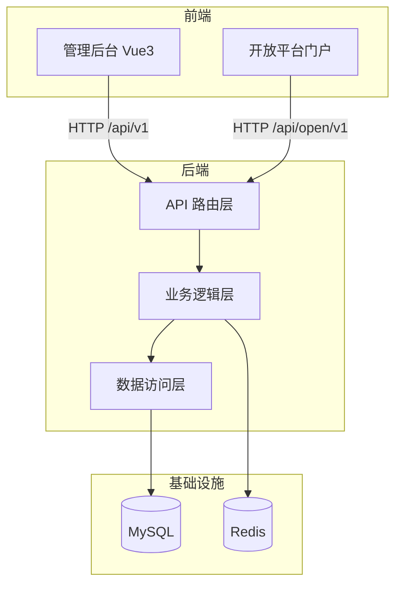
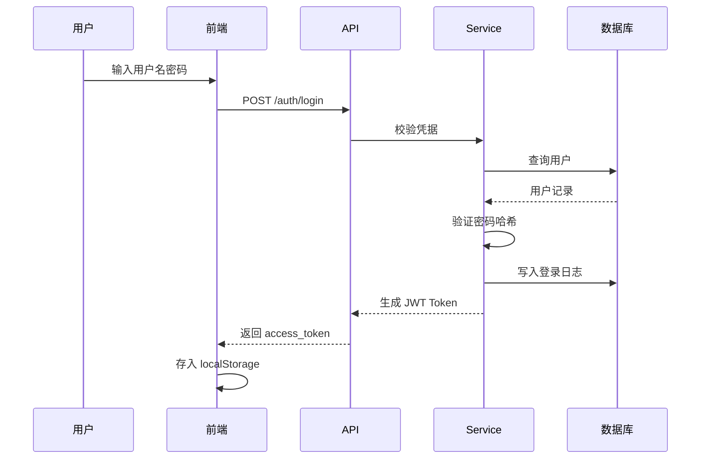
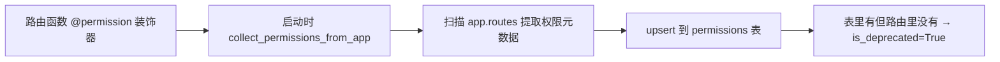

[English](README.en.md) | 中文

# 汉江（HanJiang）— 全栈快速开发平台

## 项目简介

汉江（HanJiang）是一个基于 FastAPI + Vue 3 + TypeScript 的全栈快速开发平台，深度封装企业级 Web 应用的通用能力，让开发者聚焦业务本身。

**核心特征：**
- 前后端分离：FastAPI 后端 + Vue 3 + Element Plus 前端，全栈 TypeScript 类型安全
- 内置 JWT 认证 + RBAC 权限模型 + 操作审计 + 登录日志，开箱即用
- 装饰器自动扫描路由注册权限，启动时自动同步到 permissions 表
- 开放平台 HanJiang-1 HMAC 签名鉴权，支持明文与签名双模式
- 分层架构：API 路由 → 业务逻辑 → 数据访问，职责清晰
- 生产级安全设计（常量时间比对、防重放、密码哈希）
- 内置仪表盘（用户/角色/应用统计 + 登录趋势 + 操作日志趋势 + ECharts 可视化）
- 完善的开发者体验（Swagger 文档、Alembic 迁移、统一异常处理）

**适用场景：**
- 企业内部管理系统快速搭建
- SaaS 产品后端基座
- 开放平台 / API 服务网关
- 前后端分离项目脚手架

## 快速开始

### 后端启动

```bash
cd server
uv run x-HanJiang
```

详细配置说明请参考 [server/README.md](server/README.md)。

### 前端启动

```bash
cd web/admin
npm install
npm run dev
```

访问 http://localhost:5173。详细说明请参考 [web/admin/README.md](web/admin/README.md)。

## 项目结构

```
x-HanJiang/
├── server/                  # 后端（FastAPI）
│   ├── src/
│   │   ├── api/              # 路由层（v1 用户态 + open/v1 开放平台）
│   │   ├── constants/        # 常量与枚举（ModuleCode、BaseEnum）
│   │   ├── core/             # 核心（配置/中间件/异常/安全）
│   │   ├── infras/           # 基础设施（数据库连接）
│   │   ├── models/           # SQLAlchemy 数据模型
│   │   ├── repositories/     # 数据访问层
│   │   ├── schemas/          # Pydantic Schema
│   │   ├── services/         # 业务逻辑层
│   │   ├── utils/             # 工具函数
│   │   └── main.py           # 应用入口
│   ├── alembic/              # 数据库迁移
│   ├── config/               # 配置文件
│   ├── logs/                 # 日志输出
│   └── pyproject.toml
├── web/                      # 前端
│   ├── admin/                # 管理后台（Vue3 + TS + Element Plus + ECharts）
│   └── open/                 # 开放平台门户（待开发）
├── docker-compose.yml         # Docker 编排
├── CHANGELOG.md              # 版本变更记录
└── README.md
```

## 系统架构

### 分层架构



### 核心业务流程：用户登录



### 权限自动注册流程



## 技术栈

| 分类 | 技术 |
|---|---|
| **后端语言** | Python 3.11+ |
| **后端框架** | FastAPI |
| **ORM** | SQLAlchemy 2.0 |
| **数据库迁移** | Alembic |
| **前端框架** | Vue 3 + TypeScript |
| **前端构建** | Vite 6 |
| **UI 组件库** | Element Plus |
| **状态管理** | Pinia |
| **图表** | ECharts + vue-echarts |
| **数据库** | MySQL |
| **缓存** | Redis |
| **日志** | Loguru |
| **认证** | JWT + HMAC 签名 |
| **部署** | Docker / docker-compose |

## API 文档

后端启动后可访问：

- **Swagger UI**：http://localhost:8000/docs
- **ReDoc**：http://localhost:8000/redoc
- **OpenAPI JSON**：http://localhost:8000/openapi.json

### 核心接口清单

| 模块 | 接口 | 说明 |
|---|---|---|
| 认证 | `POST /api/v1/auth/login` | 用户登录 |
| 认证 | `GET /api/v1/auth/me` | 当前用户信息 |
| 用户管理 | `GET /api/v1/users` | 用户列表（支持多角色） |
| 用户管理 | `POST /api/v1/users` | 创建用户 |
| 用户管理 | `POST /api/v1/users/{id}/update` | 更新用户 |
| 角色管理 | `GET /api/v1/roles` | 角色列表 |
| 角色管理 | `GET /api/v1/roles/{id}/permissions` | 角色权限列表 |
| 角色管理 | `POST /api/v1/roles/{id}/permissions` | 绑定权限 |
| 权限管理 | `GET /api/v1/permissions` | 权限列表 |
| 审计日志 | `GET /api/v1/audit/logs` | 业务审计日志列表 |
| 登录日志 | `GET /api/v1/audit/login-logs` | 登录日志列表 |
| 仪表盘 | `GET /api/v1/dashboard/stats` | 仪表盘统计数据 |
| 开放平台 | `GET /api/open/v1/users` | 开放平台用户查询 |
| 开放平台 | `GET /api/open/v1/apps/me` | 当前应用信息 |

### 权限控制

- **用户态接口**：JWT Bearer Token + `@permission` 装饰器自动注册权限 + 角色/权限校验
- **开放平台接口**：AppId + AppKey（明文）或 HanJiang-1 HMAC 签名认证

## 存储配置说明

### 数据库

- **类型**：MySQL 8.0+
- **配置**：通过 `.env` 文件配置 `MYSQL_HOST`、`MYSQL_PORT`、`MYSQL_DATABASE` 等
- **迁移**：使用 Alembic 管理版本

### 缓存

- **类型**：Redis
- **用途**：限流计数、会话缓存
- **配置**：通过 `.env` 文件配置 `REDIS_HOST`、`REDIS_PORT`

### 文件存储

支持两种模式，通过 `.env` 中 `STORAGE_PROVIDER` 切换：

| 模式 | 配置 | 适用场景 |
|---|---|---|
| `local` | `STORAGE_LOCAL_BASE_DIR=static` | 本地开发、小型部署 |
| `s3` | `STORAGE_S3_ENDPOINT_URL` 等 | 生产环境、对象存储（七牛/AWS S3/MinIO） |

## 许可证

本项目采用 [MIT License](LICENSE) 开源协议。

## 参考资料

- [FastAPI 官方文档](https://fastapi.tiangolo.com/)
- [SQLAlchemy 官方文档](https://docs.sqlalchemy.org/)
- [Vue 3 官方文档](https://cn.vuejs.org/)
- [Vite 官方文档](https://cn.vitejs.dev/)
- [Element Plus 官方文档](https://element-plus.org/zh-CN/)
- [ECharts 官方文档](https://echarts.apache.org/zh/)
- [Loguru 官方文档](https://loguru.readthedocs.io/)
- [Docker 官方文档](https://docs.docker.com/)

## 联系方式

- **作者**：John Young（夜雨诗来）
- **邮箱**：john.young@foxmail.com
- **Gitee**：https://gitee.com/cross-lang/x-HanJiang
- **GitHub**：https://github.com/cross-lang/x-HanJiang
- **项目地址**：https://github.com/cross-lang/x-HanJiang
