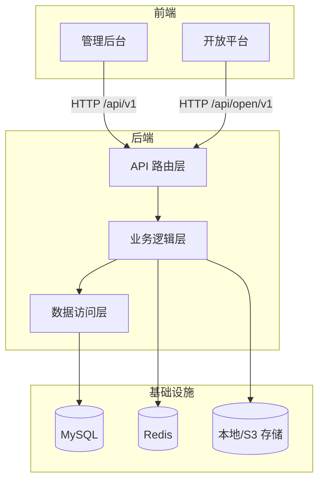
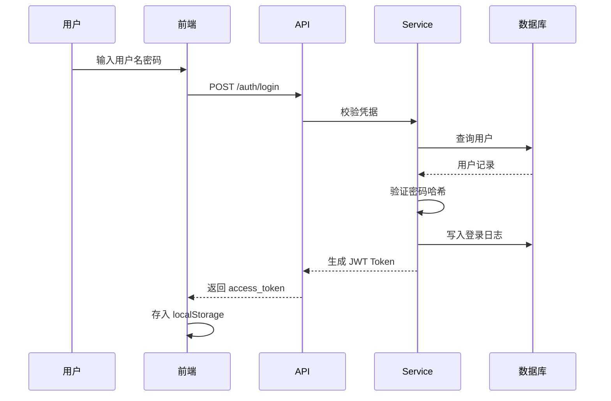
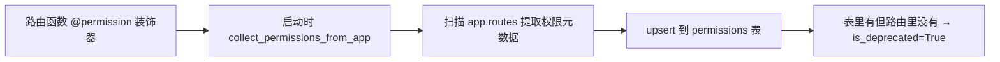
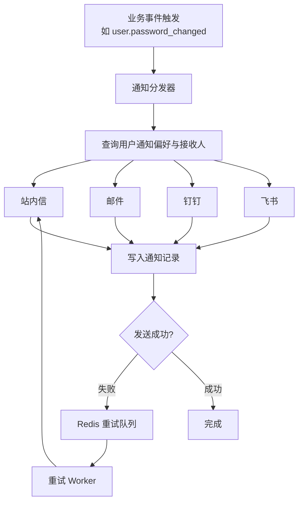

[English](README.en.md) | 中文

# 汉江（HanJiang）— 全栈快速开发平台

## 项目简介

汉江（HanJiang）是一个基于 FastAPI + Vue 3 + TypeScript 的全栈快速开发平台，深度封装企业级 Web 应用的通用能力，让开发者聚焦业务本身。

**核心特征：**

- 前后端分离：FastAPI 后端 + Vue 3 + Element Plus 前端，全栈 TypeScript 类型安全
- 内置 JWT 认证 + RBAC 权限模型 + 操作审计 + 登录日志，开箱即用
- 装饰器自动扫描路由注册权限，启动时自动同步到 permissions 表
- 开放平台 HanJiang-1 HMAC 签名鉴权，支持明文与签名双模式，内置应用管理（AppId/AppKey 生命周期、scope 授权、密钥轮换）
- 事件驱动多渠道通知系统（站内信 / 邮件 / 钉钉 / 飞书 / 短信），支持用户级偏好与失败自动重试
- 系统通知广播：面向全体用户发布普通通知 / 系统维护通知，站内信广播 + 按用户渠道推送多渠道
- 分层架构：API 路由 → 业务逻辑 → 数据访问，职责清晰
- 生产级安全设计（常量时间比对、防重放、密码哈希、邮箱验证码二次认证）
- 内置仪表盘（用户/角色/应用统计 + 登录趋势 + 操作日志趋势 + ECharts 可视化）
- 文件管理（本地 / S3 兼容存储）、全局搜索、个人中心、系统告警、公告管理（首页板块 / 横幅）
- 完善的开发者体验（Swagger 文档、Alembic 迁移、统一异常处理、GitHub Actions CI）

**适用场景：**

- 企业内部管理系统快速搭建
- SaaS 产品后端基座
- 开放平台 / API 服务网关
- 前后端分离项目脚手架

## 快速开始

### 后端启动

```bash
cd server
uv run x-HanJiang --reload
```

详细配置说明请参考 [server/README.md](server/README.md)。

### 前端启动

```bash
cd web/admin
npm install
npm run dev
```

访问 http://localhost:5173
详细说明请参考 [web/admin/README.md](web/admin/README.md)。

## 项目结构

```
x-HanJiang/
├── server/                  # 后端（FastAPI）
│   ├── src/
│   │   ├── api/              # 路由层（v1 用户态 + open/v1 开放平台）
│   │   ├── constants/        # 常量与枚举（ModuleCode、BaseEnum）
│   │   ├── core/             # 核心（配置/中间件/异常/安全）
│   │   ├── infras/           # 基础设施（数据库/缓存/存储/通知渠道）
│   │   ├── models/           # SQLAlchemy 数据模型（models/entities）
│   │   ├── notification/     # 通知子系统（分发器/模板/重试）
│   │   ├── repositories/     # 数据访问层
│   │   ├── scheduling/       # 调度任务（通知重试 Worker）
│   │   ├── schemas/          # Pydantic Schema
│   │   ├── services/         # 业务逻辑层
│   │   ├── utils/            # 工具函数
│   │   └── main.py           # 应用入口
│   ├── alembic/              # 数据库迁移
│   ├── config/               # 配置文件
│   ├── docs/                 # 项目文档（建表 SQL、Postman 集合）
│   ├── examples/             # 使用示例
│   ├── logs/                 # 日志输出
│   ├── scripts/              # 工程脚本
│   ├── static/               # 本地文件存储目录
│   ├── tests/                # 单元测试
│   └── pyproject.toml
├── web/                      # 前端
│   ├── admin/                # 管理后台（Vue3 + TS + Element Plus + ECharts）
│   └── open/                 # 开放平台门户（待开发）
├── docker-compose.yml        # Docker 编排
└── README.md
```

## 系统架构

### 分层架构


```mermaid
graph TB
    subgraph 前端
        A[管理后台]
        B[开放平台]
    end

    subgraph 后端
        C[API 路由层]
        D[业务逻辑层]
        E[数据访问层]
    end

    subgraph 基础设施
        F[(MySQL)]
        G[(Redis)]
        H[(本地/S3 存储)]
    end

    A -->|HTTP /api/v1| C
    B -->|HTTP /api/open/v1| C
    C --> D
    D --> E
    E --> F
    D --> G
    D --> H
```

### 核心业务流程：用户登录


```mermaid
sequenceDiagram
    participant U as 用户
    participant F as 前端
    participant A as API
    participant S as Service
    participant DB as 数据库

    U->>F: 输入用户名密码
    F->>A: POST /auth/login
    A->>S: 校验凭据
    S->>DB: 查询用户
    DB-->>S: 用户记录
    S->>S: 验证密码哈希
    S->>DB: 写入登录日志
    S-->>A: 生成 JWT Token
    A-->>F: 返回 access_token
    F->>F: 存入 localStorage
```

### 权限自动注册流程


```mermaid
flowchart LR
    A[路由函数 @permission 装饰器] --> B[启动时 collect_permissions_from_app]
    B --> C[扫描 app.routes 提取权限元数据]
    C --> D[upsert 到 permissions 表]
    D --> E[表里有但路由里没有 → is_deprecated=True]
```

### 通知发送流程


```mermaid
flowchart TD
    A[业务事件触发<br/>如 user.password_changed] --> B[通知分发器]
    B --> C[查询用户通知偏好与接收人]
    C --> D[站内信]
    C --> E[邮件]
    C --> F[钉钉]
    C --> G[飞书]
    D --> H[写入通知记录]
    E --> H
    F --> H
    G --> H
    H --> I{发送成功?}
    I -->|失败| J[Redis 重试队列]
    J --> K[重试 Worker]
    K --> D
    I -->|成功| L[完成]
```

## 技术栈

| 分类 | 技术 |
|---|---|
| **后端语言** | Python 3.11+ |
| **后端框架** | FastAPI |
| **ORM** | SQLAlchemy 2.0 |
| **数据库迁移** | Alembic |
| **前端框架** | Vue 3 + TypeScript |
| **前端构建** | Vite 6 |
| **UI 组件库** | Element Plus |
| **状态管理** | Pinia |
| **图表** | ECharts 6 + vue-echarts |
| **数据库** | MySQL |
| **缓存** | Redis |
| **日志** | Loguru |
| **认证** | JWT + HMAC 签名 |
| **包管理** | uv |
| **部署** | Docker / docker-compose |

## API 文档

后端启动后可访问：

- **Swagger UI**：http://localhost:8000/docs
- **ReDoc**：http://localhost:8000/redoc
- **OpenAPI JSON**：http://localhost:8000/openapi.json

### 核心接口清单

| 模块 | 接口 | 说明 |
|---|---|---|
| 认证 | `POST /api/v1/auth/login` | 用户登录 |
| 认证 | `POST /api/v1/auth/refresh` | 刷新令牌 |
| 认证 | `POST /api/v1/auth/logout` | 退出登录 |
| 个人中心 | `GET /api/v1/profile/me` | 当前用户信息 |
| 个人中心 | `GET /api/v1/profile/menus` | 当前用户菜单树 |
| 个人中心 | `POST /api/v1/profile/change-password` | 修改密码（验证码二次认证） |
| 用户管理 | `GET /api/v1/users` | 用户列表（支持多角色） |
| 用户管理 | `POST /api/v1/users` | 创建用户 |
| 用户管理 | `GET /api/v1/users/export` | 导出用户（CSV） |
| 用户管理 | `POST /api/v1/users/import` | 批量导入用户（CSV） |
| 用户管理 | `POST /api/v1/users/{id}/update` | 更新用户 |
| 角色管理 | `GET /api/v1/roles` | 角色列表 |
| 角色管理 | `GET /api/v1/roles/{id}/permissions` | 角色权限列表 |
| 角色管理 | `POST /api/v1/roles/{id}/permissions` | 绑定权限 |
| 权限管理 | `GET /api/v1/permissions` | 权限列表 |
| 审计日志 | `GET /api/v1/audit/logs` | 业务审计日志列表 |
| 登录日志 | `GET /api/v1/audit/login-logs` | 登录日志列表 |
| 文件管理 | `POST /api/v1/files/upload` | 上传文件 |
| 文件管理 | `GET /api/v1/files` | 文件列表 |
| 通知管理 | `POST /api/v1/notifications/publish` | 发布系统通知（普通 / 维护，全体用户广播） |
| 通知管理 | `GET /api/v1/notifications/published` | 系统通知列表 |
| 通知管理 | `GET /api/v1/notifications` | 通知列表 |
| 站内信 | `GET /api/v1/station/messages` | 我的消息列表 |
| 站内信 | `GET /api/v1/station/messages/unread-count` | 未读消息数 |
| 公告管理 | `GET /api/v1/announcements/active` | 首页生效公告 |
| 公告管理 | `POST /api/v1/announcements` | 创建公告（草稿） |
| 公告管理 | `POST /api/v1/announcements/{id}/publish` | 发布公告 |
| 公告管理 | `POST /api/v1/announcements/{id}/unpublish` | 下架公告 |
| 仪表盘 | `GET /api/v1/dashboard/stats` | 仪表盘统计数据 |
| 全局搜索 | `GET /api/v1/search` | 全局搜索（用户/角色/权限/应用/文件） |
| 开放平台应用 | `POST /api/v1/admin/apps` | 创建开放应用（返回 AppId + AppKey） |
| 开放平台应用 | `POST /api/v1/admin/apps/{app_id}/rotate-key` | 重置 AppKey |
| 开放平台 | `GET /api/open/v1/me` | 当前应用信息 |
| 开放平台 | `GET /api/open/v1/users` | 开放平台用户查询 |

### 权限控制

- **用户态接口**：JWT Bearer Token + `@permission` 装饰器自动注册权限 + 角色/权限校验
- **开放平台接口**：AppId + AppKey（明文）或 HanJiang-1 HMAC 签名认证，通过 scope 控制访问范围

## 存储配置说明

### 数据库

- **类型**：MySQL 8.0+
- **配置**：通过 `.env` 文件配置 `MYSQL_HOST`、`MYSQL_PORT`、`MYSQL_DATABASE` 等
- **迁移**：使用 Alembic 管理版本

### 缓存

- **类型**：Redis
- **用途**：限流计数、登录态缓存、通知重试队列
- **配置**：通过 `.env` 文件配置 `REDIS_HOST`、`REDIS_PORT`

### 文件存储

支持两种模式，通过 `.env` 中 `STORAGE_PROVIDER` 切换：

| 模式 | 配置 | 适用场景 |
|---|---|---|
| `local` | `STORAGE_LOCAL_BASE_DIR=static` | 本地开发、小型部署 |
| `s3` | `STORAGE_S3_ENDPOINT_URL` 等 | 生产环境、对象存储（七牛/AWS S3/MinIO） |

## 许可证

本项目采用 [MIT License](LICENSE) 开源协议。

## 参考资料

- [FastAPI 官方文档](https://fastapi.tiangolo.com/)
- [uv 官方文档](https://docs.astral.sh/uv/)
- [SQLAlchemy 官方文档](https://docs.sqlalchemy.org/)
- [Vue 3 官方文档](https://cn.vuejs.org/)
- [Vite 官方文档](https://cn.vitejs.dev/)
- [Element Plus 官方文档](https://element-plus.org/zh-CN/)
- [ECharts 官方文档](https://echarts.apache.org/zh/)
- [Loguru 官方文档](https://loguru.readthedocs.io/)
- [Docker 官方文档](https://docs.docker.com/)

## 联系方式

- **作者**：John Young（夜雨诗来）
- **邮箱**：john.young@foxmail.com
- **Gitee**：https://gitee.com/yeyushilai
- **GitHub**：https://github.com/yeyushilai
- **项目地址**：https://github.com/cross-lang/x-HanJiang
