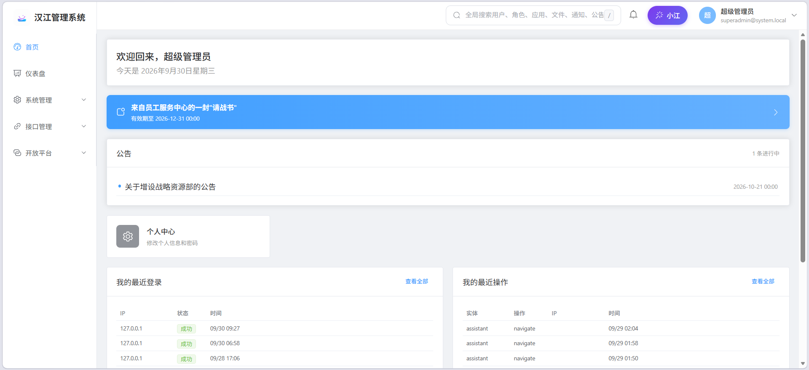

<div align="center">


# 汉江（HanJiang）— 全栈快速开发平台

基于 **FastAPI + Vue 3** 的**开箱即用**的企业级全栈平台，深度封装后台系统通用能力（认证、权限、审计、通知、AI、开放平台），开发者只需聚焦业务本身。

[English](README.en.md) | 中文


</div>

## 💡 为什么选择 HanJiang？

| 你需要的 | HanJiang | 裸 FastAPI 自研 | 通用前后端模板 |
| --- | --- | --- | --- |
| 开箱即用的后台系统 | ✅ | ⚠️ 需自研 | ❌ 只有 UI |
| FastAPI 异步高性能后端 | ✅ | ✅ 但需自建 | ❌ 无后端 |
| RBAC 菜单/按钮权限 + 启动自动注册 | ✅ | ⚠️ 需自研 | ❌ |
| AI 助手（SSE 流式对话 / 工具编排） | ✅ | ❌ | ❌ |
| 开放平台签名鉴权（HMAC / 防重放） | ✅ | ❌ | ❌ |
| 多渠道通知（站内信/邮件/钉钉/飞书） | ✅ | ❌ | ❌ |
| 审计日志 + 登录日志 | ✅ | ❌ | ❌ |
| Docker 一键部署 | ✅ | ⚠️ | ⚠️ |

## ✨ 核心能力

- **认证与权限**：JWT 认证 + RBAC 权限模型，`@permission` 装饰器声明式注册，启动时自动扫描同步到数据库
- **AI 助手**：SSE 流式对话（token / navigate / done 事件）、会话管理、记忆压缩、知识库检索与工具编排，`openai_compat` 协议可对接 DeepSeek / 火山方舟 / 通义 / vLLM 等
- **开放平台**：HanJiang-1 HMAC 签名鉴权（明文/签名双模式）、AppId/AppKey 生命周期管理、scope 授权、密钥轮换
- **通知系统**：事件驱动多渠道分发（站内信/邮件/钉钉/飞书），模板变量插值、用户级偏好、失败自动重试
- **可观测性**：业务审计日志、登录日志、操作日志趋势、系统告警
- **工程化**：分层架构（API → Service → Repository）、统一异常处理、Swagger 文档、Alembic 迁移、GitHub Actions CI

## 📸 界面预览


 
 

## 🚀 快速开始

### 🖥️ 后端

```bash
cd server
uv run x-HanJiang --reload
```

配置说明见 [server/README.md](server/README.md)。

### 🌐 前端

```bash
cd web/admin
npm install
npm run dev
```

访问 <http://localhost:5173>，详见 [web/admin/README.md](web/admin/README.md)。

## 📁 项目结构

```
x-HanJiang/
├── server/            # 后端（FastAPI）
│   ├── src/
│   │   ├── api/       # 路由层（v1 用户态 + open/v1 开放平台）
│   │   ├── assistant/ # AI 助手（对话编排/记忆/检索/工具）
│   │   ├── constants/ # 常量与枚举（ModuleCode、BaseEnum）
│   │   ├── core/      # 配置/中间件/异常/安全
│   │   ├── infras/    # 基础设施（数据库/缓存/存储/通知渠道/LLM）
│   │   ├── models/    # SQLAlchemy 数据模型
│   │   ├── notification/  # 通知子系统（分发器/模板/重试）
│   │   ├── repositories/  # 数据访问层
│   │   ├── scheduling/    # 调度任务（通知重试 Worker）
│   │   ├── schemas/   # Pydantic Schema
│   │   ├── services/  # 业务逻辑层
│   │   ├── utils/     # 工具函数
│   │   └── main.py    # 应用入口
│   ├── alembic/       # 数据库迁移
│   ├── tests/         # 单元测试
│   └── pyproject.toml
├── web/
│   ├── admin/         # 管理后台（Vue3 + TS + Element Plus）
│   └── open/          # 开放平台门户（待开发）
├── docker-compose.yml # Docker 编排
└── README.md
```

## 🛠️ 技术栈

| 分类 | 技术 |
| --- | --- |
| 后端 | Python 3.11+ / FastAPI / SQLAlchemy 2.0 / Alembic |
| 前端 | Vue 3 + TypeScript / Vite / Element Plus / Pinia / ECharts |
| 存储 | MySQL / Redis |
| 认证 | JWT + HMAC 签名 |
| AI | OpenAI SDK（openai_compat 协议） |
| 工程 | uv / Ruff / mypy / pytest / Loguru |
| 部署 | Docker / docker-compose |

## 🔌 API 文档

启动后端后访问：

- **Swagger UI**：<http://localhost:8000/docs>
- **ReDoc**：<http://localhost:8000/redoc>
- **OpenAPI JSON**：<http://localhost:8000/openapi.json>

## 📄 许可证

本项目采用 [MIT License](LICENSE) 开源协议。

## 📮 联系方式

- **作者**：John Young（夜雨诗来）
- **邮箱**：john.young@foxmail.com
- **Gitee**：https://gitee.com/yeyushilai
- **GitHub**：https://github.com/yeyushilai
- **项目地址**：https://github.com/cross-lang/x-HanJiang