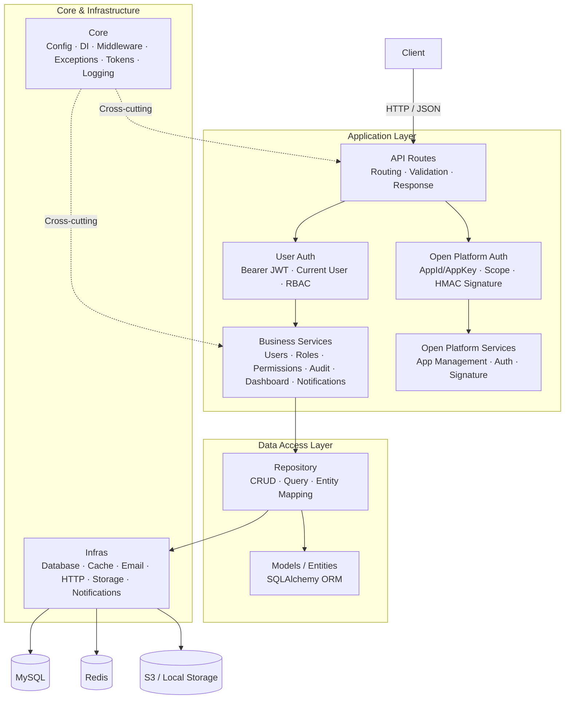
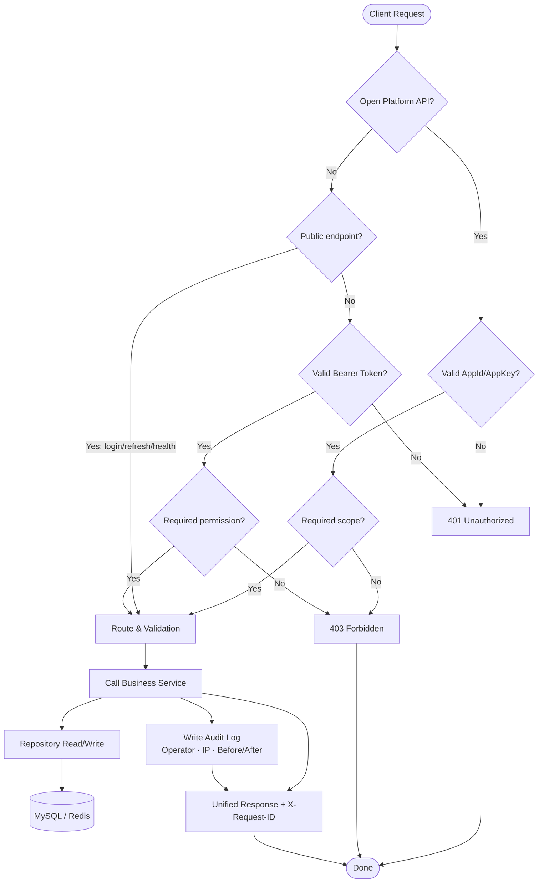

[中文](README.md) | English

# HanJiang Backend Service

## Introduction

HanJiang backend is a Python web application framework built on FastAPI, following a three-layer architecture (API → Service → Repository) with dependency injection. It includes JWT authentication, RBAC permission model, audit logging, login logging, open platform AppId/AppKey authentication (with HanJiang-1 HMAC signature upgrade path), event-driven notification system, S3-compatible object storage, and seed data initialization.

**Key Features:**
- Standard three-layer architecture + FastAPI native DI
- `@permission` decorator auto-scans routes and registers permissions to DB on startup
- Dual auth tracks: user JWT + open platform HMAC signature
- Separate business audit logs and login logs with operator, IP, before/after data
- Event-driven multi-channel notifications (email/DingTalk/Feishu/SMS)
- Unified storage abstraction (local / S3-compatible)
- Production-grade security (bcrypt hashing, constant-time comparison, replay protection)

**Use Cases:**
- Enterprise internal admin systems
- SaaS product backend foundation
- Open platform / API gateway
- Full-stack project boilerplate

## Quick Start

### 1. Requirements

| Tool | Version |
|------|---------|
| Python | >= 3.11 |
| uv | latest (recommended) |
| MySQL | >= 8.0 |
| Redis | >= 7.0 |

**Windows:**
```powershell
powershell -ExecutionPolicy ByPass -c "irm https://astral.sh/uv/install.ps1 | iex"
```

**Linux:**
```bash
curl -LsSf https://astral.sh/uv/install.sh | sh
```

**macOS:**
```bash
curl -LsSf https://astral.sh/uv/install.sh | sh
```

### 2. Clone the Repository

```bash
git clone https://github.com/cross-lang/x-HanJiang.git
cd x-HanJiang/server
```

### 3. Install Dependencies

```bash
# Install all dependencies (production + development)
uv sync

# Production only
uv sync --no-dev
```

### 4. Configuration

Two configuration methods are supported: `.env` environment variables and `config.yaml`. Priority: **env vars > env-specific YAML > default YAML > code defaults**.

**Method 1: `.env` file (recommended)**
```bash
cp .env.example .env
```

**Method 2: `config.yaml` file**
```bash
cp config.yaml.example config.yaml
```

**Key configuration parameters:**

| Parameter | Env Variable | Description |
|-----------|-------------|-------------|
| `APP_ENV` | `APP_ENV` | Environment: `development` / `testing` / `production` |
| `SERVER_HOST` | `server.host` | Bind address, default `0.0.0.0` |
| `SERVER_PORT` | `server.port` | Bind port, default `8000` |
| `AUTH_SECRET_KEY` | `auth.secret_key` | JWT signing key, must be >= 32 chars in production |
| `MYSQL_HOST` | `database.host` | MySQL host |
| `MYSQL_PORT` | `database.port` | MySQL port, default `3306` |
| `MYSQL_USER` | `database.user` | MySQL username |
| `MYSQL_PASSWORD` | `database.password` | MySQL password |
| `MYSQL_DATABASE` | `database.database` | Database name, default `hanjiang` |
| `REDIS_HOST` | `redis.host` | Redis host |
| `REDIS_PORT` | `redis.port` | Redis port, default `6379` |
| `STORAGE_PROVIDER` | `storage.provider` | Storage: `local` / `s3` |

> **Production**: inject secrets via environment variables.

> **Generate secret key**:
> ```bash
> python -c "from src.utils.security import generate_secret_key; print(generate_secret_key())"
> ```

### 5. Start the Service

**Method 1: Local dev with hot reload (recommended)**

```bash
uv run x-HanJiang
```

**Method 2: Docker deployment**

```bash
docker-compose up --build
```

Once running:
- Swagger UI: http://localhost:8000/docs
- ReDoc: http://localhost:8000/redoc
- Health check: http://localhost:8000/api/v1/health

### 6. Common Commands

```bash
# Run tests with coverage
uv run pytest tests/ -v --cov=src --cov-report=term-missing

# Format code
uv run ruff format src/ tests/

# Lint
uv run ruff check src/ tests/

# Type check
uv run mypy src/

# Export OpenAPI spec
uv run python scripts/export_openapi.py
```

### 7. Usage Examples

**Login to get token:**
```bash
curl -X POST http://localhost:8000/api/v1/auth/login \
  -H "Content-Type: application/json" \
  -d '{"username": "superadmin", "password": "admin@123456"}'
```

**Call protected API with token:**
```bash
curl http://localhost:8000/api/v1/users \
  -H "Authorization: Bearer <access_token>"
```

**Call open platform API:**
```bash
curl http://localhost:8000/api/open/v1/me \
  -H "X-App-Id: hj_xxx" \
  -H "X-App-Key: <app_key>"
```

> Default super admin: `superadmin` / `admin@123456`. Change in production.

## Project Structure

```
server/
├── .env.example              # Env variable template
├── config.yaml.example       # YAML config template
├── alembic/                  # Database migrations
│   ├── env.py
│   └── versions/             # Migration scripts
├── docs/                     # Project docs
├── logs/                     # Runtime logs
├── scripts/                  # Engineering scripts
│   ├── init_db.py            # Database initialization
│   └── export_openapi.py    # OpenAPI spec export
├── src/                      # Core business code
│   ├── main.py               # App entry (factory, lifespan)
│   ├── api/                  # API routes
│   │   ├── v1/               # User v1 routes (JWT auth)
│   │   │   ├── auth.py       # Auth (login/refresh/me/logout)
│   │   │   ├── user.py       # User CRUD
│   │   │   ├── role.py       # Role & permission binding
│   │   │   ├── permission.py # Permission management
│   │   │   ├── audit.py      # Audit logs + login logs
│   │   │   ├── dashboard.py  # Dashboard stats
│   │   │   ├── file.py       # File upload
│   │   │   ├── notification.py # Notification records
│   │   │   ├── alert.py      # System alerts
│   │   │   ├── maintenance.py # Maintenance notices
│   │   │   └── openapi_app.py # Open platform app mgmt
│   │   ├── open/             # Open platform v1 (AppId/AppKey)
│   │   │   └── v1/
│   │   │       ├── health.py  # Health check & version
│   │   │       ├── app.py    # Current app info
│   │   │       └── user.py   # Open platform user query
│   │   ├── permission_decorator.py # @permission decorator + scanner
│   │   ├── dependencies.py   # DI dependencies
│   │   ├── response.py       # Unified response
│   │   └── router.py         # Router aggregation
│   ├── constants/            # Constants & enums
│   │   ├── base.py           # Describable enum base
│   │   ├── constants.py      # Global constants
│   │   └── enums.py          # Business enums (ModuleCode, etc.)
│   ├── core/                 # Core modules
│   │   ├── config.py         # Config loading
│   │   ├── exceptions.py     # Custom exceptions & handlers
│   │   ├── logger.py         # Loguru setup
│   │   ├── middleware.py     # Middleware (request ID, CORS, rate limit)
│   │   ├── seed.py           # Seed data init
│   │   └── tokens.py         # JWT sign & verify
│   ├── infras/               # Infrastructure
│   │   ├── database.py       # DB pool & session factory
│   │   ├── cache.py          # Redis cache
│   │   ├── email.py          # Email sender
│   │   ├── http.py           # HTTP client
│   │   ├── notification.py   # Notification providers
│   │   └── storage.py        # Storage abstraction (local/S3)
│   ├── models/               # SQLAlchemy ORM entities
│   │   └── entities/
│   ├── repositories/         # Data access layer
│   ├── schemas/              # Pydantic DTOs
│   ├── services/             # Business logic layer
│   └── utils/                # Utilities
│       └── security.py       # Security (password hash/HMAC/keygen)
├── tests/                    # Tests
├── Dockerfile
├── docker-compose.yml
├── pyproject.toml
└── LICENSE
```

## System Architecture

### Layered Architecture



### Core Flow: Login & Authorization



### Permission Auto-Registration

```mermaid
flowchart LR
  A[@permission Decorator] --> B[collect_permissions_from_app on Startup]
  B --> C[Scan app.routes for Metadata]
  C --> D[Upsert to permissions Table]
  D --> E[In DB but not in Routes → is_deprecated=True]
```

## Tech Stack

| Category | Technology | Description |
|----------|-----------|-------------|
| **Language** | Python 3.11+ | Typed, async-friendly |
| **Web Framework** | FastAPI | High-performance async web |
| **ASGI Server** | Uvicorn | Lightweight ASGI server |
| **ORM** | SQLAlchemy 2.0 | Python ORM toolkit |
| **Migration** | Alembic | Database versioning |
| **Validation** | Pydantic v2 | Data models & validation |
| **Config** | pydantic-settings | Pydantic-based config |
| **Database** | MySQL 8.0 | Relational database |
| **Cache** | Redis 7 | Tokens, session, rate limiting |
| **Object Storage** | boto3 | S3-compatible (Qiniu/AWS S3/MinIO) |
| **Logging** | Loguru | Modern logging library |
| **Auth** | PyJWT + bcrypt | JWT + password hashing |
| **Encryption** | cryptography (Fernet) | AppKey encryption, HMAC |
| **Rate Limiting** | SlowAPI | Request rate limiting |
| **HTTP Client** | httpx | Async HTTP for notifications |
| **Package Mgr** | uv | High-performance Python package mgr |
| **Linting** | Ruff | Lint & format |
| **Type Check** | mypy | Static type checking |
| **Testing** | pytest | Unit testing |
| **Container** | Docker / Docker Compose | Container deployment |

## API Documentation

Once the backend is running:

| Document Type | URL | Description |
|---------------|-----|-------------|
| Swagger UI | http://localhost:8000/docs | Interactive API docs |
| ReDoc | http://localhost:8000/redoc | Read-only API docs |
| OpenAPI JSON | http://localhost:8000/openapi.json | OpenAPI 3.x spec file |

### Core Endpoints

**Health Check (public):**

| Method | Path | Description |
|--------|------|-------------|
| GET | `/api/v1/health` | Health check (DB/cache status) |
| GET | `/api/v1/version` | Version info |

**Auth:**

| Method | Path | Description | Auth |
|--------|------|-------------|------|
| POST | `/api/v1/auth/login` | User login | Public |
| POST | `/api/v1/auth/refresh` | Refresh token | Public |
| GET | `/api/v1/auth/me` | Current user info | Required |
| POST | `/api/v1/auth/logout` | Logout | Required |

**Users:**

| Method | Path | Description |
|--------|------|-------------|
| POST | `/api/v1/users` | Create user (multi-role) |
| GET | `/api/v1/users` | User list (pagination/filter) |
| GET | `/api/v1/users/{id}` | User detail |
| POST | `/api/v1/users/{id}/update` | Update user |
| POST | `/api/v1/users/{id}/delete` | Delete user |
| POST | `/api/v1/users/{id}/reset-password` | Reset password |

**Roles:**

| Method | Path | Description |
|--------|------|-------------|
| POST | `/api/v1/roles` | Create role |
| GET | `/api/v1/roles` | Role list |
| GET | `/api/v1/roles/{id}` | Role detail |
| POST | `/api/v1/roles/{id}/update` | Update role |
| POST | `/api/v1/roles/{id}/delete` | Delete role |
| GET | `/api/v1/roles/{id}/permissions` | Role permissions |
| POST | `/api/v1/roles/{id}/permissions` | Bind permission |

**Permissions:**

| Method | Path | Description |
|--------|------|-------------|
| GET | `/api/v1/permissions` | Permission list (auto-scanned, deprecated filtered) |

**Audit & Logs:**

| Method | Path | Description |
|--------|------|-------------|
| GET | `/api/v1/audit/logs` | Business audit log list |
| GET | `/api/v1/audit/logs/{id}` | Audit log detail |
| GET | `/api/v1/audit/login-logs` | Login log list |
| GET | `/api/v1/audit/login-logs/{id}` | Login log detail |

**Dashboard:**

| Method | Path | Description |
|--------|------|-------------|
| GET | `/api/v1/dashboard/stats` | Dashboard stats (cards, trends, recent records) |

**Open Platform App Management:**

| Method | Path | Description |
|--------|------|-------------|
| POST | `/api/v1/openapi-apps` | Create app (returns AppId + AppKey) |
| GET | `/api/v1/openapi-apps` | App list |
| GET | `/api/v1/openapi-apps/{id}` | App detail |
| POST | `/api/v1/openapi-apps/{id}/update` | Update app |
| POST | `/api/v1/openapi-apps/{id}/delete` | Delete app |

**Open Platform APIs (AppId/AppKey auth):**

| Method | Path | Description |
|--------|------|-------------|
| GET | `/api/open/v1/health` | Health check |
| GET | `/api/open/v1/version` | Version info |
| GET | `/api/open/v1/me` | Current app info |
| GET | `/api/open/v1/users` | User query |

### Authorization

- **User endpoints**: JWT Bearer Token + `@permission` decorator auto-registration + role/permission check
- **Open platform endpoints**: AppId + AppKey (plain) or HanJiang-1 HMAC signature, scoped access control

## Storage

### Database

- **Type**: MySQL 8.0+
- **Config**: via `.env` (`MYSQL_HOST`, `MYSQL_PORT`, `MYSQL_USER`, `MYSQL_PASSWORD`, `MYSQL_DATABASE`)
- **Migrations**: Alembic

### Cache

- **Type**: Redis 7+
- **Usage**: rate limiting, session cache, notification retry queue
- **Config**: via `.env` (`REDIS_HOST`, `REDIS_PORT`, `REDIS_PASSWORD`)

### File Storage

Two modes, switch via `storage.provider`:

| Mode | Config | Use Case |
|------|--------|----------|
| `local` | `STORAGE_LOCAL_BASE_DIR=static` | Local dev, small deployments |
| `s3` | `STORAGE_S3_ENDPOINT_URL` etc. | Production, object storage (Qiniu/AWS S3/MinIO) |

**S3 parameters:**

| Parameter | Description |
|-----------|-------------|
| `s3.endpoint_url` | S3-compatible service endpoint |
| `s3.access_key` | Access key |
| `s3.secret_key` | Secret key |
| `s3.bucket` | Bucket name |
| `s3.region` | Region |
| `s3.public_url` | Public access URL (optional) |

> **Note**: Inject S3 credentials via environment variables in production.

## License

This project is licensed under the [MIT License](LICENSE).

## References

| Technology | Official Docs |
|-----------|---------------|
| Python | https://www.python.org/ |
| FastAPI | https://fastapi.tiangolo.com/ |
| SQLAlchemy | https://docs.sqlalchemy.org/ |
| Alembic | https://alembic.sqlalchemy.org/ |
| Pydantic | https://docs.pydantic.dev/ |
| Redis | https://redis.io/docs/ |
| uv | https://docs.astral.sh/uv/ |
| Loguru | https://loguru.readthedocs.io/ |
| Docker | https://docs.docker.com/ |

## Contact

- **Author**: John Young (夜雨诗来)
- **Email**: john.young@foxmail.com
- **Gitee**: https://gitee.com/yeyushilai
- **GitHub**: https://github.com/yeyushilai
- **Project**: https://github.com/cross-lang/x-HanJiang