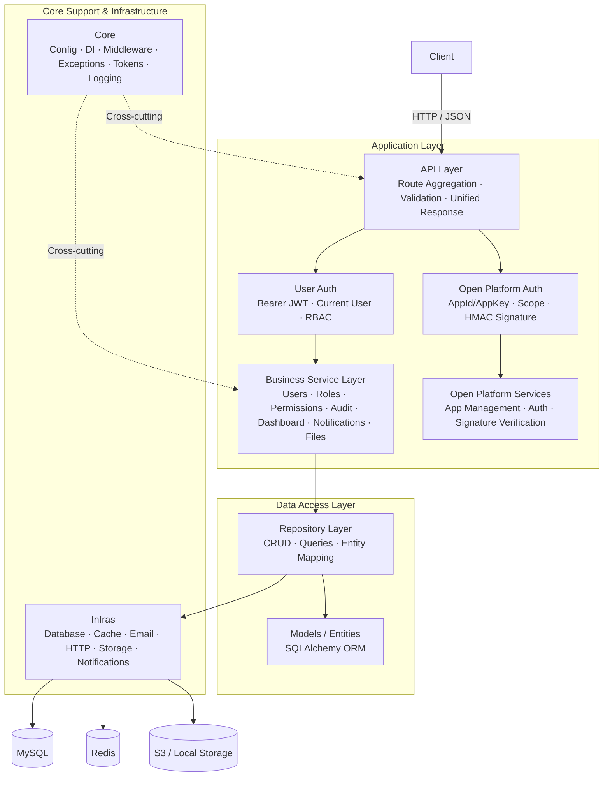
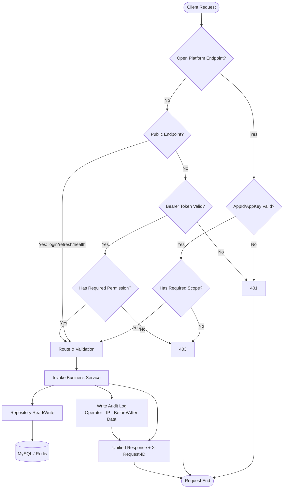
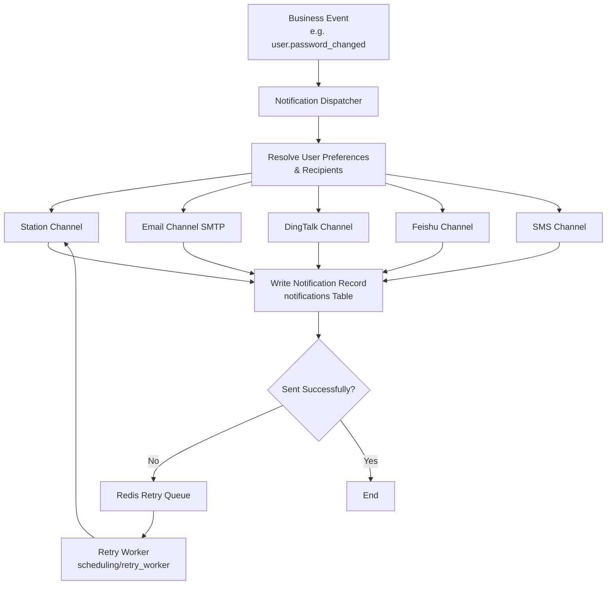
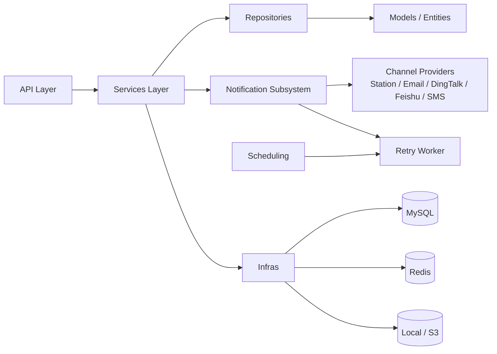

[中文](README.md) | English

# HanJiang Backend Service

## Project Introduction

HanJiang backend is a production-grade Python web application framework deeply built on FastAPI. It follows the standard three-layer architecture (API → Service → Repository) with dependency injection, and ships with JWT authentication, an RBAC permission model, audit logs, login logs, open platform AppId/AppKey authentication (with HanJiang-1 HMAC signature support), an event-driven multi-channel notification system, station messages, file management (local / S3-compatible), global search, and automatic seed data initialization — everything needed to power enterprise-grade RESTful APIs out of the box.

**Key Features:**

- Standard three-layer architecture + FastAPI native dependency injection, clear responsibilities and testable
- `@permission` decorator auto-registers route permissions, synced to the database on startup
- Dual-track authentication: user-side JWT + open platform HanJiang-1 HMAC signature
- Separate business audit logs and login logs, recording operator, IP, before/after data, with CSV export
- Event-driven multi-channel notifications (station / email / DingTalk / Feishu / SMS), per-user preferences and recipients, automatic retry on failure
- Health check integrated alerting: database / cache failures trigger notifications automatically (throttled)
- Unified storage abstraction (local / S3-compatible), zero code changes to switch backends
- Production-grade security (bcrypt password hashing, constant-time comparison, replay protection, email verification code for sensitive operations)

**Use Cases:**

- Enterprise internal admin system backend
- SaaS product server foundation
- Open platform / API gateway
- Full-stack project boilerplate

## Quick Start

### 1. Environment Requirements

| Tool | Version | Purpose |
|------|---------|---------|
| Python | >= 3.11 | Runtime |
| uv | latest (recommended) | Package management & dependency sync |
| MySQL | >= 8.0 | Primary database |
| Redis | >= 7.0 | Cache / login state / rate-limit counters / notification retry |

**Windows:**

```powershell
powershell -ExecutionPolicy ByPass -c "irm https://astral.sh/uv/install.ps1 | iex"
```

**Linux:**

```bash
curl -LsSf https://astral.sh/uv/install.sh | sh
```

**macOS:**

```bash
curl -LsSf https://astral.sh/uv/install.sh | sh
```

### 2. Clone the Project

```bash
git clone https://github.com/cross-lang/x-HanJiang.git
cd x-HanJiang/server
```

### 3. Sync & Install Dependencies

```bash
# Install all dependencies (production + development)
uv sync

# Install production dependencies only
uv sync --no-dev
```

### 4. Environment Configuration

The project supports both `.env` environment variables and `config.yaml` configuration files. Precedence: **environment variables > environment-specific YAML (config.{env}.yaml) > default YAML > code defaults**.

**Option 1: Use `.env` file (recommended)**

```bash
cp .env.example .env
```

**Option 2: Use `config.yaml` file**

```bash
cp config.yaml.example config.yaml
```

**Key configuration parameters:**

| Parameter | Env Variable | Description |
|-----------|--------------|-------------|
| `APP_ENV` | `APP_ENV` | Runtime environment: `development` / `testing` / `production` |
| `SERVER_HOST` | `SERVER_HOST` | Listen address, default `0.0.0.0` |
| `SERVER_PORT` | `SERVER_PORT` | Listen port, default `8000` |
| `AUTH_SECRET_KEY` | `AUTH_SECRET_KEY` | JWT signing key; must be overridden with a random string >= 32 chars in production |
| `MYSQL_HOST` | `MYSQL_HOST` | MySQL host |
| `MYSQL_PORT` | `MYSQL_PORT` | MySQL port, default `3306` |
| `MYSQL_USER` | `MYSQL_USER` | MySQL username |
| `MYSQL_PASSWORD` | `MYSQL_PASSWORD` | MySQL password |
| `MYSQL_DATABASE` | `MYSQL_DATABASE` | Database name, default `hanjiang` |
| `REDIS_HOST` | `REDIS_HOST` | Redis host |
| `REDIS_PORT` | `REDIS_PORT` | Redis port, default `6379` |
| `STORAGE_PROVIDER` | `STORAGE_PROVIDER` | Storage backend: `local` / `s3` |
| `NOTIFICATION_ENABLED` | `NOTIFICATION_ENABLED` | Enable the notification subsystem, default `true` |

> **Production**: inject sensitive configuration such as `AUTH_SECRET_KEY`, database password and Redis password via environment variables; never commit them to the repository.

> **Generate a secret key**:
> ```bash
> python -c "from src.utils.security import generate_secret_key; print(generate_secret_key())"
> ```

### 5. Start the Service

**Option 1: Local development with hot reload (recommended)**

```bash
uv run x-HanJiang
```

**Option 2: Docker deployment**

```bash
docker-compose up --build
```

**Option 3 (optional): Run Uvicorn directly**

```bash
uv run uvicorn src.main:app --host 0.0.0.0 --port 8000 --reload
```

After startup, visit:

- Swagger interactive docs: http://localhost:8000/docs
- ReDoc read-only docs: http://localhost:8000/redoc
- Health check: http://localhost:8000/api/v1/health

### 6. Common Engineering Commands

```bash
# Run unit tests (with coverage report)
uv run pytest tests/ -v --cov=src --cov-report=term-missing

# Format code
uv run ruff format src/ tests/

# Static code lint
uv run ruff check src/ tests/

# Type check
uv run mypy src/

# Dependency vulnerability scan
uv audit

# Export OpenAPI spec
uv run python scripts/export_openapi.py
```

### 7. Usage Examples

**Login to obtain tokens:**

```bash
curl -X POST http://localhost:8000/api/v1/auth/login \
  -H "Content-Type: application/json" \
  -d '{"username": "superadmin", "password": "admin@123456"}'
```

**Access a protected endpoint with the token:**

```bash
curl http://localhost:8000/api/v1/users \
  -H "Authorization: Bearer <access_token>"
```

**Call an open platform endpoint (plain AppId/AppKey):**

```bash
curl http://localhost:8000/api/open/v1/me \
  -H "X-App-Id: hj_xxx" \
  -H "X-App-Key: <app_key>"
```

> The default super admin account after first deployment is `superadmin` / `admin@123456`. Change it in production.

## Project Structure

```
server/
├── .env.example              # Environment variable template (fields match config.yaml.example)
├── config.yaml.example       # YAML configuration template
├── alembic/                  # Database migration management
│   ├── env.py                # Migration runtime environment
│   └── versions/             # Migration version scripts (5 versions currently)
├── docs/                     # Project docs (DDL SQL, Postman OpenAPI collection)
├── examples/                 # Usage examples
│   ├── basic_usage.py        # Basic usage
│   ├── custom_api.py         # Custom API example
│   └── openapi_client.py     # Open platform client example
├── logs/                     # Runtime log output
├── scripts/                  # Engineering scripts
│   ├── init_db.py            # Database initialization
│   └── export_openapi.py     # OpenAPI spec export
├── src/                      # Core business code
│   ├── main.py               # App entry (app factory, lifespan, middleware wiring, CLI args)
│   ├── api/                  # API route layer
│   │   ├── v1/               # User-facing v1 routes (JWT auth, /api/v1/...)
│   │   │   ├── auth.py       # Auth (login / refresh / logout)
│   │   │   ├── user.py       # User management (CRUD / import-export)
│   │   │   ├── profile.py    # Profile (info / password / menus / notification prefs)
│   │   │   ├── role.py       # Role management & permission binding
│   │   │   ├── permission.py # Permission management
│   │   │   ├── audit.py      # Audit logs + login logs (with export)
│   │   │   ├── dashboard.py  # Dashboard stats
│   │   │   ├── file.py       # File management (upload / list / download / delete)
│   │   │   ├── notification.py # Notification mgmt (records/stats/manual send + system channel configs/monitor/channel test)
│   │   │   ├── alert.py      # System alerts (webhook / broadcast)
│   │   │   ├── maintenance.py # System maintenance notices
│   │   │   ├── station.py    # Station messages (unread count / list / read)
│   │   │   ├── openapi_app.py # Open platform app management
│   │   │   ├── global_search.py # Global search
│   │   │   └── health.py     # Health check & version info
│   │   ├── open/             # Open platform routes (AppId/AppKey auth, /api/open/v1/...)
│   │   │   └── v1/
│   │   │       ├── health.py # Health check & version
│   │   │       ├── app.py    # Current app info
│   │   │       └── user.py   # Open platform user management (scope-gated)
│   │   ├── api_permission_decorator.py # @permission decorator + permission scan & sync
│   │   ├── openapi_scope_decorator.py  # @app_scope decorator + scope scan & sync
│   │   ├── dependencies.py   # DI dependency functions
│   │   ├── response.py       # Unified response wrapper
│   │   └── router.py         # Route aggregation & registration
│   ├── constants/            # Business constants & enums (ModuleCode, BaseEnum, etc.)
│   ├── core/                 # Core support modules
│   │   ├── config.py         # Config loading (env / yaml merged)
│   │   ├── exceptions.py     # Custom exceptions & global handlers
│   │   ├── logger.py         # Logging setup (loguru, JSON / console)
│   │   ├── middleware.py     # Middleware (request ID, logging, exception, CORS, rate limit)
│   │   ├── seed.py           # Seed data initialization
│   │   └── tokens.py         # JWT token issue & verification
│   ├── infras/               # Infrastructure layer
│   │   ├── database.py       # DB connection pool & session factory
│   │   ├── cache.py          # Redis cache
│   │   ├── email.py          # Email sending
│   │   ├── http.py           # HTTP client
│   │   ├── notification.py   # Notification channel provider registry
│   │   └── storage.py        # Storage abstraction (local / S3)
│   ├── models/               # SQLAlchemy ORM entities
│   │   └── entities/         # Entity definitions (users / roles / permissions / audit / notifications / apps, etc.)
│   ├── notification/         # Notification subsystem
│   │   ├── bootstrap.py      # Notification system bootstrap (lifespan registration)
│   │   ├── dispatcher.py     # Event dispatcher
│   │   ├── retry.py          # Failure retry logic
│   │   ├── template.py       # Notification template rendering
│   │   └── notification_decorators.py # Notification trigger decorators
│   ├── repositories/         # Data access layer (Repository pattern)
│   ├── scheduling/           # Scheduled tasks
│   │   └── retry_worker.py   # Notification retry worker (polls Redis retry queue)
│   ├── schemas/              # Pydantic request / response DTOs
│   ├── services/             # Business logic layer (Service pattern)
│   ├── utils/                # Utilities (security, etc.)
│   └── __init__.py
├── statics/                   # Local file storage directory (when storage.provider=local)
├── tests/                    # Unit tests
├── Dockerfile                # Multi-stage build image
├── docker-compose.yml        # Docker Compose orchestration (app + mysql + redis)
├── pyproject.toml            # Project config & dependency declaration
└── uv.lock                   # Lock file (reproducible builds)
```

## System Architecture

### Layered Architecture


```mermaid
flowchart TB
  Client[Client] -->|HTTP / JSON| API[API Layer<br/>Route Aggregation · Validation · Unified Response]

  subgraph Application[Application Layer]
    API --> Auth[User Auth<br/>Bearer JWT · Current User · RBAC]
    API --> OpenAuth[Open Platform Auth<br/>AppId/AppKey · Scope · HMAC Signature]
    Auth --> Service[Business Service Layer<br/>Users · Roles · Permissions · Audit · Dashboard · Notifications · Files]
    OpenAuth --> OpenService[Open Platform Services<br/>App Management · Auth · Signature Verification]
  end

  subgraph Data[Data Access Layer]
    Service --> Repository[Repository Layer<br/>CRUD · Queries · Entity Mapping]
    Repository --> Entity[Models / Entities<br/>SQLAlchemy ORM]
  end

  subgraph Support[Core Support & Infrastructure]
    Core[Core<br/>Config · DI · Middleware · Exceptions · Tokens · Logging]
    Infra[Infras<br/>Database · Cache · Email · HTTP · Storage · Notifications]
  end

  Core -.Cross-cutting.-> API
  Core -.Cross-cutting.-> Service
  Repository --> Infra
  Infra --> DB[(MySQL)]
  Infra --> Redis[(Redis)]
  Infra --> OSS[(S3 / Local Storage)]
```

### Core Business Flows

#### User Login & Authorization


```mermaid
flowchart TD
  Start([Client Request]) --> Open{Open Platform Endpoint?}
  Open -->|Yes| AppKey{AppId/AppKey Valid?}
  AppKey -->|No| Unauthorized[401]
  AppKey -->|Yes| Scope{Has Required Scope?}
  Scope -->|No| Forbidden[403]
  Scope -->|Yes| Route[Route & Validation]
  Open -->|No| Public{Public Endpoint?}
  Public -->|Yes: login/refresh/health| Route
  Public -->|No| Token{Bearer Token Valid?}
  Token -->|No| Unauthorized
  Token -->|Yes| Permission{Has Required Permission?}
  Permission -->|No| Forbidden
  Permission -->|Yes| Route

  Route --> Service[Invoke Business Service]
  Service --> Repository[Repository Read/Write]
  Repository --> Database[(MySQL / Redis)]
  Service --> Audit[Write Audit Log<br/>Operator · IP · Before/After Data]
  Service --> Response[Unified Response + X-Request-ID]
  Audit --> Response
  Unauthorized --> End([Request End])
  Forbidden --> End
  Response --> End
```

#### Notification Dispatch Flow


```mermaid
flowchart TD
  A[Business Event<br/>e.g. user.password_changed] --> B[Notification Dispatcher]
  B --> C[Resolve User Preferences<br/>& Recipients]
  C --> D[Station Channel]
  C --> E[Email Channel SMTP]
  C --> F[DingTalk Channel]
  C --> G[Feishu Channel]
  C --> H[SMS Channel]
  D --> I[Write Notification Record<br/>notifications Table]
  E --> I
  F --> I
  G --> I
  H --> I
  I --> J{Sent Successfully?}
  J -->|No| K[Redis Retry Queue]
  K --> L[Retry Worker<br/>scheduling/retry_worker]
  L --> D
  J -->|Yes| M[End]
```

#### Permission Auto-Registration

```mermaid
flowchart LR
  A[@permission Decorator on Routes] --> B[collect_permissions_from_app on Startup]
  B --> C[Scan app.routes for Permission Metadata]
  C --> D[Upsert to permissions Table]
  D --> E[In DB but Not in Routes → is_deprecated=True]
```

### Module Dependency Diagram


```mermaid
graph LR
  API[API Layer] --> SVC[Services Layer]
  SVC --> REPO[Repositories]
  REPO --> ENT[Models / Entities]
  SVC --> DISP[Notification Subsystem]
  DISP --> CH[Channel Providers<br/>Station / Email / DingTalk / Feishu / SMS]
  DISP --> RETRY[Retry Worker]
  SVC --> INFRA[Infras]
  INFRA --> DB[(MySQL)]
  INFRA --> RD[(Redis)]
  INFRA --> OSS[(Local / S3)]
  SCHED[Scheduling] --> RETRY
```

## Tech Stack

| Category | Technology | Description |
|----------|------------|-------------|
| **Language** | Python 3.11+ | Strongly typed, async friendly |
| **Web Framework** | FastAPI | High-performance async web framework |
| **ASGI Server** | Uvicorn / Gunicorn | Dev hot reload / production multi-process |
| **Validation** | Pydantic v2 | Data models & validation |
| **ORM** | SQLAlchemy 2.0 | Python ORM toolkit |
| **Migration** | Alembic | Database versioning |
| **Data Storage** | MySQL 8.0 | Relational database |
| **Cache** | Redis 7 | Tokens, login state, rate-limit counters, notification retry queue |
| **Object Storage** | boto3 | S3-compatible (Qiniu / AWS S3 / MinIO) |
| **Message Queue** | No standalone MQ | In-process event dispatch + Redis retry queue (notification subsystem) |
| **Logging** | Loguru | Modern logging (JSON / console) |
| **Auth** | PyJWT + bcrypt | JWT issue/verify + password hashing |
| **Encryption** | cryptography (Fernet) | AppKey encryption, HMAC signing |
| **Rate Limiting** | SlowAPI | Request rate limiting |
| **HTTP Client** | httpx | Async HTTP (notification channels) |
| **Config** | pydantic-settings | Pydantic-based config loading |
| **Package Manager** | uv | High-performance Python package manager |
| **Lint** | Ruff | Linting & formatting |
| **Type Check** | mypy | Static type checking |
| **Testing** | pytest | Unit tests (with coverage) |
| **Deployment** | Docker / Docker Compose | Container deployment & orchestration |

## API Documentation

Once the backend is running:

| Doc Type | URL | Description |
|----------|-----|-------------|
| Swagger UI | http://localhost:8000/docs | Interactive debugging docs |
| ReDoc | http://localhost:8000/redoc | Read-only API docs |
| OpenAPI JSON | http://localhost:8000/openapi.json | Standard OpenAPI 3.x spec |

### Core Endpoints

**Health (public):**

| Method | Path | Description |
|--------|------|-------------|
| GET | `/api/v1/health` | Health check (DB/cache connectivity, auto-alert on failure) |
| GET | `/api/v1/version` | Version info |

**Auth:**

| Method | Path | Description | Auth |
|--------|------|-------------|------|
| POST | `/api/v1/auth/login` | Login (username/email + password) | Public |
| POST | `/api/v1/auth/refresh` | Refresh tokens | Public |
| POST | `/api/v1/auth/logout` | Logout (clear Redis login state) | JWT |

**Users:**

| Method | Path | Description |
|--------|------|-------------|
| POST | `/api/v1/users` | Create user (multi-role) |
| GET | `/api/v1/users` | User list (paged / keyword / status) |
| GET | `/api/v1/users/export` | Export users (CSV) |
| POST | `/api/v1/users/import` | Bulk import users (CSV) |
| GET | `/api/v1/users/{id}` | User detail |
| POST | `/api/v1/users/{id}/update` | Update user |
| POST | `/api/v1/users/{id}/reset-password` | Reset user password |
| POST | `/api/v1/users/{id}/delete` | Delete user (soft) |

**Profile:**

| Method | Path | Description |
|--------|------|-------------|
| GET | `/api/v1/profile/me` | Current user info (roles & permissions) |
| PUT | `/api/v1/profile/me` | Update personal info |
| POST | `/api/v1/profile/change-password` | Change password (old password + email code) |
| GET | `/api/v1/profile/menus` | Current user menu tree (permission-filtered) |
| GET | `/api/v1/profile/notification-preferences` | My notification preferences |
| PUT | `/api/v1/profile/notification-preferences` | Update my notification preferences |
| GET | `/api/v1/profile/notification-recipients` | My notification recipients |
| POST | `/api/v1/profile/notification-recipients` | Add recipient |
| PUT | `/api/v1/profile/notification-recipients/{id}` | Update recipient |
| DELETE | `/api/v1/profile/notification-recipients/{id}` | Delete recipient |
| POST | `/api/v1/profile/send-verify-code` | Send email verification code |
| POST | `/api/v1/profile/update-phone` | Update phone (email code verification) |
| POST | `/api/v1/profile/update-email` | Update email (old email code verification) |

**Roles:**

| Method | Path | Description |
|--------|------|-------------|
| GET | `/api/v1/roles` | Role list (paged / keyword / type / status) |
| POST | `/api/v1/roles` | Create role |
| GET | `/api/v1/roles/{id}` | Role detail |
| POST | `/api/v1/roles/{id}/update` | Update role |
| POST | `/api/v1/roles/{id}/delete` | Delete role (soft) |
| GET | `/api/v1/roles/{id}/permissions` | Role permissions (with details) |
| POST | `/api/v1/roles/{id}/permissions` | Bind permission |
| POST | `/api/v1/roles/{id}/permissions/{pid}/unbind` | Unbind permission |

**Permissions:**

| Method | Path | Description |
|--------|------|-------------|
| GET | `/api/v1/permissions/meta` | Permission metadata (module/operation list) |
| GET | `/api/v1/permissions` | Permission list (paged / keyword / module / operation) |
| POST | `/api/v1/permissions` | Create permission |
| GET | `/api/v1/permissions/{id}` | Permission detail |
| POST | `/api/v1/permissions/{id}/update` | Update permission |
| POST | `/api/v1/permissions/{id}/delete` | Delete permission |

**Audit & Logs:**

| Method | Path | Description |
|--------|------|-------------|
| GET | `/api/v1/audit/logs` | Business audit log list |
| GET | `/api/v1/audit/logs/export` | Export audit logs (CSV) |
| GET | `/api/v1/audit/logs/{id}` | Audit log detail |
| GET | `/api/v1/audit/login-logs` | Login log list |
| GET | `/api/v1/audit/login-logs/export` | Export login logs (CSV) |
| GET | `/api/v1/audit/login-logs/{id}` | Login log detail |

**Files:**

| Method | Path | Description |
|--------|------|-------------|
| POST | `/api/v1/files/upload` | Upload file (folder grouping) |
| GET | `/api/v1/files` | File list (paged / folder / keyword) |
| GET | `/api/v1/files/{file_path:path}` | Get / download file |
| DELETE | `/api/v1/files/{file_id}` | Delete file |

**Notifications:**

| Method | Path | Description |
|--------|------|-------------|
| POST | `/api/v1/notifications/send` | Manually send notification (by event or recipients) |
| GET | `/api/v1/notifications` | Notification list (paged / event / channel / status) |
| GET | `/api/v1/notifications/stats` | Notification stats (success/failed/pending) |
| GET | `/api/v1/notifications/{id}` | Notification detail |

**System Notification Configs:**

| Method | Path | Description |
|--------|------|-------------|
| GET | `/api/v1/admin/notification-configs` | All system notification channel configs |
| PUT | `/api/v1/admin/notification-configs/{channel}` | Update channel config (hot reload) |
| GET | `/api/v1/admin/notification-configs/monitor/system` | System monitor status |
| POST | `/api/v1/admin/notification-configs/{channel}/test` | Send channel test message |

**System Alerts:**

| Method | Path | Description |
|--------|------|-------------|
| POST | `/api/v1/alerts` | Send system alert (external monitoring webhook) |
| POST | `/api/v1/alerts/broadcast` | Broadcast alert (admin, all active users) |

**Maintenance:**

| Method | Path | Description |
|--------|------|-------------|
| POST | `/api/v1/maintenance/notify` | Send maintenance notice (admin, all active users) |

**Station Messages:**

| Method | Path | Description |
|--------|------|-------------|
| GET | `/api/v1/station/messages/unread-count` | Unread message count |
| GET | `/api/v1/station/messages` | My message list |
| POST | `/api/v1/station/messages/{msg_id}/read` | Mark one message read |
| POST | `/api/v1/station/messages/read-all` | Mark all read |

**Dashboard:**

| Method | Path | Description |
|--------|------|-------------|
| GET | `/api/v1/dashboard/stats` | Dashboard stats (cards, trends, recent records) |
| GET | `/api/v1/dashboard/my-activity` | My recent activity (login + operation logs) |

**Open Platform App Management:**

| Method | Path | Description |
|--------|------|-------------|
| GET | `/api/v1/admin/apps/scopes` | Available scopes |
| POST | `/api/v1/admin/apps` | Create open app (returns AppId + AppKey) |
| GET | `/api/v1/admin/apps` | App list |
| GET | `/api/v1/admin/apps/{app_id}` | App detail |
| PUT | `/api/v1/admin/apps/{app_id}` | Update app |
| PUT | `/api/v1/admin/apps/{app_id}/scopes` | Update app scopes |
| POST | `/api/v1/admin/apps/{app_id}/rotate-key` | Rotate AppKey |
| DELETE | `/api/v1/admin/apps/{app_id}` | Delete app |

**Global Search:**

| Method | Path | Description |
|--------|------|-------------|
| GET | `/api/v1/search?keyword=` | Global search (users/roles/permissions/apps/files, permission-filtered) |

**Open Platform Endpoints (AppId/AppKey auth):**

| Method | Path | Description | Scope |
|--------|------|-------------|-------|
| GET | `/api/open/v1/health` | Health check | Public |
| GET | `/api/open/v1/version` | Version info | Public |
| GET | `/api/open/v1/me` | Current app info | Public |
| POST | `/api/open/v1/users` | Create user | `user:write` |
| GET | `/api/open/v1/users` | User list | `user:read` |
| GET | `/api/open/v1/users/{id}` | User detail | `user:read` |
| PATCH | `/api/open/v1/users/{id}` | Update user | `user:write` |
| DELETE | `/api/open/v1/users/{id}` | Delete user | `user:write` |

### Authorization

- **User endpoints**: JWT Bearer Token + `@permission` decorator auto-registration + role/permission checks; permission changes are auto-synced on startup (stale permissions marked `is_deprecated`)
- **Open platform endpoints**: AppId + AppKey (plain mode) or HanJiang-1 HMAC signature, access controlled by scopes declared via `@app_scope`; scopes are also auto-synced on startup

## Storage

### Database

- **Type**: MySQL 8.0+
- **Config**: via `.env` (`MYSQL_HOST`, `MYSQL_PORT`, `MYSQL_USER`, `MYSQL_PASSWORD`, `MYSQL_DATABASE`, `MYSQL_POOL_SIZE`)
- **Migrations**: Alembic; current versions cover users, notification records, user notification configs, open platform apps and other core tables
- **Note**: inject the database password via environment variables in production; never commit it

### Cache

- **Type**: Redis 7+
- **Usage**: rate limiting, login state (instant invalidation on logout), email verification codes, notification retry queue
- **Config**: via `.env` (`REDIS_HOST`, `REDIS_PORT`, `REDIS_PASSWORD`, `REDIS_DB`)

### File Storage

Two modes, switch via `storage.provider` / `STORAGE_PROVIDER`:

| Mode | Config | Use Case |
|------|--------|----------|
| `local` | `STORAGE_LOCAL_BASE_DIR=statics` | Local dev, small deployments |
| `s3` | `STORAGE_S3_ENDPOINT_URL` etc. | Production, object storage (Qiniu / AWS S3 / MinIO) |

**S3 parameters:**

| Parameter | Description |
|-----------|-------------|
| `STORAGE_S3_ENDPOINT_URL` | S3-compatible endpoint (Qiniu Kodo: `https://s3.<region>.qiniucs.com`) |
| `STORAGE_S3_ACCESS_KEY` | Access key |
| `STORAGE_S3_SECRET_KEY` | Secret key |
| `STORAGE_S3_BUCKET` | Bucket name |
| `STORAGE_S3_REGION` | Region |
| `STORAGE_S3_PREFIX` | Object prefix (default `uploads`) |
| `STORAGE_S3_PUBLIC_URL` | Public URL (optional) |
| `STORAGE_S3_USE_SSL` | Enable HTTPS |

> **Note**: inject S3 keys via environment variables in production; switching storage backends only requires changing the `provider` field with zero business code changes.

## License

This project is open-sourced under the [MIT License](../LICENSE).

## References

| Technology | Official Docs |
|------------|---------------|
| Python | https://www.python.org/ |
| uv | https://docs.astral.sh/uv/ |
| FastAPI | https://fastapi.tiangolo.com/ |
| Uvicorn | https://www.uvicorn.org/ |
| SQLAlchemy | https://docs.sqlalchemy.org/ |
| Alembic | https://alembic.sqlalchemy.org/ |
| Pydantic | https://docs.pydantic.dev/ |
| MySQL | https://dev.mysql.com/doc/ |
| Redis | https://redis.io/docs/ |
| Loguru | https://loguru.readthedocs.io/ |
| Ruff | https://docs.astral.sh/ruff/ |
| mypy | https://mypy.readthedocs.io/ |
| Docker | https://docs.docker.com/ |

## Contact

- **Author**: John Young (夜雨诗来)
- **Email**: john.young@foxmail.com
- **Gitee**: https://gitee.com/yeyushilai
- **GitHub**: https://github.com/yeyushilai
- **Project**: https://github.com/cross-lang/x-HanJiang
