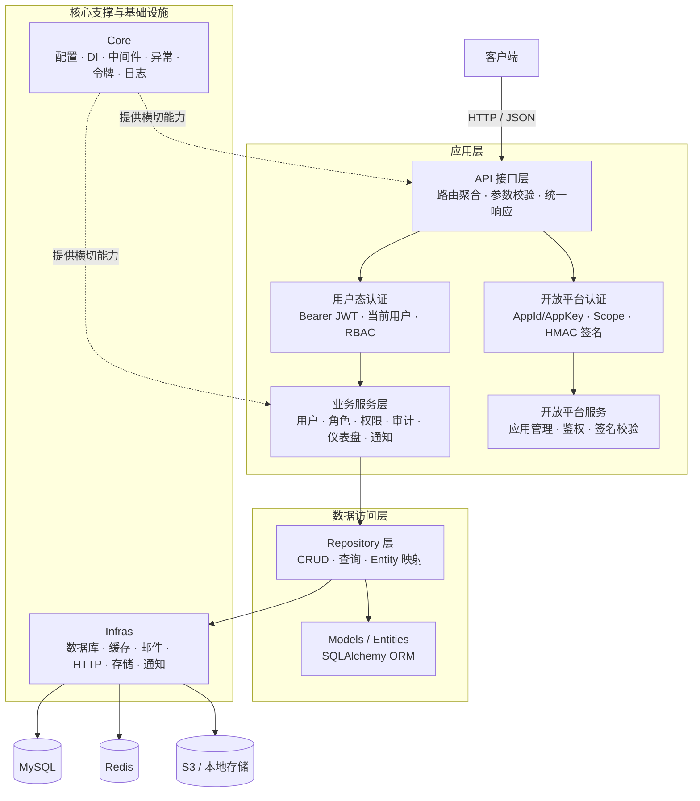
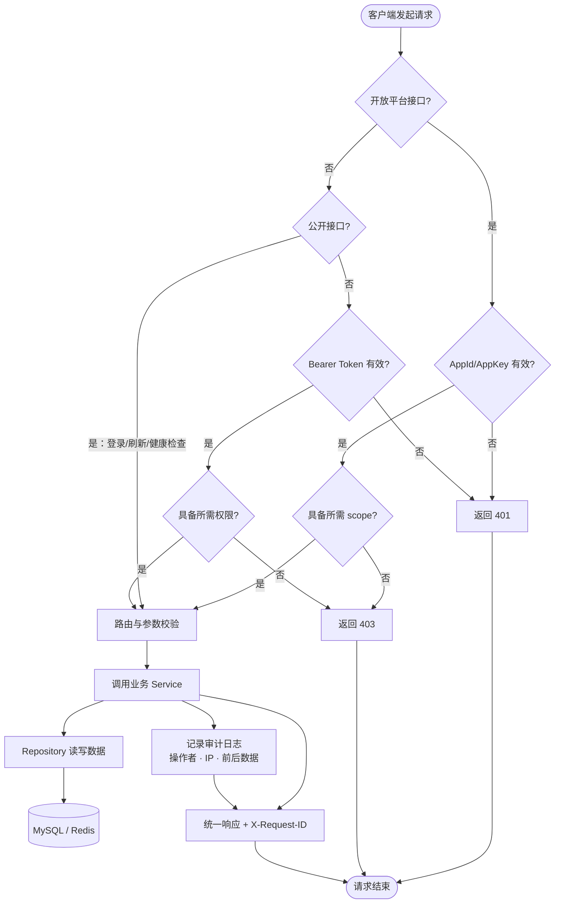

[English](README.en.md) | 中文

# 汉江（HanJiang）后端服务

## 项目简介

汉江（HanJiang）后端是基于 FastAPI 深度封装的 Python Web 应用框架，遵循三层架构（API → Service → Repository）与依赖注入设计，内置 JWT 认证、RBAC 权限模型、审计日志、登录日志、开放平台 AppId/AppKey 鉴权（支持 HanJiang-1 HMAC 签名升级）、事件驱动通知系统、S3 兼容对象存储与种子数据自动初始化，开箱即用支撑企业级 RESTful API 服务。

**核心特征：**
- 标准三层架构 + FastAPI 原生 DI，职责清晰、可测试
- `@permission` 装饰器自动扫描路由注册权限，启动时同步到数据库
- 用户态 JWT 认证 + 开放平台 HMAC 签名双轨鉴权
- 业务审计日志与登录日志分离，记录操作者、IP、前后数据
- 事件驱动多渠道通知（邮件/钉钉/飞书/短信）
- 统一存储抽象（本地 / S3 兼容），业务代码零改动切换
- 生产级安全（密码 bcrypt 哈希、常量时间比对、防重放）

**适用场景：**
- 企业内部管理系统后端
- SaaS 产品服务端基座
- 开放平台 / API 网关
- 前后端分离项目脚手架

## 快速开始

### 1. 环境要求

| 工具 | 版本要求 |
|------|----------|
| Python | >= 3.11 |
| uv | latest（推荐） |
| MySQL | >= 8.0 |
| Redis | >= 7.0 |

**Windows：**
```powershell
powershell -ExecutionPolicy ByPass -c "irm https://astral.sh/uv/install.ps1 | iex"
```

**Linux：**
```bash
curl -LsSf https://astral.sh/uv/install.sh | sh
```

**macOS：**
```bash
curl -LsSf https://astral.sh/uv/install.sh | sh
```

### 2. 项目代码克隆

```bash
git clone https://github.com/cross-lang/x-HanJiang.git
cd x-HanJiang/server
```

### 3. 依赖同步安装

```bash
# 安装所有依赖（生产 + 开发）
uv sync

# 仅安装生产依赖
uv sync --no-dev
```

### 4. 环境配置

项目支持 `.env` 环境变量和 `config.yaml` 配置文件两种方式，配置优先级：**环境变量 > 环境特定 YAML > 默认 YAML > 代码默认值**。

**方式一：使用 `.env` 文件（推荐）**
```bash
cp .env.example .env
```

**方式二：使用 `config.yaml` 文件**
```bash
cp config.yaml.example config.yaml
```

**核心配置参数：**

| 参数 | 环境变量 | 说明 |
|------|----------|------|
| `APP_ENV` | `APP_ENV` | 运行环境：`development` / `testing` / `production` |
| `SERVER_HOST` | `server.host` | 监听地址，默认 `0.0.0.0` |
| `SERVER_PORT` | `server.port` | 监听端口，默认 `8000` |
| `AUTH_SECRET_KEY` | `auth.secret_key` | JWT 签名密钥，生产环境必须覆盖为 >= 32 字符随机串 |
| `MYSQL_HOST` | `database.host` | MySQL 主机地址 |
| `MYSQL_PORT` | `database.port` | MySQL 端口，默认 `3306` |
| `MYSQL_USER` | `database.user` | MySQL 用户名 |
| `MYSQL_PASSWORD` | `database.password` | MySQL 密码 |
| `MYSQL_DATABASE` | `database.database` | 数据库名，默认 `hanjiang` |
| `REDIS_HOST` | `redis.host` | Redis 主机地址 |
| `REDIS_PORT` | `redis.port` | Redis 端口，默认 `6379` |
| `STORAGE_PROVIDER` | `storage.provider` | 存储后端：`local` / `s3` |

> **生产环境**：建议通过环境变量注入 `AUTH_SECRET_KEY`、数据库密码等敏感配置。

> **密钥生成**：
> ```bash
> python -c "from src.utils.security import generate_secret_key; print(generate_secret_key())"
> ```

### 5. 服务启动

**方式一：本地开发热重载启动（推荐）**

```bash
uv run x-HanJiang
```

**方式二：Docker 容器部署**

```bash
docker-compose up --build
```

服务启动后访问：
- Swagger 交互式文档：http://localhost:8000/docs
- ReDoc 只读文档：http://localhost:8000/redoc
- 健康检查：http://localhost:8000/api/v1/health

### 6. 常用工程命令

```bash
# 运行单元测试（含覆盖率报告）
uv run pytest tests/ -v --cov=src --cov-report=term-missing

# 代码格式化
uv run ruff format src/ tests/

# 静态代码检查
uv run ruff check src/ tests/

# 类型检查
uv run mypy src/

# 导出 OpenAPI 规范
uv run python scripts/export_openapi.py
```

### 7. 使用方法示例

**登录获取令牌：**
```bash
curl -X POST http://localhost:8000/api/v1/auth/login \
  -H "Content-Type: application/json" \
  -d '{"username": "superadmin", "password": "admin@123456"}'
```

**携带令牌访问受保护接口：**
```bash
curl http://localhost:8000/api/v1/users \
  -H "Authorization: Bearer <access_token>"
```

**调用开放平台接口：**
```bash
curl http://localhost:8000/api/open/v1/me \
  -H "X-App-Id: hj_xxx" \
  -H "X-App-Key: <app_key>"
```

> 首次部署后默认超级管理员账号：`superadmin` / `admin@123456`，生产环境请务必修改。

## 项目结构

```
server/
├── .env.example              # 环境变量模板
├── config.yaml.example       # YAML 配置文件模板
├── alembic/                  # 数据库迁移管理
│   ├── env.py
│   └── versions/             # 迁移版本脚本
├── docs/                     # 项目文档
├── logs/                     # 运行日志输出
├── scripts/                  # 工程脚本
│   ├── init_db.py            # 数据库初始化
│   └── export_openapi.py    # OpenAPI 规范导出
├── src/                      # 核心业务代码
│   ├── main.py               # 应用入口（工厂函数、生命周期）
│   ├── api/                  # API 路由层
│   │   ├── v1/               # 用户态 v1 路由（JWT 鉴权）
│   │   │   ├── auth.py       # 认证（登录/刷新/当前用户/登出）
│   │   │   ├── user.py       # 用户管理 CRUD
│   │   │   ├── role.py       # 角色管理与权限绑定
│   │   │   ├── permission.py # 权限管理
│   │   │   ├── audit.py      # 业务审计日志 + 登录日志
│   │   │   ├── dashboard.py  # 仪表盘统计
│   │   │   ├── file.py       # 文件上传
│   │   │   ├── notification.py # 通知记录查询
│   │   │   ├── alert.py      # 系统告警
│   │   │   ├── maintenance.py # 系统维护通知
│   │   │   └── openapi_app.py # 开放平台应用管理
│   │   ├── open/             # 开放平台 v1 路由（AppId/AppKey 鉴权）
│   │   │   └── v1/
│   │   │       ├── health.py  # 健康检查与版本
│   │   │       ├── app.py    # 当前应用信息
│   │   │       └── user.py   # 开放平台用户查询
│   │   ├── permission_decorator.py # @permission 装饰器 + 路由扫描注册
│   │   ├── dependencies.py   # DI 依赖函数
│   │   ├── response.py       # 统一响应封装
│   │   └── router.py         # 路由聚合注册
│   ├── constants/            # 业务常量与枚举
│   │   ├── base.py           # 可描述枚举基类
│   │   ├── constants.py      # 全局常量
│   │   └── enums.py          # 业务枚举（ModuleCode 等）
│   ├── core/                 # 核心支撑模块
│   │   ├── config.py         # 配置加载
│   │   ├── exceptions.py     # 自定义异常与全局处理
│   │   ├── logger.py         # 日志初始化（loguru）
│   │   ├── middleware.py     # 中间件（请求ID、日志、CORS、限流）
│   │   ├── seed.py           # 种子数据初始化
│   │   └── tokens.py         # JWT 令牌签发与验证
│   ├── infras/               # 基础设施层
│   │   ├── database.py       # 数据库连接池与会话工厂
│   │   ├── cache.py          # Redis 缓存
│   │   ├── email.py          # 邮件发送
│   │   ├── http.py           # HTTP 客户端
│   │   ├── notification.py   # 通知渠道 Provider
│   │   └── storage.py        # 存储抽象层（本地/S3）
│   ├── models/               # SQLAlchemy ORM 实体
│   │   └── entities/
│   ├── repositories/         # 数据访问层（Repository 模式）
│   ├── schemas/              # Pydantic 请求/响应 DTO
│   ├── services/             # 业务逻辑层（Service 模式）
│   └── utils/                # 工具函数
│       └── security.py       # 安全工具（密码哈希/HMAC/密钥生成）
├── tests/                    # 测试代码
├── Dockerfile
├── docker-compose.yml
├── pyproject.toml
└── LICENSE
```

## 系统架构

### 系统分层架构



### 核心业务流程：用户登录与鉴权



### 权限自动注册流程

```mermaid
flowchart LR
  A[路由函数<br/>@permission 装饰器] --> B[启动时<br/>collect_permissions_from_app]
  B --> C[扫描 app.routes<br/>提取权限元数据]
  C --> D[upsert 到<br/>permissions 表]
  D --> E[表里有但路由里没有<br/>→ is_deprecated=True]
```

## 技术栈

| 分类 | 技术 | 说明 |
|------|------|------|
| **开发语言** | Python 3.11+ | 强类型、异步友好 |
| **Web 框架** | FastAPI | 高性能异步 Web 框架 |
| **ASGI 服务器** | Uvicorn | 轻量级 ASGI 服务器 |
| **ORM** | SQLAlchemy 2.0 | Python ORM 工具包 |
| **数据库迁移** | Alembic | 数据库版本迁移 |
| **数据校验** | Pydantic v2 | 数据模型与校验 |
| **配置管理** | pydantic-settings | 基于 Pydantic 的配置 |
| **数据存储** | MySQL 8.0 | 关系型数据库 |
| **缓存** | Redis 7 | 令牌、登录态、限流计数 |
| **对象存储** | boto3 | S3 兼容（七牛/AWS S3/MinIO） |
| **日志** | Loguru | 现代化日志库 |
| **认证** | PyJWT + bcrypt | JWT 签发验证 + 密码哈希 |
| **加密** | cryptography (Fernet) | AppKey 加密存储、HMAC 签名 |
| **限流** | SlowAPI | 请求限流中间件 |
| **HTTP 客户端** | httpx | 异步 HTTP（通知渠道调用） |
| **包管理器** | uv | 高性能 Python 包管理器 |
| **代码检查** | Ruff | 代码检查与格式化 |
| **类型检查** | mypy | 静态类型检查 |
| **测试框架** | pytest | 单元测试 |
| **容器化** | Docker / Docker Compose | 容器部署与编排 |

## API 文档说明

后端启动后可访问：

| 文档类型 | 地址 | 说明 |
|----------|------|------|
| Swagger UI | http://localhost:8000/docs | 交互式调试文档 |
| ReDoc | http://localhost:8000/redoc | 只读 API 文档 |
| OpenAPI JSON | http://localhost:8000/openapi.json | 标准 OpenAPI 3.x 规范文件 |

### 核心接口清单

**健康检查（公开）：**

| 方法 | 路径 | 说明 |
|------|------|------|
| GET | `/api/v1/health` | 健康检查（数据库/缓存连通状态） |
| GET | `/api/v1/version` | 版本信息 |

**认证：**

| 方法 | 路径 | 说明 | 鉴权 |
|------|------|------|------|
| POST | `/api/v1/auth/login` | 用户登录 | 公开 |
| POST | `/api/v1/auth/refresh` | 刷新令牌 | 公开 |
| GET | `/api/v1/auth/me` | 当前用户信息 | 需鉴权 |
| POST | `/api/v1/auth/logout` | 退出登录 | 需鉴权 |

**用户管理：**

| 方法 | 路径 | 说明 |
|------|------|------|
| POST | `/api/v1/users` | 创建用户（支持多角色） |
| GET | `/api/v1/users` | 用户列表（分页/关键字/状态过滤） |
| GET | `/api/v1/users/{id}` | 用户详情 |
| POST | `/api/v1/users/{id}/update` | 更新用户 |
| POST | `/api/v1/users/{id}/delete` | 删除用户 |
| POST | `/api/v1/users/{id}/reset-password` | 重置密码 |

**角色管理：**

| 方法 | 路径 | 说明 |
|------|------|------|
| POST | `/api/v1/roles` | 创建角色 |
| GET | `/api/v1/roles` | 角色列表 |
| GET | `/api/v1/roles/{id}` | 角色详情 |
| POST | `/api/v1/roles/{id}/update` | 更新角色 |
| POST | `/api/v1/roles/{id}/delete` | 删除角色 |
| GET | `/api/v1/roles/{id}/permissions` | 角色权限列表 |
| POST | `/api/v1/roles/{id}/permissions` | 绑定权限 |

**权限管理：**

| 方法 | 路径 | 说明 |
|------|------|------|
| GET | `/api/v1/permissions` | 权限列表（自动扫描注册，过滤已废弃） |

**审计与日志：**

| 方法 | 路径 | 说明 |
|------|------|------|
| GET | `/api/v1/audit/logs` | 业务审计日志列表 |
| GET | `/api/v1/audit/logs/{id}` | 审计日志详情 |
| GET | `/api/v1/audit/login-logs` | 登录日志列表 |
| GET | `/api/v1/audit/login-logs/{id}` | 登录日志详情 |

**仪表盘：**

| 方法 | 路径 | 说明 |
|------|------|------|
| GET | `/api/v1/dashboard/stats` | 仪表盘统计（卡片指标、趋势图表、最近记录） |

**开放平台应用管理：**

| 方法 | 路径 | 说明 |
|------|------|------|
| POST | `/api/v1/openapi-apps` | 创建应用（返回 AppId + AppKey） |
| GET | `/api/v1/openapi-apps` | 应用列表 |
| GET | `/api/v1/openapi-apps/{id}` | 应用详情 |
| POST | `/api/v1/openapi-apps/{id}/update` | 更新应用 |
| POST | `/api/v1/openapi-apps/{id}/delete` | 删除应用 |

**开放平台接口（AppId/AppKey 鉴权）：**

| 方法 | 路径 | 说明 |
|------|------|------|
| GET | `/api/open/v1/health` | 健康检查 |
| GET | `/api/open/v1/version` | 版本信息 |
| GET | `/api/open/v1/me` | 当前应用信息 |
| GET | `/api/open/v1/users` | 用户查询 |

### 权限控制说明

- **用户态接口**：JWT Bearer Token + `@permission` 装饰器自动注册权限 + 角色/权限校验
- **开放平台接口**：AppId + AppKey（明文模式）或 HanJiang-1 HMAC 签名认证，通过 scope 控制接口访问范围

## 存储配置说明

### 数据库存储

- **类型**：MySQL 8.0+
- **配置**：通过 `.env` 配置 `MYSQL_HOST`、`MYSQL_PORT`、`MYSQL_USER`、`MYSQL_PASSWORD`、`MYSQL_DATABASE`
- **迁移**：使用 Alembic 管理数据库版本

### 缓存

- **类型**：Redis 7+
- **用途**：限流计数、登录态缓存、通知重试队列
- **配置**：通过 `.env` 配置 `REDIS_HOST`、`REDIS_PORT`、`REDIS_PASSWORD`

### 文件存储

支持两种模式，通过 `storage.provider` 切换：

| 模式 | 配置 | 适用场景 |
|------|------|----------|
| `local` | `STORAGE_LOCAL_BASE_DIR=static` | 本地开发、小型部署 |
| `s3` | `STORAGE_S3_ENDPOINT_URL` 等 | 生产环境、对象存储（七牛/AWS S3/MinIO） |

**S3 配置参数：**

| 参数 | 说明 |
|------|------|
| `s3.endpoint_url` | S3 兼容服务地址 |
| `s3.access_key` | 访问密钥 |
| `s3.secret_key` | 秘密密钥 |
| `s3.bucket` | 存储桶名称 |
| `s3.region` | 存储区域 |
| `s3.public_url` | 公开访问域名（可选） |

> **注意**：生产环境建议通过环境变量注入 S3 密钥，避免写入版本库。

## 许可证

本项目基于 [MIT License](LICENSE) 开源。

## 参考资料

| 技术 | 官方文档 |
|------|----------|
| Python | https://www.python.org/ |
| FastAPI | https://fastapi.tiangolo.com/ |
| SQLAlchemy | https://docs.sqlalchemy.org/ |
| Alembic | https://alembic.sqlalchemy.org/ |
| Pydantic | https://docs.pydantic.dev/ |
| Redis | https://redis.io/docs/ |
| uv | https://docs.astral.sh/uv/ |
| Loguru | https://loguru.readthedocs.io/ |
| Docker | https://docs.docker.com/ |

## 联系方式

- **作者**：John Young（夜雨诗来）
- **邮箱**：john.young@foxmail.com
- **Gitee**：https://gitee.com/yeyushilai
- **GitHub**：https://github.com/yeyushilai
- **项目地址**：https://github.com/cross-lang/x-HanJiang