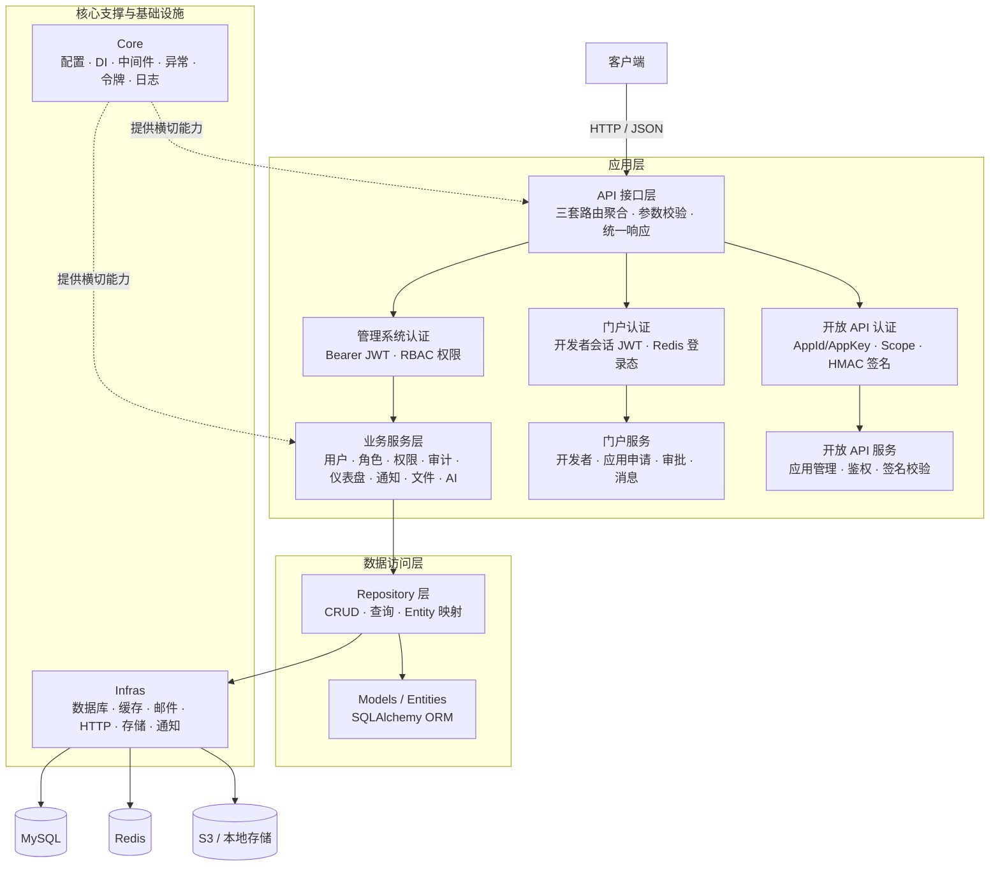
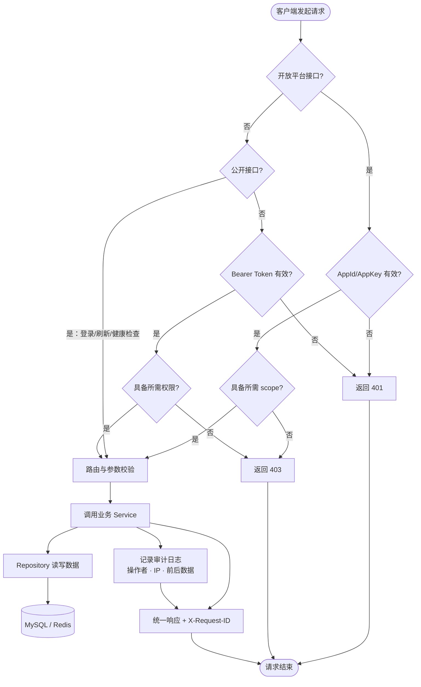
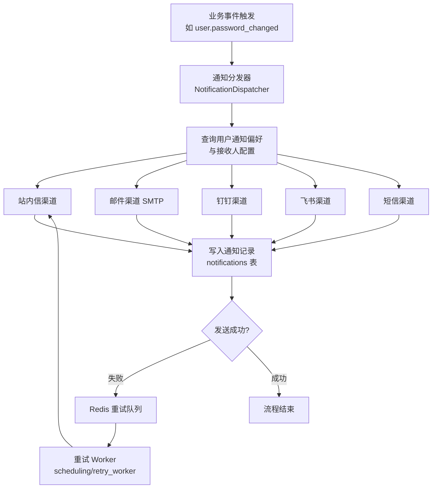
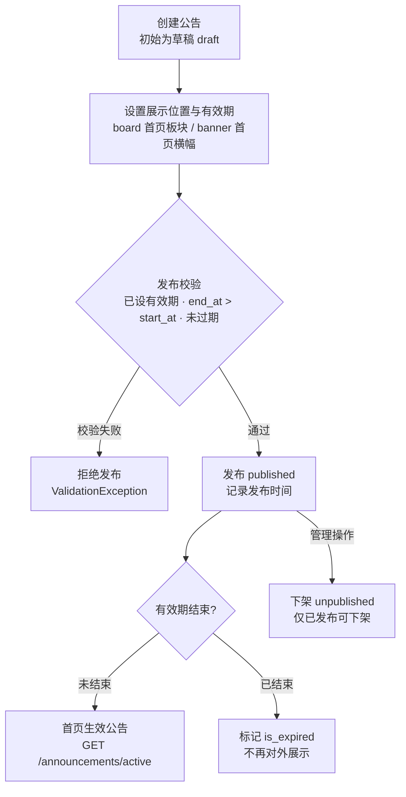
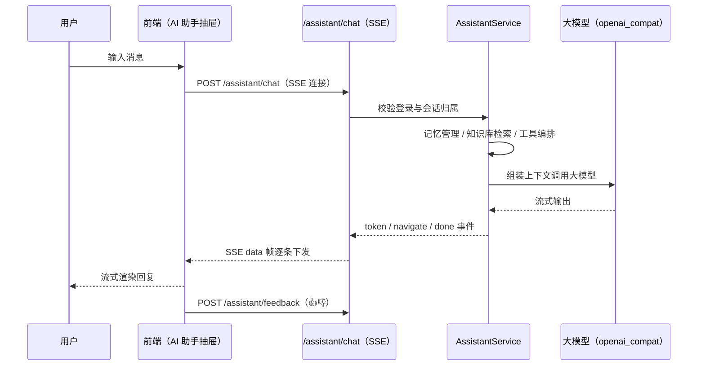
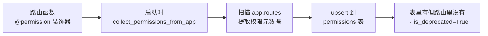
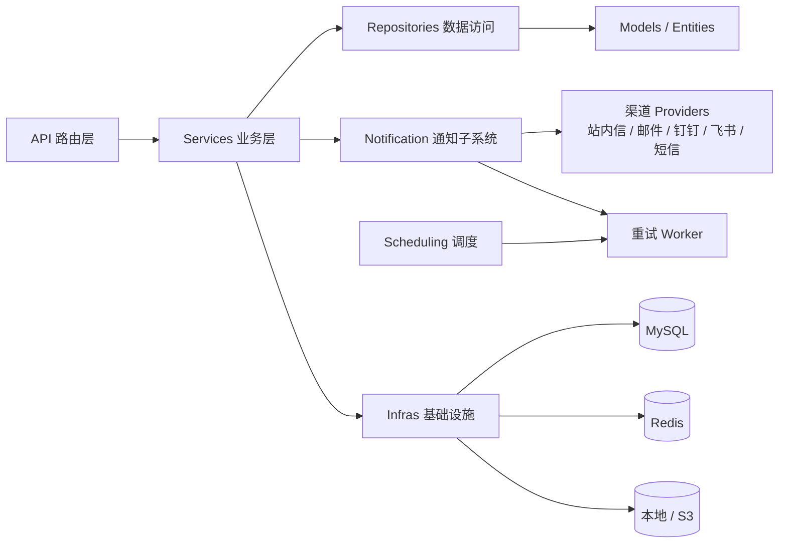

[English](README.en.md) | 中文

# 汉江（HanJiang）后端服务

基于 FastAPI 深度封装的生产级 Python Web 应用框架，三层架构 + 依赖注入，开箱即用支撑企业级 RESTful API 服务。


## 📖 项目简介

汉江（HanJiang）后端是一个基于 FastAPI 深度封装的生产级 Python Web 应用框架，遵循标准三层架构（API → Service → Repository）与依赖注入设计，面向**管理系统（Admin）、开放 API（Open）、开放平台（Open Portal）**三端场景提供三套 API 体系：内置 JWT 认证与 RBAC 权限模型、开发者有状态会话、开放 API AppId/AppKey 鉴权（HanJiang-1 HMAC 签名）、审计日志、登录日志、事件驱动多渠道通知系统、站内信、文件管理（本地 / S3 兼容）、AI 助手、全局搜索与种子数据自动初始化，开箱即用支撑企业级 RESTful API 服务。

**核心特征：**

- 标准三层架构 + FastAPI 原生依赖注入，职责清晰、可测试
- `@permission` 装饰器自动扫描路由注册权限，启动时同步到数据库
- 三套 API 体系：管理系统 `/api/v1`（JWT + RBAC）、开放 API `/api/open/v1`（AppId/AppKey + HMAC 签名 + scope）、开放平台 `/api/open-portal/v1`（开发者会话 JWT，登出/改密即时失效）
- 业务审计日志与登录日志分离，记录操作者、IP、前后数据，支持 CSV 导出
- 事件驱动多渠道通知（站内信 / 邮件 / 钉钉 / 飞书 / 短信），支持用户级偏好与接收人管理、失败自动重试
- 系统通知广播：面向全体活跃用户发布普通通知 / 系统维护通知，站内信广播产生未读红点，维护通知按用户渠道配置推送多渠道
- 公告管理：首页板块 / 横幅展示位，草稿 → 发布 → 下架全生命周期，支持有效期、排序与 Markdown / 富文本正文
- 健康检查联动告警：数据库 / 缓存故障自动触发通知（带节流，避免重复告警）
- AI 助手：SSE 流式对话（token / navigate / done 事件）、会话管理、记忆压缩、知识库检索与工具编排，openai_compat 协议可对接 DeepSeek / 火山方舟 / 通义 / vLLM 等
- 统一存储抽象（本地 / S3 兼容），业务代码零改动切换
- 生产级安全（密码 bcrypt 哈希、常量时间比对、防重放、邮箱验证码二次认证）

**适用场景：**

- 企业内部管理系统后端
- SaaS 产品服务端基座
- 开放平台 / API 网关
- 前后端分离项目脚手架

## 🚀 快速开始

### ⚙️ 1. 环境要求

| 工具 | 版本要求 | 用途 |
|------|----------|------|
| Python | >= 3.11 | 运行时 |
| uv | latest（推荐） | 包管理与依赖同步 |
| MySQL | >= 8.0 | 主数据库 |
| Redis | >= 7.0 | 缓存 / 登录态 / 限流计数 / 通知重试 |

**Windows：**

```powershell
powershell -ExecutionPolicy ByPass -c "irm https://astral.sh/uv/install.ps1 | iex"
```

**Linux：**

```bash
curl -LsSf https://astral.sh/uv/install.sh | sh
```

**macOS：**

```bash
curl -LsSf https://astral.sh/uv/install.sh | sh
```

### 📥 2. 项目代码克隆

```bash
git clone https://github.com/cross-lang/x-HanJiang.git
cd x-HanJiang/server
```

### 📦 3. 依赖同步安装

```bash
# 安装所有依赖（生产 + 开发）
uv sync

# 仅安装生产依赖
uv sync --no-dev
```

### ⚙️ 4. 环境配置

项目支持 `.env` 环境变量和 `config.yaml` 配置文件两种方式，配置优先级：**环境变量 > 环境特定 YAML（config.{env}.yaml）> 默认 YAML > 代码默认值**。

**方式一：使用 `.env` 文件（推荐）**

```bash
cp .env.example .env
```

**方式二：使用 `config.yaml` 文件**

```bash
cp config.yaml.example config.yaml
```

**核心配置参数：**

| 参数 | 环境变量 | 说明 |
|------|----------|------|
| `APP_ENV` | `APP_ENV` | 运行环境：`development` / `testing` / `production` |
| `SERVER_HOST` | `SERVER_HOST` | 监听地址，默认 `0.0.0.0` |
| `SERVER_PORT` | `SERVER_PORT` | 监听端口，默认 `8000` |
| `AUTH_SECRET_KEY` | `AUTH_SECRET_KEY` | JWT 签名密钥，生产环境必须覆盖为 >= 32 字符随机串 |
| `MYSQL_HOST` | `MYSQL_HOST` | MySQL 主机地址 |
| `MYSQL_PORT` | `MYSQL_PORT` | MySQL 端口，默认 `3306` |
| `MYSQL_USER` | `MYSQL_USER` | MySQL 用户名 |
| `MYSQL_PASSWORD` | `MYSQL_PASSWORD` | MySQL 密码 |
| `MYSQL_DATABASE` | `MYSQL_DATABASE` | 数据库名，默认 `hanjiang` |
| `REDIS_HOST` | `REDIS_HOST` | Redis 主机地址 |
| `REDIS_PORT` | `REDIS_PORT` | Redis 端口，默认 `6379` |
| `STORAGE_PROVIDER` | `STORAGE_PROVIDER` | 存储后端：`local` / `s3` |
| `NOTIFICATION_ENABLED` | `NOTIFICATION_ENABLED` | 是否启用通知子系统，默认 `true` |
| `AI_ENABLED` | `AI_ENABLED` | 是否启用 AI 助手，默认 `true` |
| `AI_LLM_PROVIDER` | `AI_LLM_PROVIDER` | 大模型供应商：`openai_compat`（OpenAI 兼容协议） |
| `AI_LLM_BASE_URL` | `AI_LLM_BASE_URL` | 大模型 API 地址（可对接 DeepSeek / 火山方舟 / 通义 / vLLM） |
| `AI_LLM_API_KEY` | `AI_LLM_API_KEY` | 大模型密钥（敏感信息走环境变量注入） |
| `AI_LLM_MODEL` | `AI_LLM_MODEL` | 模型名称，默认 `mimo-v2.6-pro`（可切换图片理解模型） |

> **生产环境**：建议通过环境变量注入 `AUTH_SECRET_KEY`、数据库密码、Redis 密码等敏感配置，避免写入版本库。

> **密钥生成**：
> ```bash
> python -c "from src.utils.security import generate_secret_key; print(generate_secret_key())"
> ```

### ▶️ 5. 服务启动

**方式一：本地开发热重载启动（推荐）**

```bash
uv run x-HanJiang --reload
```

**方式二：Docker 容器部署**

编排文件位于**仓库根目录**（nginx + app + mysql + redis 四服务，nginx 统一 80 入口）：

```bash
# 在仓库根目录执行
docker compose up -d --build
```

**方式三（可选）：直接使用 Uvicorn**

```bash
uv run uvicorn src.main:app --host 0.0.0.0 --port 8000 --reload
```

服务启动后访问：

- Swagger 交互式文档：http://localhost:8000/docs
- ReDoc 只读文档：http://localhost:8000/redoc
- 健康检查：http://localhost:8000/api/admin/v1/health

### ⌨️ 6. 常用工程命令

```bash
# 运行单元测试（含覆盖率报告）
uv run pytest tests/ -v --cov=src --cov-report=term-missing

# 代码格式化
uv run ruff format src/ tests/

# 静态代码检查
uv run ruff check src/ tests/

# 类型检查
uv run mypy src/

# 依赖漏洞扫描
uv audit

# 导出 OpenAPI 规范
uv run python scripts/export_openapi.py
```

### 📚 7. 使用方法示例

**登录获取令牌：**

```bash
curl -X POST http://localhost:8000/api/admin/v1/auth/login \
  -H "Content-Type: application/json" \
  -d '{"username": "superadmin", "password": "admin@123456"}'
```

**携带令牌访问受保护接口：**

```bash
curl http://localhost:8000/api/admin/v1/users \
  -H "Authorization: Bearer <access_token>"
```

**调用开放 API 接口（明文 AppId/AppKey）：**

```bash
curl http://localhost:8000/api/open/v1/me \
  -H "X-App-Id: hj_xxx" \
  -H "X-App-Key: <app_key>"
```

> 首次部署后默认超级管理员账号：`superadmin` / `admin@123456`，生产环境请务必修改。

### ❓ 8. 常见问题排查

| 问题 | 可能原因 | 解决方案 |
|------|----------|----------|
| 端口占用（Address already in use） | 8000 端口被其他进程占用 | 换端口启动：`uv run uvicorn src.main:app --port 8001`，或 `netstat -ano \| findstr :8000` 定位进程 |
| uv 安装失败 | 网络受限或代理未配置 | 重装 uv 或配置镜像源：`UV_DEFAULT_INDEX=https://pypi.tuna.tsinghua.edu.cn/simple` |
| 配置加载异常 | `.env` / `config.yaml` 未创建 | 执行 `cp .env.example .env` 或 `cp config.yaml.example config.yaml` |
| MySQL 连接失败 | 数据库未启动 / 账号密码错误 | 检查 MySQL 服务与 `MYSQL_*` 配置，首次部署先执行 `uv run python scripts/init_db.py` |
| Redis 连接失败 | Redis 未启动 / 密码未配置 | 检查 Redis 服务与 `REDIS_*` 配置 |
| 接口返回 403 | 角色缺少权限或令牌过期 | 检查角色权限绑定，重新登录获取新令牌 |

## 📁 项目结构

```
server/
├── .env.example              # 环境变量模板（与 config.yaml.example 字段一致）
├── config.yaml.example       # YAML 配置文件模板
├── alembic/                  # 数据库迁移管理
│   ├── env.py                # 迁移运行环境
│   └── versions/             # 迁移版本脚本（0001~0033，覆盖用户/通知/应用/公告/AI 会话/开发者档案等核心表）
├── docs/                     # 项目文档（建表 SQL、Postman OpenAPI 集合）
├── examples/                 # 使用示例脚本
│   ├── layered_architecture.py  # 三层架构 CRUD 示例
│   └── openapi_client.py     # 开放 API 客户端示例
├── logs/                     # 运行日志输出
├── scripts/                  # 工程脚本
│   ├── init_db.py            # 数据库初始化
│   └── export_openapi.py     # OpenAPI 规范导出
├── src/                      # 核心业务代码
│   ├── main.py               # 应用入口（应用工厂、生命周期、中间件编排、CLI 参数）
│   ├── api/                  # API 路由层
│   │   ├── admin/             # 管理系统路由（JWT 鉴权，/api/v1 与 /api/admin/v1 双路径兼容）
│   │   │   ├── permission_decorator.py # @permission 装饰器 + 权限扫描注册
│   │   │   └── v1/            # 管理端 v1 路由
│   │   │   ├── auth.py       # 认证（登录 / 刷新 / 登出）
│   │   │   ├── user.py       # 用户管理（CRUD / 导入导出）
│   │   │   ├── profile.py    # 个人中心（资料 / 改密 / 菜单树 / 通知偏好）
│   │   │   ├── role.py       # 角色管理与权限绑定
│   │   │   ├── permission.py # 权限管理
│   │   │   ├── audit.py      # 业务审计日志 + 登录日志（含导出）
│   │   │   ├── dashboard.py  # 仪表盘统计
│   │   │   ├── file.py       # 文件管理（上传 / 列表 / 下载 / 删除）
│   │   │   ├── notification.py # 通知管理（系统通知发布/撤回 + 记录查询/统计 + 渠道配置/监控/测试）
│   │   │   ├── alert.py      # 系统告警（Webhook / 广播）
│   │   │   ├── announcement.py # 公告管理（创建/修改/删除/发布/下架/首页生效公告）
│   │   │   ├── station.py    # 站内信（未读数 / 列表 / 已读）
│   │   │   ├── openapi_app.py # 开放平台应用管理（含开发者申请审批流）
│   │   │   ├── developer.py # 开放平台开发者管理（列表 / 名下应用）
│   │   │   ├── search.py      # 全局搜索
│   │   │   ├── assistant.py # AI 助手（SSE 对话 / 会话 / 反馈）
│   │   │   └── health.py     # 健康检查与版本信息
│   │   ├── open/             # 开放 API 路由（路由（AppId/AppKey 鉴权，/api/open/v1/...）
│   │   │   ├── scope_decorator.py # @app_scope 装饰器 + scope 扫描注册
│   │   │   └── v1/
│   │   │       ├── health.py # 健康检查与版本
│   │   │       ├── app.py    # 当前应用信息
│   │   │       ├── user.py   # 开放 API 用户管理（scope 控制）
│   │   │       ├── role.py   # 开放 API 角色管理（scope 控制）
│   │   │       └── file.py   # 开放 API 文件管理（Base64 上传，scope 控制）
│   │   ├── open_portal/      # 开放平台路由（开发者会话 JWT 鉴权，/api/open-portal/v1/...）
│   │   │   └── v1/           # 门户 v1 路由（auth / developer / apps / scopes / messages）
│   │   ├── dependencies.py   # DI 依赖函数
│   │   ├── response.py       # 统一响应封装
│   │   └── router.py         # 路由聚合注册
│   ├── assistant/           # AI 助手子系统
│   │   ├── agent.py          # agent 循环（流式推理 / 三分支决策 / 工具执行）
│   │   ├── tools/            # 内置工具包（页面跳转 + 只读查询工具 / 注册表 / 工具来源）
│   │   ├── memories/         # 四层记忆包（端口 / 上下文 / 提示词层 / 长期记忆 / 滚动摘要 / 最近原文 / 门面 / 知识库）
│   │   └── text_call.py      # 正文内联工具调用的协议防御（检测门 + 解析）
│   ├── constants/            # 业务常量与枚举（ModuleCode、BaseEnum 等）
│   ├── core/                 # 核心支撑模块
│   │   ├── config.py         # 配置加载（env / yaml 合并）
│   │   ├── exceptions.py     # 自定义异常与全局处理
│   │   ├── logger.py         # 日志初始化（loguru，支持 JSON / console）
│   │   ├── middleware.py     # 中间件（请求 ID、日志、异常兜底、CORS、限流）
│   │   ├── seed.py           # 种子数据初始化
│   │   └── tokens.py         # JWT 令牌签发与验证
│   ├── infras/               # 基础设施层
│   │   ├── database.py       # 数据库连接池与会话工厂
│   │   ├── cache.py          # Redis 缓存
│   │   ├── email.py          # 邮件发送
│   │   ├── http.py           # HTTP 客户端
│   │   ├── notification.py   # 通知渠道 Provider 注册中心
│   │   ├── llm.py            # 大模型客户端（openai_compat 协议）
│   │   └── storage.py        # 存储抽象层（本地 / S3）
│   ├── models/               # SQLAlchemy ORM 实体
│   │   └── entities/         # 实体定义（用户 / 角色 / 权限 / 审计 / 通知 / 应用等）
│   ├── notification/         # 通知子系统
│   │   ├── bootstrap.py      # 通知系统初始化（生命周期注册）
│   │   ├── dispatcher.py     # 事件分发器
│   │   ├── retry.py          # 失败重试逻辑
│   │   ├── template.py       # 通知模板渲染
│   │   └── notification_decorators.py # 通知触发装饰器
│   ├── repositories/         # 数据访问层（Repository 模式）
│   ├── scheduling/           # 调度任务
│   │   └── retry_worker.py   # 通知重试 Worker（轮询 Redis 重试队列）
│   ├── schemas/              # Pydantic 请求 / 响应 DTO
│   ├── services/             # 业务逻辑层（Service 模式）
│   ├── templates/            # 提示词模板（AI 助手系统提示词 / FAQ）
│   ├── utils/                # 工具函数（security 等）
│   └── __init__.py
├── statics/                   # 本地文件存储目录（storage.provider=local 时）
├── tests/                    # 单元测试
├── Dockerfile                # 多阶段构建镜像（由仓库根 docker-compose.yml 的 app 服务引用）
├── pyproject.toml            # 项目配置与依赖声明
└── uv.lock                   # 依赖锁定文件（可复现构建）
```

## 🏗️ 系统架构

### 🏗️ 系统分层架构


```mermaid
flowchart TB
  Client[客户端] -->|HTTP / JSON| API[API 接口层<br/>三套路由聚合 · 参数校验 · 统一响应]

  subgraph Application[应用层]
    API --> Auth[管理系统认证<br/>Bearer JWT · RBAC 权限]
    API --> PortalAuth[门户认证<br/>开发者会话 JWT · Redis 登录态]
    API --> OpenAuth[开放 API 认证<br/>AppId/AppKey · Scope · HMAC 签名]
    Auth --> Service[业务服务层<br/>用户 · 角色 · 权限 · 审计 · 仪表盘 · 通知 · 文件 · AI]
    PortalAuth --> PortalService[门户服务<br/>开发者 · 应用申请 · 审批 · 消息]
    OpenAuth --> OpenService[开放 API 服务<br/>应用管理 · 鉴权 · 签名校验]
  end

  subgraph Data[数据访问层]
    Service --> Repository[Repository 层<br/>CRUD · 查询 · Entity 映射]
    Repository --> Entity[Models / Entities<br/>SQLAlchemy ORM]
  end

  subgraph Support[核心支撑与基础设施]
    Core[Core<br/>配置 · DI · 中间件 · 异常 · 令牌 · 日志]
    Infra[Infras<br/>数据库 · 缓存 · 邮件 · HTTP · 存储 · 通知]
  end

  Core -.提供横切能力.-> API
  Core -.提供横切能力.-> Service
  Repository --> Infra
  Infra --> DB[(MySQL)]
  Infra --> Redis[(Redis)]
  Infra --> OSS[(S3 / 本地存储)]
```

### 🔄 核心业务流程

#### 🔐 用户登录与鉴权


```mermaid
flowchart TD
  Start([客户端发起请求]) --> Open{开放平台接口?}
  Open -->|是| AppKey{AppId/AppKey 有效?}
  AppKey -->|否| Unauthorized[返回 401]
  AppKey -->|是| Scope{具备所需 scope?}
  Scope -->|否| Forbidden[返回 403]
  Scope -->|是| Route[路由与参数校验]
  Open -->|否| Public{公开接口?}
  Public -->|是：登录/刷新/健康检查| Route
  Public -->|否| Token{Bearer Token 有效?}
  Token -->|否| Unauthorized
  Token -->|是| Permission{具备所需权限?}
  Permission -->|否| Forbidden
  Permission -->|是| Route

  Route --> Service[调用业务 Service]
  Service --> Repository[Repository 读写数据]
  Repository --> Database[(MySQL / Redis)]
  Service --> Audit[记录审计日志<br/>操作者 · IP · 前后数据]
  Service --> Response[统一响应 + X-Request-ID]
  Audit --> Response
  Unauthorized --> End([请求结束])
  Forbidden --> End
  Response --> End
```

#### 🔔 通知发送流程


```mermaid
flowchart TD
  A[业务事件触发<br/>如 user.password_changed] --> B[通知分发器<br/>NotificationDispatcher]
  B --> C[查询用户通知偏好<br/>与接收人配置]
  C --> D[站内信渠道]
  C --> E[邮件渠道 SMTP]
  C --> F[钉钉渠道]
  C --> G[飞书渠道]
  C --> H[短信渠道]
  D --> I[写入通知记录<br/>notifications 表]
  E --> I
  F --> I
  G --> I
  H --> I
  I --> J{发送成功?}
  J -->|失败| K[Redis 重试队列]
  K --> L[重试 Worker<br/>scheduling/retry_worker]
  L --> D
  J -->|成功| M[流程结束]
```

#### 📢 公告发布流程


```mermaid
flowchart TD
  A[创建公告<br/>初始为草稿 draft] --> B[设置展示位置与有效期<br/>board 首页板块 / banner 首页横幅]
  B --> C{发布校验<br/>已设有效期 · end_at > start_at · 未过期}
  C -->|校验失败| E[拒绝发布<br/>ValidationException]
  C -->|通过| D[发布 published<br/>记录发布时间]
  D --> F{有效期结束?}
  F -->|未结束| G[首页生效公告<br/>GET /announcements/active]
  F -->|已结束| H[标记 is_expired<br/>不再对外展示]
  D -->|管理操作| I[下架 unpublished<br/>仅已发布可下架]
```

#### 🤖 AI 助手对话流程


```mermaid
sequenceDiagram
    participant U as 用户
    participant F as 前端（AI 助手抽屉）
    participant A as /assistant/chat（SSE）
    participant S as AssistantService
    participant L as 大模型（openai_compat）

    U->>F: 输入消息
    F->>A: POST /assistant/chat（SSE 连接）
    A->>S: 校验登录与会话归属
    S->>S: 记忆管理 / 知识库检索 / 工具编排
    S->>L: 组装上下文调用大模型
    L-->>S: 流式输出
    S-->>A: token / navigate / done 事件
    A-->>F: SSE data 帧逐条下发
    F-->>U: 流式渲染回复
    F->>A: POST /assistant/feedback（👍👎）
```

#### 🛡️ 权限自动注册流程


```mermaid
flowchart LR
  A["路由函数<br/>@permission 装饰器"] --> B["启动时<br/>collect_permissions_from_app"]
  B --> C["扫描 app.routes<br/>提取权限元数据"]
  C --> D["upsert 到<br/>permissions 表"]
  D --> E["表里有但路由里没有<br/>→ is_deprecated=True"]
```

### 🧩 模块依赖关系


```mermaid
graph LR
  API[API 路由层] --> SVC[Services 业务层]
  SVC --> REPO[Repositories 数据访问]
  REPO --> ENT[Models / Entities]
  SVC --> DISP[Notification 通知子系统]
  DISP --> CH[渠道 Providers<br/>站内信 / 邮件 / 钉钉 / 飞书 / 短信]
  DISP --> RETRY[重试 Worker]
  SVC --> INFRA[Infras 基础设施]
  INFRA --> DB[(MySQL)]
  INFRA --> RD[(Redis)]
  INFRA --> OSS[(本地 / S3)]
  SCHED[Scheduling 调度] --> RETRY
```

### 🧩 关键技术组件说明

| 组件 | 职责 |
|------|------|
| `api/admin` | 管理系统接口层（`/api/v1` 与 `/api/admin/v1` 双路径兼容），JWT + RBAC 权限校验，覆盖认证、用户、角色、权限、审计、文件、公告、通知、AI 助手、开放应用审批等 18 个路由模块 |
| `api/open` | 开放平台接口层（`/api/open/v1`），AppId/AppKey + HanJiang-1 HMAC 签名鉴权，`@app_scope` 声明式注册 scope，覆盖健康 / 应用 / 用户 / 角色 / 文件 5 类能力 |
| `api/open_portal` | 开放平台门户接口层（`/api/open-portal/v1`），开发者会话 JWT + Redis 有状态登录态，覆盖注册登录、开发者资料与认证、应用与 scope 申请、站内信 |
| `assistant` | AI 助手编排：agent 循环（三分支决策）、四层记忆（memories/：系统提示词 / 长期记忆 / 滚动摘要 / 最近原文）、内置工具（tools/：页面跳转 + 只读查询）、正文内联工具调用防御、👍👎 反馈收集 |
| `notification` | 通知子系统：事件分发、模板渲染、多渠道 Provider（站内信/邮件/钉钉/飞书/短信）、失败自动重试 |
| `infras` | 基础设施：数据库连接池、Redis 缓存、邮件、HTTP 客户端、存储抽象（本地/S3）、LLM 客户端（openai_compat） |
| `core` | 核心支撑：配置加载（env/yaml）、统一异常、日志（loguru）、中间件、JWT 令牌、种子数据 |
| `repositories` | Repository 模式数据访问层，统一 CRUD 与查询 |
| `scheduling` | 后台调度：通知重试 Worker（轮询 Redis 重试队列） |

## 🛠️ 技术栈

| 分类 | 技术 | 说明 |
|------|------|------|
| **开发语言** | Python 3.11+ | 强类型、异步友好 |
| **Web 框架** | FastAPI | 高性能异步 Web 框架 |
| **ASGI 服务器** | Uvicorn / Gunicorn | 开发热重载 / 生产多进程部署 |
| **数据校验** | Pydantic v2 | 数据模型与校验 |
| **ORM** | SQLAlchemy 2.0 | Python ORM 工具包 |
| **数据库迁移** | Alembic | 数据库版本迁移 |
| **数据存储** | MySQL 8.0 | 关系型数据库 |
| **缓存** | Redis 7 | 令牌、登录态、限流计数、通知重试队列 |
| **对象存储** | boto3 | S3 兼容（七牛 / AWS S3 / MinIO） |
| **消息队列** | 无独立 MQ | 进程内事件分发 + Redis 重试队列（通知子系统） |
| **日志** | Loguru | 现代化日志库（JSON / console 双格式） |
| **认证** | PyJWT + bcrypt | JWT 签发验证 + 密码哈希 |
| **加密** | cryptography (Fernet) | AppKey 加密存储、HMAC 签名 |
| **限流** | SlowAPI | 请求限流中间件 |
| **HTTP 客户端** | httpx | 异步 HTTP（通知渠道调用） |
| **AI 集成** | openai SDK | openai_compat 兼容协议（DeepSeek / 火山方舟 / 通义 / vLLM） |
| **配置管理** | pydantic-settings | 基于 Pydantic 的配置加载 |
| **包管理器** | uv | 高性能 Python 包管理器 |
| **代码检查** | Ruff | 代码检查与格式化 |
| **类型检查** | mypy | 静态类型检查 |
| **测试框架** | pytest | 单元测试（含覆盖率） |
| **部署运维** | Docker / Docker Compose | 容器部署与编排 |

## 🔌 API 文档说明

后端启动后可访问：

| 文档类型 | 地址 | 说明 |
|----------|------|------|
| Swagger UI | http://localhost:8000/docs | 交互式调试文档 |
| ReDoc | http://localhost:8000/redoc | 只读 API 文档 |
| OpenAPI JSON | http://localhost:8000/openapi.json | 标准 OpenAPI 3.x 规范文件 |

### 🔌 核心接口清单

**健康检查（公开）：**

| 方法 | 路径 | 说明 |
|------|------|------|
| GET | `/api/admin/v1/health` | 健康检查（数据库/缓存连通状态，故障自动告警） |
| GET | `/api/admin/v1/version` | 版本信息 |

**认证：**

| 方法 | 路径 | 说明 | 鉴权 |
|------|------|------|------|
| POST | `/api/admin/v1/auth/login` | 用户登录（用户名/邮箱 + 密码） | 公开 |
| POST | `/api/admin/v1/auth/refresh` | 刷新令牌 | 公开 |
| POST | `/api/admin/v1/auth/logout` | 退出登录（清除 Redis 登录态） | 需鉴权 |

**用户管理：**

| 方法 | 路径 | 说明 |
|------|------|------|
| POST | `/api/admin/v1/users` | 创建用户（支持多角色） |
| GET | `/api/admin/v1/users` | 用户列表（分页/关键字/状态过滤） |
| GET | `/api/admin/v1/users/export` | 导出用户列表（CSV） |
| POST | `/api/admin/v1/users/import` | CSV 批量导入用户 |
| GET | `/api/admin/v1/users/{id}` | 用户详情 |
| POST | `/api/admin/v1/users/{id}/update` | 更新用户 |
| POST | `/api/admin/v1/users/{id}/reset-password` | 重置用户密码 |
| POST | `/api/admin/v1/users/{id}/delete` | 删除用户（软删除） |

**个人中心：**

| 方法 | 路径 | 说明 |
|------|------|------|
| GET | `/api/admin/v1/profile/me` | 当前用户信息（含角色与权限） |
| PUT | `/api/admin/v1/profile/me` | 修改个人信息 |
| POST | `/api/admin/v1/profile/change-password` | 修改密码（原密码 + 验证码二次认证） |
| GET | `/api/admin/v1/profile/menus` | 当前用户菜单树（按权限过滤） |
| GET | `/api/admin/v1/profile/notification-preferences` | 我的通知偏好 |
| PUT | `/api/admin/v1/profile/notification-preferences` | 更新我的通知偏好 |
| GET | `/api/admin/v1/profile/notification-recipients` | 我的通知接收人列表 |
| POST | `/api/admin/v1/profile/notification-recipients` | 添加通知接收人 |
| PUT | `/api/admin/v1/profile/notification-recipients/{id}` | 更新通知接收人 |
| DELETE | `/api/admin/v1/profile/notification-recipients/{id}` | 删除通知接收人 |
| POST | `/api/admin/v1/profile/send-verify-code` | 发送验证码（安全二次认证，6 位发送至邮箱） |
| POST | `/api/admin/v1/profile/update-phone` | 修改手机号（验证码二次认证） |
| POST | `/api/admin/v1/profile/update-email` | 修改邮箱（原验证码二次认证） |

**角色管理：**

| 方法 | 路径 | 说明 |
|------|------|------|
| GET | `/api/admin/v1/roles` | 角色列表（分页/关键字/类型/状态过滤） |
| POST | `/api/admin/v1/roles` | 创建角色 |
| GET | `/api/admin/v1/roles/{id}` | 角色详情 |
| POST | `/api/admin/v1/roles/{id}/update` | 更新角色 |
| POST | `/api/admin/v1/roles/{id}/delete` | 删除角色（软删除） |
| GET | `/api/admin/v1/roles/{id}/permissions` | 角色权限列表（含权限详情） |
| POST | `/api/admin/v1/roles/{id}/permissions` | 绑定权限 |
| POST | `/api/admin/v1/roles/{id}/permissions/{pid}/unbind` | 解绑权限 |

**权限管理：**

| 方法 | 路径 | 说明 |
|------|------|------|
| GET | `/api/admin/v1/permissions/meta` | 权限元数据（模块/操作类型去重列表） |
| GET | `/api/admin/v1/permissions` | 权限列表（分页/关键字/模块/操作过滤） |
| POST | `/api/admin/v1/permissions` | 创建权限 |
| GET | `/api/admin/v1/permissions/{id}` | 权限详情 |
| POST | `/api/admin/v1/permissions/{id}/update` | 更新权限 |
| POST | `/api/admin/v1/permissions/{id}/delete` | 删除权限 |

**审计与日志：**

| 方法 | 路径 | 说明 |
|------|------|------|
| GET | `/api/admin/v1/logs/audit` | 业务审计日志列表 |
| GET | `/api/admin/v1/logs/audit/export` | 导出审计日志（CSV） |
| GET | `/api/admin/v1/logs/audit/{id}` | 审计日志详情 |
| GET | `/api/admin/v1/logs/login` | 登录日志列表 |
| GET | `/api/admin/v1/logs/login/export` | 导出登录日志（CSV） |
| GET | `/api/admin/v1/logs/login/{id}` | 登录日志详情 |

**文件管理：**

| 方法 | 路径 | 说明 |
|------|------|------|
| POST | `/api/admin/v1/files/upload` | 上传文件（folder 分组） |
| GET | `/api/admin/v1/files` | 文件列表（分页/文件夹/关键字过滤） |
| GET | `/api/admin/v1/files/{file_path:path}` | 获取 / 下载文件 |
| DELETE | `/api/admin/v1/files/{file_id}` | 删除文件 |

**通知管理（含系统通知广播）：**

| 方法 | 路径 | 说明 | 鉴权 |
|------|------|------|------|
| POST | `/api/admin/v1/notifications/publish` | 发布系统通知（普通通知 / 系统维护，面向全体活跃用户） | `notification:create` |
| POST | `/api/admin/v1/notifications/{notice_id}/withdraw` | 撤回系统通知（幂等） | `notification:create` |
| GET | `/api/admin/v1/notifications/published` | 系统通知列表（分页/类型/状态/关键字过滤） | `notification:view` |
| GET | `/api/admin/v1/notifications/published/{notice_id}` | 系统通知详情 | `notification:view` |
| GET | `/api/admin/v1/notifications` | 通知列表（分页/事件/渠道/状态过滤） | `notification:view` |
| GET | `/api/admin/v1/notifications/stats` | 通知统计（成功/失败/待发送） | `notification:view` |
| GET | `/api/admin/v1/notifications/{id}` | 通知详情 | `notification:view` |

**系统通知配置（管理员）：**

| 方法 | 路径 | 说明 | 鉴权 |
|------|------|------|------|
| GET | `/api/admin/v1/notification-configs` | 所有系统通知渠道配置 | `notification:config` |
| PUT | `/api/admin/v1/notification-configs/{channel}` | 更新渠道配置（热生效，无需重启） | `notification:config` |
| GET | `/api/admin/v1/notification-configs/monitor/system` | 系统监控状态 | `notification:config` |
| POST | `/api/admin/v1/notification-configs/{channel}/test` | 发送渠道测试消息 | `notification:config` |

**公告管理：**

| 方法 | 路径 | 说明 | 鉴权 |
|------|------|------|------|
| GET | `/api/admin/v1/announcements/active` | 首页生效公告（已发布且在有效期，登录用户可见） | 登录即可 |
| POST | `/api/admin/v1/announcements` | 创建公告（初始为草稿） | `announcement:create` |
| POST | `/api/admin/v1/announcements/{id}/update` | 修改公告（所有字段可选） | `announcement:edit` |
| POST | `/api/admin/v1/announcements/{id}/delete` | 删除公告（物理删除） | `announcement:delete` |
| POST | `/api/admin/v1/announcements/{id}/publish` | 发布公告（校验有效期，草稿/已下架 → 已发布） | `announcement:publish` |
| POST | `/api/admin/v1/announcements/{id}/unpublish` | 下架公告（已发布 → 已下架） | `announcement:publish` |
| GET | `/api/admin/v1/announcements` | 公告列表（管理视角，分页/状态/位置/关键字过滤） | `announcement:view` |
| GET | `/api/admin/v1/announcements/{id}` | 公告详情 | `announcement:view` |

**系统告警：**

| 方法 | 路径 | 说明 |
|------|------|------|
| POST | `/api/admin/v1/alerts` | 发送系统告警（供外部监控 Webhook 调用） |
| POST | `/api/admin/v1/alerts/broadcast` | 广播系统告警（管理员，全体活跃用户） |

**站内信：**

| 方法 | 路径 | 说明 |
|------|------|------|
| GET | `/api/admin/v1/station/messages/unread-count` | 未读消息数 |
| GET | `/api/admin/v1/station/messages` | 我的消息列表 |
| POST | `/api/admin/v1/station/messages/{msg_id}/read` | 标记单条已读 |
| POST | `/api/admin/v1/station/messages/read-all` | 全部已读 |

**首页 / 仪表盘：**

| 方法 | 路径 | 说明 |
|------|------|------|
| GET | `/api/admin/v1/home/my-activity` | 首页：我的最近活动（登录日志 + 操作日志），权限 `home:view` |
| GET | `/api/admin/v1/dashboard/stats` | 仪表盘统计（指标卡片、趋势图表、最近记录），权限 `dashboard:view` |

**开放平台应用管理：**

| 方法 | 路径 | 说明 |
|------|------|------|
| GET | `/api/admin/v1/apps/scopes` | 可用 scope 列表 |
| POST | `/api/admin/v1/apps` | 创建开放应用（返回 AppId + AppKey） |
| GET | `/api/admin/v1/apps` | 应用列表 |
| GET | `/api/admin/v1/apps/{app_id}` | 应用详情 |
| PUT | `/api/admin/v1/apps/{app_id}` | 更新应用 |
| PUT | `/api/admin/v1/apps/{app_id}/scopes` | 更新应用 scope |
| POST | `/api/admin/v1/apps/{app_id}/rotate-key` | 重置 AppKey |
| DELETE | `/api/admin/v1/apps/{app_id}` | 删除应用 |

**全局搜索：**

| 方法 | 路径 | 说明 |
|------|------|------|
| GET | `/api/admin/v1/search?keyword=` | 全局搜索（用户/角色/权限/开放应用/文件，按权限过滤分类） |

**AI 助手：**

| 方法 | 路径 | 说明 | 鉴权 |
|------|------|------|------|
| POST | `/api/admin/v1/assistant/chat` | AI 助手对话（SSE 流式，token / navigate / done 事件） | 登录即可 |
| POST | `/api/admin/v1/assistant/conversations` | 创建会话 | 登录即可 |
| GET | `/api/admin/v1/assistant/conversations` | 会话列表 | 登录即可 |
| GET | `/api/admin/v1/assistant/conversations/{id}/messages` | 会话消息列表（校验归属） | 登录即可 |
| POST | `/api/admin/v1/assistant/feedback` | 消息反馈（👍👎，提示词调优数据源） | 登录即可 |

**开放平台接口（AppId/AppKey 鉴权）：**

| 方法 | 路径 | 说明 | Scope |
|------|------|------|------|
| GET | `/api/open/v1/health` | 健康检查 | 公开 |
| GET | `/api/open/v1/version` | 版本信息 | 公开 |
| GET | `/api/open/v1/me` | 当前应用信息 | 公开 |
| POST | `/api/open/v1/users` | 创建用户 | `user:write` |
| GET | `/api/open/v1/users` | 用户列表 | `user:read` |
| GET | `/api/open/v1/users/{id}` | 用户详情 | `user:read` |
| PATCH | `/api/open/v1/users/{id}` | 更新用户 | `user:write` |
| DELETE | `/api/open/v1/users/{id}` | 删除用户 | `user:write` |
| GET | `/api/open/v1/roles` | 角色列表 | `role:read` |
| POST | `/api/open/v1/roles` | 创建角色 | `role:write` |
| GET | `/api/open/v1/roles/{role_id}` | 角色详情 | `role:read` |
| PATCH | `/api/open/v1/roles/{role_id}` | 更新角色 | `role:write` |
| DELETE | `/api/open/v1/roles/{role_id}` | 删除角色（软删除） | `role:write` |
| GET | `/api/open/v1/roles/{role_id}/permissions` | 角色绑定权限列表 | `role:read` |
| GET | `/api/open/v1/files` | 文件列表 | `file:read` |
| POST | `/api/open/v1/files` | 上传文件（Base64 内嵌 JSON） | `file:write` |
| GET | `/api/open/v1/files/{file_path:path}` | 下载文件（本地流 / 云存储 302） | `file:read` |
| DELETE | `/api/open/v1/files/{file_id}` | 删除文件（软删除） | `file:write` |

**开放平台门户接口（开发者会话 JWT 鉴权）：**

| 方法 | 路径 | 说明 |
|------|------|------|
| POST | `/api/open-portal/v1/auth/register` | 注册开发者账号 |
| POST | `/api/open-portal/v1/auth/login` | 开发者登录（签发 access/refresh 令牌对） |
| POST | `/api/open-portal/v1/auth/refresh` | 刷新令牌（旧 access 令牌随即失效） |
| POST | `/api/open-portal/v1/auth/logout` | 退出登录（撤销服务端会话） |
| POST | `/api/open-portal/v1/auth/change-password` | 修改密码（成功后需重新登录） |
| GET | `/api/open-portal/v1/developers/profile` | 当前开发者资料 |
| PUT | `/api/open-portal/v1/developers/profile` | 更新资料（姓名/手机号） |
| POST | `/api/open-portal/v1/developers/certification` | 提交认证申请（个人/企业） |
| GET | `/api/open-portal/v1/apps` | 我的应用分页列表（owner 隔离） |
| POST | `/api/open-portal/v1/apps` | 创建应用（app_key 仅此一次返回，进入审批流） |
| GET | `/api/open-portal/v1/apps/{app_id}` | 应用详情（含审批状态/意见） |
| PUT | `/api/open-portal/v1/apps/{app_id}` | 更新应用 |
| DELETE | `/api/open-portal/v1/apps/{app_id}` | 删除应用（软删） |
| PUT | `/api/open-portal/v1/apps/{app_id}/scopes` | 提交 scope 申请 / 调整（复位待审） |
| POST | `/api/open-portal/v1/apps/{app_id}/rotate-key` | 重置 App Key（新 key 仅此一次返回） |
| GET | `/api/open-portal/v1/apps/scopes` | scope 目录 |
| GET | `/api/open-portal/v1/messages/unread-count` | 未读消息数 |
| GET | `/api/open-portal/v1/messages` | 我的站内信列表（分页） |
| POST | `/api/open-portal/v1/messages/{msg_id}/read` | 标记单条已读 |
| POST | `/api/open-portal/v1/messages/read-all` | 全部已读 |

**开发者审批（管理端，双路径兼容）：**

| 方法 | 路径 | 说明 |
|------|------|------|
| PUT | `/api/admin/v1/apps/{app_id}/approval` | 审批开发者应用 / scope 申请（通过/驳回 + 意见） |
| GET | `/api/admin/v1/open-developers` | 开发者列表（含认证状态） |
| GET | `/api/admin/v1/open-developers/{developer_id}/apps` | 开发者名下应用 |

### 🛡️ 权限控制说明

- **用户态接口**：JWT Bearer Token + `@permission` 装饰器自动注册权限 + 角色/权限校验；权限声明变更在服务启动时自动同步（失效权限标记 `is_deprecated`）
- **核心权限项**：公告管理 `announcement:view / create / edit / delete / publish`；通知管理 `notification:view / create / config`（发布/撤回系统通知、渠道配置管理）
- **AI 助手**：`assistant:chat`（对话与会话管理，自动注册，实际仅要求登录）、`assistant:feedback`（消息反馈）
- **开放平台接口**：AppId + AppKey（明文模式）或 HanJiang-1 HMAC 签名认证，通过 `@app_scope` 声明的 scope 控制接口访问范围；scope 同样在启动时自动同步
- **开放平台门户接口**：开发者会话 JWT（Bearer Token），登录态存 Redis（`login_dev:{developer_id}`），登出 / 改密 / 刷新令牌后旧 access 令牌立即失效；应用与 scope 申请须管理端审批通过后方可调用开放接口

## 🗄️ 存储配置说明

### 🗄️ 数据库存储

- **类型**：MySQL 8.0+
- **配置**：通过 `.env` 配置 `MYSQL_HOST`、`MYSQL_PORT`、`MYSQL_USER`、`MYSQL_PASSWORD`、`MYSQL_DATABASE`、`MYSQL_POOL_SIZE`
- **迁移**：使用 Alembic 管理数据库版本（0001~0033），覆盖用户、通知记录、用户通知配置、开放平台应用、系统通知、公告、AI 助手会话与消息、开发者、开发者站内信、用户档案、文件归属等核心表
- **注意**：生产环境务必通过环境变量注入数据库密码，且不写入版本库

### ⚡ 缓存

- **类型**：Redis 7+
- **用途**：限流计数、登录态缓存（登出即时失效）、邮箱验证码、通知重试队列
- **配置**：通过 `.env` 配置 `REDIS_HOST`、`REDIS_PORT`、`REDIS_PASSWORD`、`REDIS_DB`

### 📂 文件存储

支持两种模式，通过 `storage.provider` / `STORAGE_PROVIDER` 切换：

| 模式 | 配置 | 适用场景 |
|------|------|----------|
| `local` | `STORAGE_LOCAL_BASE_DIR=statics` | 本地开发、小型部署 |
| `s3` | `STORAGE_S3_ENDPOINT_URL` 等 | 生产环境、对象存储（七牛 / AWS S3 / MinIO） |

**S3 配置参数：**

| 参数 | 说明 |
|------|------|
| `STORAGE_S3_ENDPOINT_URL` | S3 兼容服务地址（七牛 Kodo 格式：`https://s3.<region>.qiniucs.com`） |
| `STORAGE_S3_ACCESS_KEY` | 访问密钥 |
| `STORAGE_S3_SECRET_KEY` | 秘密密钥 |
| `STORAGE_S3_BUCKET` | 存储桶名称 |
| `STORAGE_S3_REGION` | 存储区域 |
| `STORAGE_S3_PREFIX` | 对象前缀（默认 `uploads`） |
| `STORAGE_S3_PUBLIC_URL` | 公开访问域名（可选） |
| `STORAGE_S3_USE_SSL` | 是否启用 HTTPS |

> **注意**：生产环境建议通过环境变量注入 S3 密钥，避免写入版本库；切换存储后端只需修改 `provider` 字段，业务代码零改动。

## 📄 许可证

本项目基于 [MIT License](../LICENSE) 开源。

## 📚 参考资料

| 技术 | 官方文档 |
|------|----------|
| Python | https://www.python.org/ |
| uv | https://docs.astral.sh/uv/ |
| FastAPI | https://fastapi.tiangolo.com/ |
| Uvicorn | https://www.uvicorn.org/ |
| SQLAlchemy | https://docs.sqlalchemy.org/ |
| Alembic | https://alembic.sqlalchemy.org/ |
| Pydantic | https://docs.pydantic.dev/ |
| MySQL | https://dev.mysql.com/doc/ |
| Redis | https://redis.io/docs/ |
| Loguru | https://loguru.readthedocs.io/ |
| Ruff | https://docs.astral.sh/ruff/ |
| mypy | https://mypy.readthedocs.io/ |
| Docker | https://docs.docker.com/ |

## 📮 联系方式

- **作者**：John Young（夜雨诗来）
- **邮箱**：john.young@foxmail.com
- **Gitee**：https://gitee.com/yeyushilai
- **GitHub**：https://github.com/yeyushilai
- **项目地址**：https://github.com/cross-lang/x-HanJiang
