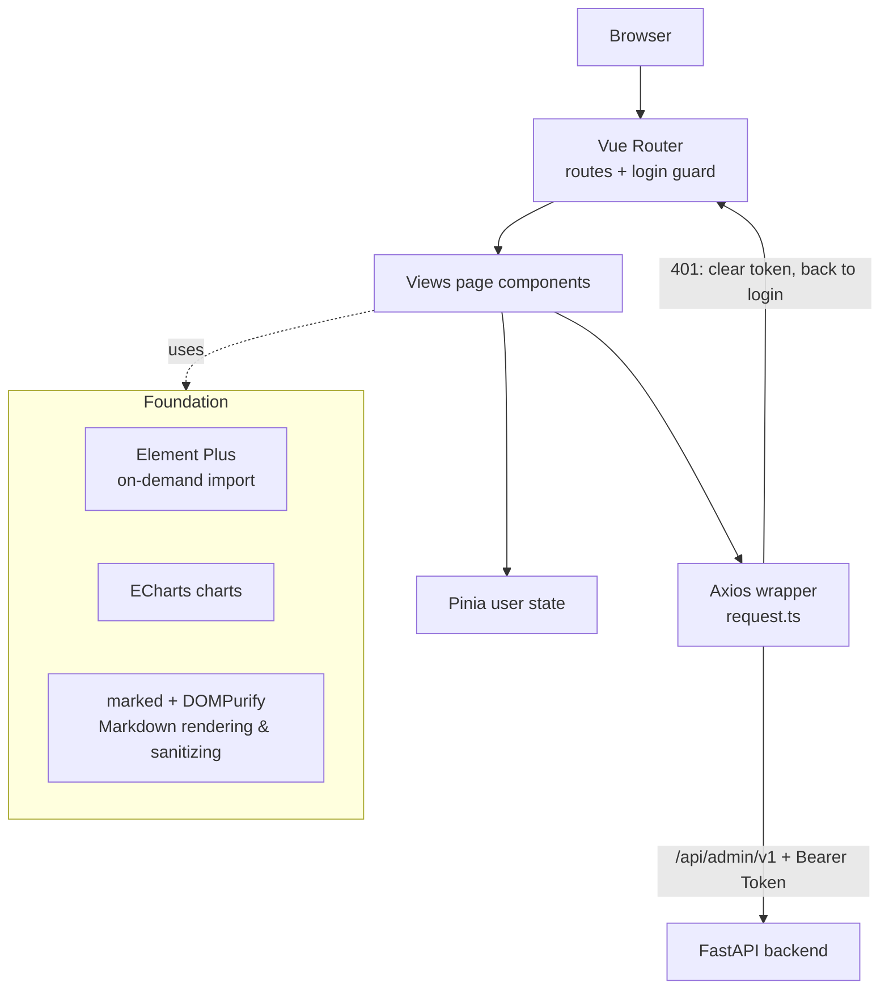
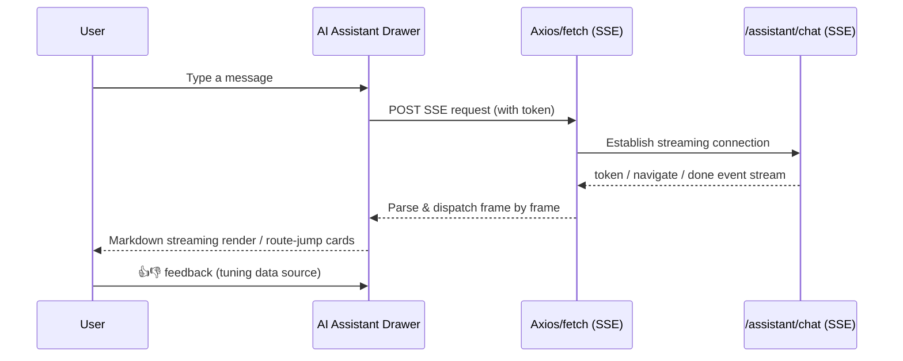

[中文](README.md) | English

# HanJiang Admin Console

HanJiang Admin is the management console of the [HanJiang full-stack rapid development platform](https://github.com/cross-lang/x-HanJiang). Built with Vue 3 + TypeScript + Vite + Element Plus and paired with the FastAPI backend, it delivers an out-of-the-box enterprise admin UI.


## 📖 Project Introduction

HanJiang Admin targets enterprise internal administrators and pairs with the backend `/api/admin/v1` API system (JWT + RBAC): login & auth, dashboard, user / role / permission management, audit & login logs, files, announcements, notification center, system notice broadcast, open platform app approvals, global search, and the top-bar AI assistant drawer (SSE streaming chat). Production builds are served by the repository-root Nginx (`/` path); during development the Vite proxy removes cross-origin concerns.

## 🚀 Quick Start

### ⚙️ 1. Environment Requirements

| OS | Requirements |
|------|------|
| **Windows / Linux / macOS** | Node.js ≥ 18, npm ≥ 9 |

### 📥 2. Clone the Repository

```bash
git clone https://github.com/cross-lang/x-HanJiang.git
cd x-HanJiang/web/admin
```

### 📦 3. Install Dependencies

```bash
npm install
```

### 🔑 4. Configuration

No frontend-side config file is needed: development API addresses are maintained in `vite.config.ts` (proxy target defaults to `http://127.0.0.1:8000`); in production Nginx reverse-proxies `/api` to the backend — same-origin access, no CORS issues.

### ▶️ 5. Start the Service

**Option 1: local development with hot reload (recommended)**

```bash
npm run dev        # http://localhost:5173
```

Vite automatically proxies `/api`, `/docs`, `/redoc` and `/openapi.json` to the backend at `http://127.0.0.1:8000` (and injects `X-Real-IP: 127.0.0.1` to mimic production Nginx behavior), so no CORS handling is needed during development.

**Option 2: Docker deployment**

This frontend is built and served by the nginx service of the repository-root `docker-compose.yml` (multi-stage build: npm build → Nginx hosting) — no separate deployment required:

```bash
# Run from the repository root
docker compose up -d --build
# Visit http://localhost/ (unified Nginx entry on port 80)
```

**Option 3 (optional): production build + static preview**

```bash
npm run build      # vue-tsc type check + Vite bundling, output to dist/
npm run preview    # preview the build output locally
```

### ⌨️ 6. Common Engineering Commands

```bash
npm run dev          # dev server with hot reload
npm run build        # production build (includes vue-tsc type check)
npm run preview      # preview build output locally
npm run typecheck    # type check (vue-tsc --noEmit)
npm run lint         # ESLint check
npm run lint:fix     # ESLint auto-fix
npm run format       # Prettier formatting
npm run format:check # Prettier format check
```

### 📚 7. Usage Examples

```bash
# 1. Start the backend (port 8000 by default, see server/README.md) and this frontend
npm run dev
# 2. Open http://localhost:5173 and log in with the default account
#    superadmin / admin@123456 (change it in production!)
# 3. Open User Management / Announcement Management / Open Apps from the sidebar;
#    use the top-bar search box for global search; click the "Xiaojiang" icon
#    in the top bar to open the AI assistant drawer
```

### ❓ 8. Troubleshooting

| Issue | Possible Cause | Solution |
|------|----------|----------|
| Network error on the login page | Backend not started / port mismatch | Start the backend (default 8000) and check the proxy target in `vite.config.ts` |
| Redirected to login after 401 | Token expired | Just log in again (handled automatically by the Axios interceptor) |
| Port 5173 already in use | Occupied by another process | Vite auto-increments the port, or change `server.port` in `vite.config.ts` |
| Slow `npm install` | Network fluctuation | Use a mirror: `npm config set registry https://registry.npmmirror.com` |
| Build fails with type errors | `vue-tsc` check failed | Fix the issues reported by `npm run typecheck`, then rebuild |

## 📁 Project Structure

```
admin/
├── src/
│   ├── api/                # API wrappers (split by business module)
│   │   ├── request.ts      #   Axios instance (baseURL /api/admin/v1, interceptors, unified error handling)
│   │   ├── auth.ts         #   Auth (login / current user / menus / logout)
│   │   ├── user.ts / role.ts / permission.ts # System management endpoints
│   │   ├── openapi.ts      #   Open platform apps / approvals / developers
│   │   ├── assistant.ts    #   AI assistant (conversation CRUD / feedback / SSE chat)
│   │   └── ...             #   announcement / notification / audit / file / dashboard / search / profile
│   ├── assets/             # Static assets
│   ├── components/         # Shared components
│   │   ├── Search.vue           # Top-bar global search
│   │   └── NotificationBell.vue # Top-bar notification bell (unread count)
│   ├── router/index.ts     # Route config + login guard
│   ├── stores/user.ts      # User state (Pinia)
│   ├── utils/
│   │   ├── format.ts       # Formatting utilities (dates etc.)
│   │   └── announcement.ts # Announcement body rendering (marked + DOMPurify sanitizing)
│   ├── views/              # Page components (by module)
│   ├── App.vue             # Root component
│   └── main.ts             # Entry
├── vite.config.ts          # Port 5173, backend proxy, Element Plus on-demand import, build chunking
├── package.json
├── tsconfig.json           # TypeScript config
└── tsconfig.node.json
```

## 🏗️ System Architecture

### 🏗️ Layered Architecture & Data Flow



### 🔄 AI Assistant SSE Chat Flow



### 🧩 Key Components

| Component | Responsibility |
|------|------|
| `api/request.ts` | Axios instance: `baseURL=/api/admin/v1`; request interceptor injects Bearer Token; response interceptor unwraps responses / redirects on 401 / unified error toast |
| `router/index.ts` | 17 business routes + login guard (redirect `/login` when unauthenticated) |
| `stores/user.ts` | Pinia user state (token / profile / menu permissions) |
| `vite.config.ts` | Port 5173, four-prefix proxy (X-Real-IP injection), Element Plus on-demand auto import, vendor / element-plus / echarts chunking |
| `NotificationBell.vue` | Station-message unread polling & badge |
| AI assistant drawer | SSE streaming rendering (marked), navigate route-jump cards, conversation history restore |

## 🛠️ Tech Stack

| Category         | Technology                                          |
| ---------------- | --------------------------------------------------- |
| **Framework**    | Vue 3.5 (Composition API)                           |
| **Language**     | TypeScript 5.7                                      |
| **Build Tool**   | Vite 6                                              |
| **UI Library**   | Element Plus 2.9 (unplugin on-demand import) + icons-vue |
| **State**        | Pinia                                               |
| **Router**       | Vue Router 4 (with login guard)                     |
| **HTTP Client**  | Axios 1.7 (unified wrapper)                         |
| **Charts**       | ECharts 6 + vue-echarts                             |
| **Rendering**    | marked (Markdown) + DOMPurify (XSS sanitizing)      |
| **Code Quality** | ESLint + Prettier + vue-tsc                         |

## 🔌 API Documentation

This is a pure frontend project and exposes no APIs of its own. For the backend endpoints it consumes:

- Swagger UI: <http://localhost:8000/docs> (also embedded in the sidebar "API Docs" page after login)
- Backend endpoint list: see [server/README.en.md](../../server/README.en.md#-api-documentation)

### 🔗 Request Conventions

- `src/api/request.ts` creates the Axios instance with `baseURL` `/api/admin/v1`
- **Request interceptor**: reads `access_token` from `localStorage` and injects `Authorization: Bearer <token>`
- **Response interceptor**: returns `response.data` directly; on 401 clears the token and redirects to the login page; other errors show a unified `ElMessage` toast
- Business pages call endpoints through `request`, with paths matching backend routes under the `/api/admin/v1` prefix (e.g. `/users`, `/profile/me`)

## 🧭 Pages & Routes

| Route                  | Page             | Description                                                                   |
| ---------------------- | ---------------- | ------------------------------------------------------------------------------ |
| `/login`               | Login            | Username / password login                                                       |
| `/`                    | Layout           | Sidebar + top bar (global search, notification bell, AI assistant entry)        |
| `/home`                | Home             | Welcome message + announcements + quick entries                                 |
| `/dashboard`           | Dashboard        | Stat cards + ECharts charts + recent records                                    |
| `/users`               | User Management  | User list + multi-role + edit / disable / reset password + import / export      |
| `/roles`               | Role Management  | Role list + grouped permission checkboxes + edit / delete / enable-disable      |
| `/permissions`         | Permission Mgmt  | Permission list (auto-scanned & registered by the backend) + metadata           |
| `/apis/swagger`        | Swagger Docs     | Embedded Swagger UI for online API debugging                                    |
| `/logs/audit`          | Audit Logs       | Business operation logs (with export)                                           |
| `/logs/login`          | Login Logs       | Login logs (with export)                                                        |
| `/apps`                | Open Apps        | Apps I created: CRUD + scope grants + AppKey rotation                           |
| `/app-approvals`       | App Approvals    | Approved by me: approve / reject developer apps & scope requests                |
| `/app-scopes`          | App Scopes       | Open platform scope list                                                        |
| `/open-developers`     | Developers       | Developer list (incl. certification status) + owned apps                        |
| `/system-notification` | System Notices   | Publish / withdraw system notices (normal / maintenance) + channel config / test / monitoring |
| `/announcements`       | Announcements    | Create / edit / delete / publish / unpublish, status / placement / keyword filter, validity display |
| `/station-messages`    | Station Messages | My message list, mark one read / mark all read                                  |
| `/profile`             | Profile          | Personal info + change password / phone / email (verification-code 2FA) + notification preferences / recipients |
| `/files`               | File Management  | Upload / list / download / delete                                               |

## � Backend Proxy (Development)

`vite.config.ts` configures the following proxies (the `/api` proxy additionally injects `X-Real-IP: 127.0.0.1` to mimic production Nginx injecting the real client IP — the backend `get_client_ip` only trusts that header):

| Prefix          | Target                |
| --------------- | --------------------- |
| `/api`          | http://127.0.0.1:8000 |
| `/docs`         | http://127.0.0.1:8000 |
| `/redoc`        | http://127.0.0.1:8000 |
| `/openapi.json` | http://127.0.0.1:8000 |

## 🤝 Integration Notes

- Start the backend first (see [server/README.en.md](../../server/README.en.md)), default port `8000`
- Default super admin: `superadmin` / `admin@123456` — change it in production
- After a production build, the repository-root Nginx ([web/nginx.conf](../nginx.conf)) serves everything: `/` → this frontend, `/api/` → backend with `X-Real-IP` injected

## 🗄️ Storage Notes

This frontend is a pure static SPA and persists no business data; the token and user info live in the browser's `localStorage`, while data storage is managed by the backend.

## 📄 License

This project is open-sourced under the [MIT License](../../LICENSE).

## 📚 References

| Technology | Official Docs |
|------|----------|
| Vue 3 | https://vuejs.org/ |
| TypeScript | https://www.typescriptlang.org/docs/ |
| Vite | https://vite.dev/ |
| Element Plus | https://element-plus.org/ |
| Pinia | https://pinia.vuejs.org/ |
| Vue Router | https://router.vuejs.org/ |
| Axios | https://axios-http.com/docs/intro |
| ECharts | https://echarts.apache.org/ |
| ESLint | https://eslint.org/docs/latest/ |
| Prettier | https://prettier.io/docs/ |

## 📮 Contact

- **Author**: John Young
- **Email**: john.young@foxmail.com
- **Gitee**: https://gitee.com/yeyushilai
- **GitHub**: https://github.com/yeyushilai
- **Project**: https://github.com/cross-lang/x-HanJiang
