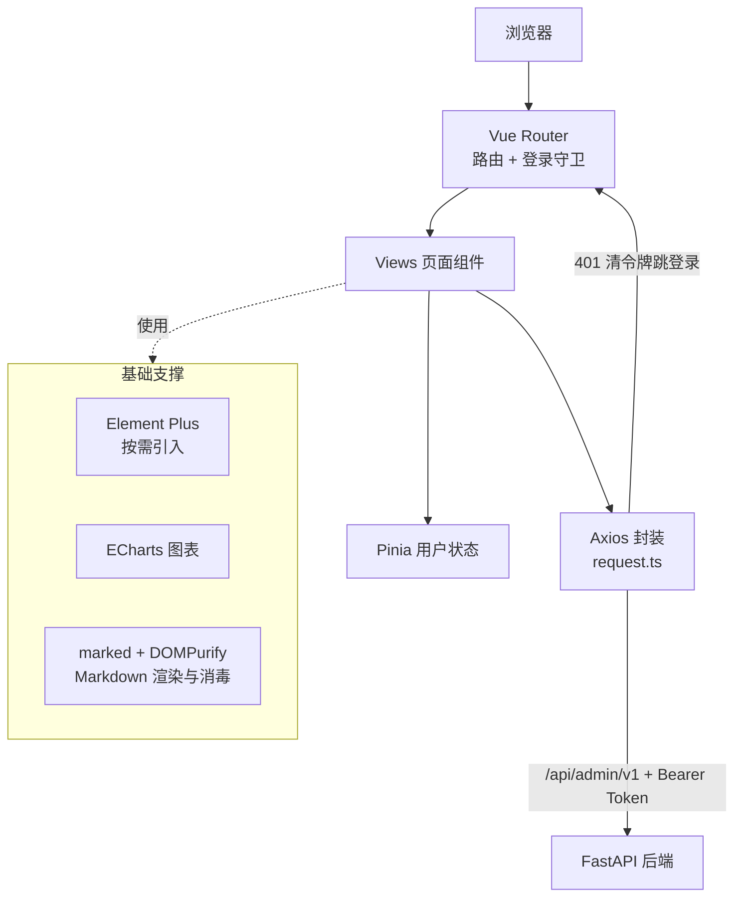
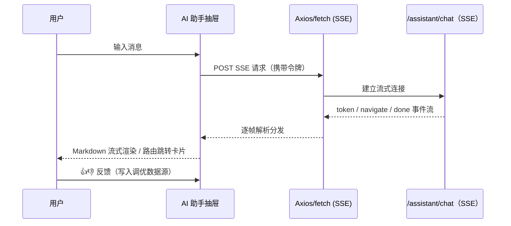

[English](README.en.md) | 中文

# 汉江管理系统前端（HanJiang Admin）

汉江管理系统前端是 [汉江（HanJiang）全栈快速开发平台](https://github.com/cross-lang/x-HanJiang) 的管理界面，基于 Vue 3 + TypeScript + Vite + Element Plus 构建，配套 FastAPI 后端使用，提供企业级中后台开箱即用的管理界面。


## 📖 项目简介

汉江管理系统前端面向企业内部管理员，与后端 `/api/admin/v1` 接口体系（JWT + RBAC）配套：登录鉴权、仪表盘、用户 / 角色 / 权限管理、审计与登录日志、文件、公告、通知中心、系统通知广播、开放平台应用审批、全局搜索，以及顶栏 AI 助手抽屉（SSE 流式对话）。生产构建产物由仓库根部的 Nginx 统一托管（`/` 路径），开发态通过 Vite 代理免跨域联调。

## 🚀 快速开始

### ⚙️ 1. 环境要求

| 系统 | 要求 |
|------|------|
| **Windows / Linux / macOS** | Node.js ≥ 18、npm ≥ 9 |

### 📥 2. 项目代码克隆

```bash
git clone https://github.com/cross-lang/x-HanJiang.git
cd x-HanJiang/web/admin
```

### 📦 3. 依赖同步安装

```bash
npm install
```

### 🔑 4. 环境配置

本项目无需前端侧配置文件，开发接口地址在 `vite.config.ts` 中维护（代理目标默认 `http://127.0.0.1:8000`）；生产环境由 Nginx 反代 `/api` 到后端，同源访问，无跨域问题。

### ▶️ 5. 服务启动

**方式一：本地开发热重载（推荐）**

```bash
npm run dev        # http://localhost:5173
```

Vite 自动将 `/api`、`/docs`、`/redoc`、`/openapi.json` 代理到后端 `http://127.0.0.1:8000`（并注入 `X-Real-IP: 127.0.0.1`，模拟生产 Nginx 行为），开发时无需处理跨域。

**方式二：Docker 容器部署**

本前端随仓库根 `docker-compose.yml` 的 nginx 服务构建部署（多阶段构建：npm build → Nginx 托管），无需单独部署：

```bash
# 在仓库根目录执行
docker compose up -d --build
# 访问 http://localhost/（nginx 统一 80 入口）
```

**方式三（可选）：生产构建 + 静态预览**

```bash
npm run build      # vue-tsc 类型检查 + Vite 打包，产物输出 dist/
npm run preview    # 本地预览构建产物
```

### ⌨️ 6. 常用工程命令

```bash
npm run dev          # 开发热重载
npm run build        # 生产构建（含 vue-tsc 类型检查）
npm run preview      # 本地预览构建产物
npm run typecheck    # 类型检查（vue-tsc --noEmit）
npm run lint         # ESLint 检查
npm run lint:fix     # ESLint 自动修复
npm run format       # Prettier 格式化
npm run format:check # Prettier 格式检查
```

### 📚 7. 使用方法示例

```bash
# 1. 启动后端（默认 8000，见 server/README.md）与本前端
npm run dev
# 2. 浏览器访问 http://localhost:5173，使用默认账号登录
#    superadmin / admin@123456（生产环境请务必修改）
# 3. 侧边栏进入用户管理 / 公告管理 / 开放应用等页面；
#    顶栏搜索框全局搜索；顶栏「小江」图标唤起 AI 助手抽屉
```

### ❓ 8. 常见问题排查

| 问题 | 可能原因 | 解决方案 |
|------|----------|----------|
| 登录页报网络错误 | 后端未启动 / 端口不一致 | 先启动后端（默认 8000），确认 `vite.config.ts` 代理目标一致 |
| 接口 401 后跳回登录页 | 令牌过期 | 重新登录即可（Axios 拦截器自动处理） |
| 端口 5173 被占用 | 其他进程占用 | Vite 自动 +1 换端口，或修改 `vite.config.ts` 的 `server.port` |
| `npm install` 缓慢 | 网络波动 | 使用国内镜像：`npm config set registry https://registry.npmmirror.com` |
| 构建报类型错误 | `vue-tsc` 类型检查失败 | 按 `npm run typecheck` 输出修复类型问题后再构建 |

## 📁 项目结构

```
admin/
├── src/
│   ├── api/                # API 请求封装（按业务模块拆分）
│   │   ├── request.ts      #   Axios 实例（baseURL /api/admin/v1，拦截器、统一错误处理）
│   │   ├── auth.ts         #   认证（登录 / 当前用户 / 菜单 / 登出）
│   │   ├── user.ts / role.ts / permission.ts # 系统管理接口
│   │   ├── openapi.ts      #   开放平台应用 / 审批 / 开发者接口
│   │   ├── assistant.ts    #   AI 助手（会话 CRUD / 反馈 / SSE 对话）
│   │   └── ...             #   announcement / notification / audit / file / dashboard / search / profile
│   ├── assets/             # 静态资源
│   ├── components/         # 通用组件
│   │   ├── Search.vue           # 顶栏全局搜索
│   │   └── NotificationBell.vue # 顶栏通知铃铛（站内信未读数）
│   ├── router/index.ts     # 路由配置 + 登录守卫
│   ├── stores/user.ts      # 用户状态（Pinia）
│   ├── utils/
│   │   ├── format.ts       # 格式化工具（日期等）
│   │   └── announcement.ts # 公告正文渲染（marked + DOMPurify 消毒）
│   ├── views/              # 页面组件（按模块分目录）
│   ├── App.vue             # 根组件
│   └── main.ts             # 入口
├── vite.config.ts          # 端口 5173、后端代理、Element Plus 按需引入、构建分包
├── package.json
├── tsconfig.json           # TypeScript 配置
└── tsconfig.node.json
```

## 🏗️ 系统架构

### 🏗️ 分层架构与数据流



### 🔄 AI 助手 SSE 对话流程



### 🧩 关键技术组件说明

| 组件 | 职责 |
|------|------|
| `api/request.ts` | Axios 实例：`baseURL=/api/admin/v1`，请求拦截注入 Bearer Token，响应拦截统一解包 / 401 跳登录 / 错误提示 |
| `router/index.ts` | 17 个业务路由 + 登录守卫（未登录重定向 `/login`） |
| `stores/user.ts` | Pinia 用户态（令牌 / 用户信息 / 菜单权限） |
| `vite.config.ts` | 端口 5173、四前缀代理（注入 X-Real-IP）、Element Plus 按需自动引入、vendor / element-plus / echarts 分包 |
| `NotificationBell.vue` | 站内信未读数轮询与角标 |
| AI 助手抽屉 | SSE 流式渲染（marked）、navigate 路由跳转卡片、会话历史恢复 |

## 🛠️ 技术栈

| 分类            | 技术                                           |
| --------------- | ---------------------------------------------- |
| **框架**        | Vue 3.5（Composition API）                     |
| **语言**        | TypeScript 5.7                                 |
| **构建工具**    | Vite 6                                         |
| **UI 组件库**   | Element Plus 2.9（unplugin 按需引入）+ icons-vue |
| **状态管理**    | Pinia                                          |
| **路由**        | Vue Router 4（含登录守卫）                     |
| **HTTP 客户端** | Axios 1.7（统一封装）                          |
| **图表**        | ECharts 6 + vue-echarts                        |
| **内容渲染**    | marked（Markdown）+ DOMPurify（XSS 消毒）      |
| **代码质量**    | ESLint + Prettier + vue-tsc                    |

## 🔌 API 文档说明

本项目为纯前端，不对外提供 API；调用的后端接口文档：

- Swagger UI：<http://localhost:8000/docs>（也可登录后在侧边栏「API 文档」页内嵌使用）
- 后端接口清单：见 [server/README.md](../../server/README.md#-api-文档说明)

### 🔗 请求封装约定

- `src/api/request.ts` 创建 Axios 实例，`baseURL` 为 `/api/admin/v1`
- **请求拦截器**：自动从 `localStorage` 读取 `access_token` 并注入 `Authorization: Bearer <token>`
- **响应拦截器**：直接返回 `response.data`；401 时清除令牌并跳转登录页；其他错误统一弹出 `ElMessage` 提示
- 业务页面统一通过 `request` 调用接口，路径与后端 `/api/admin/v1` 前缀下的路由对应（如 `/users`、`/profile/me`）

## 🧭 页面与路由

| 路由                   | 页面         | 说明                                                                   |
| ---------------------- | ------------ | ---------------------------------------------------------------------- |
| `/login`               | 登录页       | 用户名密码登录                                                         |
| `/`                    | 布局页       | 侧边栏 + 顶栏（含全局搜索、通知铃铛、AI 助手入口）                     |
| `/home`                | 首页         | 欢迎信息 + 公告展示 + 快捷入口                                          |
| `/dashboard`           | 仪表盘       | 统计卡片 + ECharts 图表 + 最近记录                                     |
| `/users`               | 用户管理     | 用户列表 + 多角色 + 编辑 / 禁用 / 重置密码 + 导入导出                  |
| `/roles`               | 角色管理     | 角色列表 + 权限分组勾选 + 编辑 / 删除 / 启停                           |
| `/permissions`         | 权限管理     | 权限列表（后端自动扫描注册）+ 权限元数据                               |
| `/apis/swagger`        | Swagger 文档 | 内嵌 Swagger UI，在线调试接口                                          |
| `/logs/audit`          | 审计日志     | 业务操作日志列表（含导出）                                             |
| `/logs/login`          | 登录日志     | 登录日志列表（含导出）                                                 |
| `/apps`                | 开放应用管理 | 我新建的应用：CRUD + scope 授权 + AppKey 轮换                          |
| `/app-approvals`       | 应用审批     | 我审批的：开发者应用 / scope 申请的通过与驳回                          |
| `/app-scopes`          | 应用 scope   | 开放平台 scope 列表                                                    |
| `/open-developers`     | 开发者管理   | 开发者列表（含认证状态）+ 名下应用                                     |
| `/system-notification` | 系统通知管理 | 发布 / 撤回系统通知（普通 / 维护）+ 渠道配置 / 测试 / 监控             |
| `/announcements`       | 公告管理     | 创建 / 编辑 / 删除 / 发布 / 下架，状态 / 位置 / 关键字过滤，有效期展示 |
| `/station-messages`    | 站内信       | 我的消息列表、单条已读 / 全部已读                                       |
| `/profile`             | 个人中心     | 个人信息 + 改密 / 改手机 / 改邮箱（验证码二次认证）+ 通知偏好 / 接收人 |
| `/files`               | 文件管理     | 上传 / 列表 / 下载 / 删除                                              |

## 🔀 后端代理（开发环境）

`vite.config.ts` 中配置了以下代理（`/api` 代理额外注入 `X-Real-IP: 127.0.0.1`，模拟生产 Nginx 注入真实客户端 IP 的行为——后端 `get_client_ip` 只认该头）：

| 前缀            | 目标                  |
| --------------- | --------------------- |
| `/api`          | http://127.0.0.1:8000 |
| `/docs`         | http://127.0.0.1:8000 |
| `/redoc`        | http://127.0.0.1:8000 |
| `/openapi.json` | http://127.0.0.1:8000 |

## 🤝 联调说明

- 开发前需先启动后端服务（参考 [server/README.md](../../server/README.md)），默认端口 `8000`
- 默认超级管理员账号：`superadmin` / `admin@123456`，生产环境请务必修改
- 生产构建后由仓库根的 Nginx（`web/nginx.conf`）统一托管：`/` 指向本前端产物、`/api/` 反代后端并注入 `X-Real-IP`，详见 [web/nginx.conf](../nginx.conf)

## 🗄️ 存储配置说明

本前端为纯静态 SPA，不持久化任何业务数据；令牌与用户信息存于浏览器 `localStorage`，由后端统一管理数据存储。

## 📄 许可证

本项目基于 [MIT License](../../LICENSE) 开源。

## 📚 参考资料

| 技术 | 官方文档 |
|------|----------|
| Vue 3 | https://vuejs.org/ |
| TypeScript | https://www.typescriptlang.org/docs/ |
| Vite | https://vite.dev/ |
| Element Plus | https://element-plus.org/ |
| Pinia | https://pinia.vuejs.org/ |
| Vue Router | https://router.vuejs.org/ |
| Axios | https://axios-http.com/docs/intro |
| ECharts | https://echarts.apache.org/ |
| ESLint | https://eslint.org/docs/latest/ |
| Prettier | https://prettier.io/docs/ |

## 📮 联系方式

- **作者**：John Young（夜雨诗来）
- **邮箱**：john.young@foxmail.com
- **Gitee**：https://gitee.com/yeyushilai
- **GitHub**：https://github.com/yeyushilai
- **项目地址**：https://github.com/cross-lang/x-HanJiang
