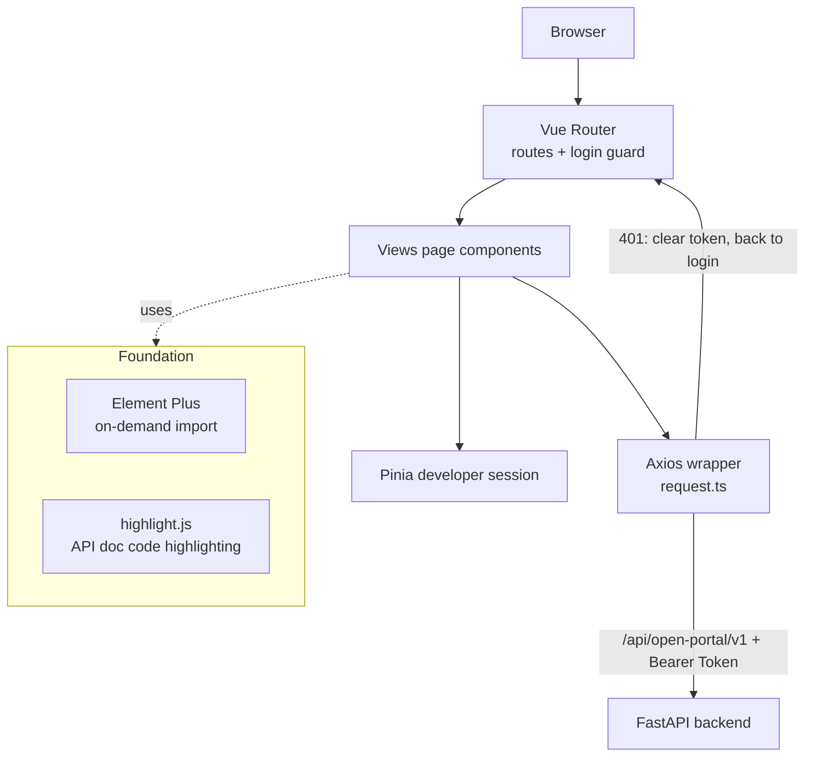
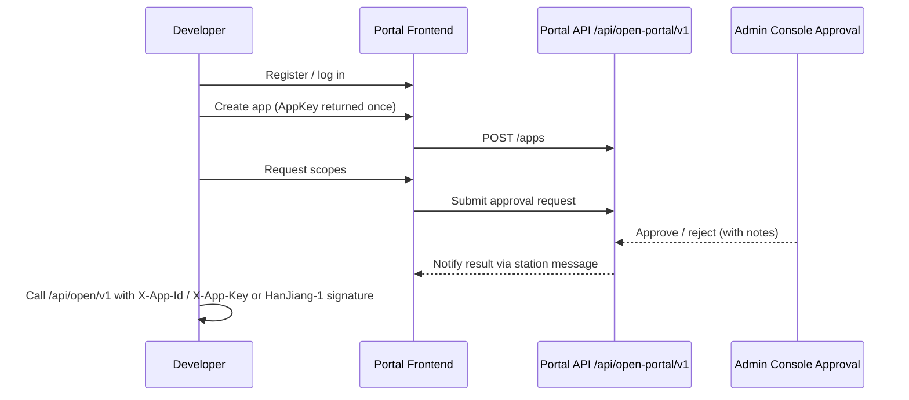

[中文](README.md) | English

# HanJiang Open Portal

HanJiang Open Portal is the developer portal of the [HanJiang full-stack rapid development platform](https://github.com/cross-lang/x-HanJiang). Built with Vue 3 + TypeScript + Vite + Element Plus, it provides external developers with a one-stop entry for app onboarding, open capability documentation and authentication guides, paired with the FastAPI backend.


## 📖 Project Introduction

HanJiang Open Portal targets external developers and pairs with the backend `/api/open-portal/v1` API system (developer session JWT + Redis login state). It is the portal side of the platform's three parts (Admin Console / Open API / Developer Portal): developer registration / login / password recovery, app management (create / scope requests / AppKey rotation / approval tracking), open capability docs, authentication & authorization guides, station messages, and profile center. Production builds are served by the repository-root Nginx under the `/portal/` subpath (same-domain deployment with the admin console); during development the Vite proxy removes cross-origin concerns.

**Key Features:**

- **Developer Account**: register / login (stateful session: JWT + Redis login state; old tokens invalidated on logout / password change), forgot / reset password, profile maintenance
- **App Management**: create app (AppId auto-generated + AppKey returned once at creation), edit / delete (soft), scope request & adjustment, AppKey rotation, approval status & notes tracking (apps not yet approved cannot call open APIs)
- **Open Capability Docs**: a built-in catalog of 18 open endpoints (Health / App Info / User / Role / File), each documenting request headers, Query / Body parameters, response fields & examples, and cURL examples (HanJiang-1 HMAC signature mode)
- **Auth & Authorization Guides**: auth modes (plain / signed / mixed), HanJiang-1 signature algorithm & anti-replay explanation, common request parameters, gateway auth error codes
- **Station Messages**: top-bar bell unread badge (15s polling), message list, mark one read / mark all read
- **Profile Center**: developer profile, certification status, change password
- **Code Highlighting**: API doc code blocks rendered with highlight.js

## 🚀 Quick Start

### ⚙️ 1. Environment Requirements

| OS | Requirements |
|------|------|
| **Windows / Linux / macOS** | Node.js ≥ 18, npm ≥ 9 |

### 📥 2. Clone the Repository

```bash
git clone https://github.com/cross-lang/x-HanJiang.git
cd x-HanJiang/web/open_portal
```

### 📦 3. Install Dependencies

```bash
npm install
```

### 🔑 4. Configuration

No frontend-side config file is needed: development API addresses are maintained in `vite.config.ts` (proxy target defaults to `http://127.0.0.1:8000`); in production Nginx reverse-proxies `/api` to the backend — same-origin access, no CORS issues.

### ▶️ 5. Start the Service

**Option 1: local development with hot reload (recommended)**

```bash
npm run dev        # http://localhost:5174
```

In development `base=/`, so the root path is used directly. Vite automatically proxies `/api/`, `/docs`, `/redoc` and `/openapi.json` to the backend at `http://127.0.0.1:8000` (the `/api/` proxy additionally injects `X-Real-IP: 127.0.0.1` to mimic production Nginx behavior), so no CORS handling is needed.

> The portal dev port is **5174** (distinct from the admin console's 5173); the `/api/` proxy prefix carries a trailing slash so only real API paths are proxied — frontend routes starting with `/api` (e.g. `/api-docs`) are not swallowed.

**Option 2: Docker deployment**

This frontend is built and served by the nginx service of the repository-root `docker-compose.yml` (multi-stage build: npm build → Nginx hosting under the `/portal/` subpath) — no separate deployment required:

```bash
# Run from the repository root
docker compose up -d --build
# Visit http://localhost/portal/ (unified Nginx entry on port 80)
```

**Option 3 (optional): production build + static preview**

```bash
npm run build      # vue-tsc type check + Vite bundling (production base=/portal/), output to dist/
npm run preview    # preview the build output locally at http://localhost:4173/portal/
```

### ⌨️ 6. Common Engineering Commands

```bash
npm run dev          # dev server with hot reload
npm run build        # production build (includes vue-tsc type check)
npm run preview      # preview build output locally
npm run typecheck    # type check (vue-tsc --noEmit)
npm run lint         # ESLint check
npm run lint:fix     # ESLint auto-fix
npm run format       # Prettier formatting
npm run format:check # Prettier format check
```

### 📚 7. Usage Examples

```bash
# 1. Start the backend (port 8000 by default, see server/README.md) and this frontend
npm run dev
# 2. Open http://localhost:5174, register a developer account and log in
# 3. Create an app in "My Apps": AppId is generated automatically,
#    and the AppKey is returned only once at creation — store it safely
# 4. Request the scopes you need and wait for admin approval;
#    the result is delivered via station messages
# 5. Once approved, open "Open Capabilities" for endpoint docs and cURL examples,
#    then call the open APIs with X-App-Id / X-App-Key (or the HanJiang-1 signature)
```

### ❓ 8. Troubleshooting

| Issue | Possible Cause | Solution |
|------|----------|----------|
| Port 5174 already in use | Occupied by another process | Vite auto-increments the port, or change `server.port` in `vite.config.ts` |
| Redirected to login after 401 | Session expired | Just log in again (handled automatically by the Axios interceptor) |
| Open API call rejected | App not approved / wrong signature | Complete app & scope approval in the admin console; check the signature against the "Auth & Authorization" guides |
| AppKey lost | AppKey is returned only once at creation | Rotate the AppKey in "My Apps" and use the new key |
| Slow `npm install` | Network fluctuation | Use a mirror: `npm config set registry https://registry.npmmirror.com` |
| Build fails with type errors | `vue-tsc` check failed | Fix the issues reported by `npm run typecheck`, then rebuild |

## 📁 Project Structure

```
open_portal/
├── src/
│   ├── api/                # Portal API wrappers (unified under the /api/open-portal/v1 prefix)
│   │   ├── request.ts      #   Axios instance (baseURL /api/open-portal/v1, interceptors, unified error handling)
│   │   ├── auth.ts         #   Register / login / refresh / logout / change password
│   │   ├── developer.ts    #   Developer profile & certification
│   │   ├── apps.ts         #   App CRUD / scope requests / key rotation
│   │   ├── scopes.ts       #   Scope catalog
│   │   └── messages.ts     #   Station messages (unread / list / read)
│   ├── components/         # Shared components
│   │   ├── GroupCheckboxPanel.vue # Grouped scope checkbox panel
│   │   ├── NotificationBell.vue   # Top-bar bell (unread badge)
│   │   ├── SecretResultDialog.vue # One-time AppKey display dialog
│   │   ├── CodeBlock.vue          # Code block (highlight.js + copy)
│   │   ├── AuthAnchorNav.vue      # Anchor navigation for auth guides
│   │   ├── GlobalSearch.vue       # Top-bar global search
│   │   └── PageHead.vue           # Page title head
│   ├── composables/
│   │   └── useScopeCatalog.ts     # Scope catalog data
│   ├── data/
│   │   └── capability.ts   # Open capability endpoint catalog (18 endpoints, one-to-one with /api/open/v1)
│   ├── plugins/icons.ts    # Element Plus icon registration
│   ├── router/index.ts     # Route config + login guard (public paths: login / register / forgot / reset password)
│   ├── stores/developer.ts # Developer session state (Pinia)
│   ├── styles/             # Global styles (global / auth-guide / utilities)
│   ├── types/              # TypeScript type definitions
│   ├── utils/
│   │   ├── storage.ts      # Token storage (localStorage)
│   │   └── format.ts       # Formatting utilities
│   ├── views/              # Page components (by module)
│   │   ├── login/ register/ forgot-password/ reset-password/ # Account pages
│   │   ├── layout/         # Layout (header / sidebar / main area)
│   │   ├── home/           # Home (capability module overview + my apps summary)
│   │   ├── apps/           # App management (CRUD / scope requests / approval records)
│   │   ├── capability/     # Open capability docs (module → endpoint three-level menu)
│   │   ├── auth/           # Auth & authorization guides (modes / signature / common params / error codes)
│   │   └── profile/        # Profile center
│   ├── App.vue             # Root component
│   └── main.ts             # Entry
├── index.html
├── vite.config.ts          # Port 5174, production base=/portal/, backend proxy, Element Plus on-demand import, build chunking
├── package.json
├── tsconfig.json           # TypeScript config
└── tsconfig.node.json
```

## 🏗️ System Architecture

### 🏗️ Layered Architecture & Data Flow



### 🔄 App Onboarding & Approval Flow



### 🧩 Key Components

| Component | Responsibility |
|------|------|
| `api/request.ts` | Axios instance: `baseURL=/api/open-portal/v1`; request interceptor injects Bearer Token; on 401 clears the token and redirects to login; other errors show a unified `ElMessage` toast |
| `router/index.ts` | Routes + global guard: when unauthenticated only login / register / forgot / reset password are allowed; after login the developer profile is fetched automatically |
| `stores/developer.ts` | Pinia developer session state (token / profile) |
| `data/capability.ts` | Catalog of 18 open endpoints, driving the three-level "Open Capabilities" doc menu |
| `vite.config.ts` | Port 5174, production base=`/portal/`, four-prefix proxy (`/api/` with X-Real-IP injection), vendor / element-plus chunking |
| `NotificationBell.vue` | Station-message unread polling (15s) & badge |
| `CodeBlock.vue` | highlight.js rendering for API example code |
| `GlobalSearch.vue` | Top-bar global search |

## 🛠️ Tech Stack

| Category         | Technology                                             |
| ---------------- | ------------------------------------------------------ |
| **Framework**    | Vue 3.5 (Composition API)                              |
| **Language**     | TypeScript 5.7                                         |
| **Build Tool**   | Vite 6 (production base=`/portal/`)                    |
| **UI Library**   | Element Plus 2.9 (unplugin on-demand import) + icons-vue |
| **State**        | Pinia (developer session state)                        |
| **Router**       | Vue Router 4 (with login guard)                        |
| **HTTP Client**  | Axios 1.7 (unified wrapper)                            |
| **Highlighting** | highlight.js 11                                        |
| **Code Quality** | ESLint + Prettier + vue-tsc                            |

## 🔌 API Documentation

This is a pure frontend project and exposes no APIs of its own. It consumes two API groups with strictly separated prefixes and auth:

| Type          | Prefix                 | Auth                                                                 |
| ------------- | ---------------------- | -------------------------------------------------------------------- |
| Portal APIs   | `/api/open-portal/v1`  | Developer session JWT (`Authorization: Bearer <access_token>` in localStorage) |
| Open APIs     | `/api/open/v1`         | `X-App-Id` / `X-App-Key` (plain) or HanJiang-1 HMAC signature; the portal provides docs & examples only — actual calls come from developer apps |

- Unified response envelope: `{ code, message, data, timestamp, request_id }`
- Pagination: `data: { items, total, page, page_size, total_pages }`
- New apps enter the admin approval workflow (`approval_status = pending`); only approved apps may call open APIs
- App/scope applications and approval results are delivered via developer station messages

> See [API_DEPENDENCIES.md](./API_DEPENDENCIES.md) for the full backend endpoint dependency list.

### 📦 Request Conventions

- `src/api/request.ts` creates the Axios instance with `baseURL` `/api/open-portal/v1` and a 10s timeout
- **Request interceptor**: reads the token from `localStorage` and injects `Authorization: Bearer <token>`
- **Response interceptor**: on 401 clears the token and redirects to the login page (silent when not logged in); other errors show a unified `ElMessage` toast
- Generic methods `get / post / put / patch / delete` return the full `ApiResponse<T>` envelope; callers read business data via `res.data`
- Open APIs (`/api/open/v1`) are never called by the portal itself: the cURL examples on the "Open Capabilities" pages are generated from `data/capability.ts`

## 🧭 Pages & Routes

| Route                        | Page              | Description                                                            |
| ---------------------------- | ----------------- | ----------------------------------------------------------------------- |
| `/login`                     | Login             | Developer login                                                          |
| `/register`                  | Register          | Register developer account                                               |
| `/forgot-password`           | Forgot Password   | Self-service password recovery                                           |
| `/reset-password`            | Reset Password    | Set a new password                                                       |
| `/` (`/home`)                | Layout            | Sidebar + top bar (notification bell, global search)                     |
| `/home`                      | Home              | Capability module overview + my apps summary                             |
| `/apps`                      | App Management    | App CRUD + scope requests + AppKey rotation + approval status & records  |
| `/capability/:module/:apiId` | Capability        | Endpoint docs (headers / params / response / cURL examples)              |
| `/capability/:module`        | —                 | Module route, redirects to the module's first endpoint                   |
| `/api-docs`                  | —                 | Legacy path, redirects to `/capability/user/user-create`                 |
| `/auth/modes`                | Auth Modes        | Plain / signed / mixed integration modes                                 |
| `/auth/signature`            | Signature Guide   | HanJiang-1 signature construction & anti-replay explanation              |
| `/auth/params`               | Common Params     | Common request headers & response envelope                               |
| `/auth/errors`               | Gateway Errors    | Open API auth error codes                                                |
| `/profile`                   | Profile           | Profile maintenance / certification / change password                    |

## 🔀 Backend Proxy (Development)

`vite.config.ts` configures the following proxies (the `/api/` proxy additionally injects `X-Real-IP: 127.0.0.1` to mimic production Nginx injecting the real client IP — the backend `get_client_ip` only trusts that header):

| Prefix          | Target                |
| --------------- | --------------------- |
| `/api/`         | http://127.0.0.1:8000 |
| `/docs`         | http://127.0.0.1:8000 |
| `/redoc`        | http://127.0.0.1:8000 |
| `/openapi.json` | http://127.0.0.1:8000 |

## 🤝 Integration Notes

- Start the backend first (see [server/README.en.md](../../server/README.en.md)), default port `8000`
- The portal uses a separate developer account system, isolated from the admin user system (developer tables + developer session login state)
- The portal dev port is 5174 and does not conflict with the admin console (5173); both can run side by side
- After a production build, the repository-root Nginx ([web/nginx.conf](../nginx.conf)) serves everything: `/portal/` → this frontend (built with base=`/portal/`), `/api/` → backend with `X-Real-IP` injected
- Apps must be approved in the admin console before calling open APIs

## 🗄️ Storage Notes

This frontend is a pure static SPA and persists no business data; the developer session token lives in the browser's `localStorage`, while the server-side login state is managed by Redis (old tokens are invalidated immediately on logout / password change / token refresh).

## 📄 License

This project is open-sourced under the [MIT License](../../LICENSE).

## 📚 References

| Technology | Official Docs |
|------|----------|
| Vue 3 | https://vuejs.org/ |
| TypeScript | https://www.typescriptlang.org/docs/ |
| Vite | https://vite.dev/ |
| Element Plus | https://element-plus.org/ |
| Pinia | https://pinia.vuejs.org/ |
| Vue Router | https://router.vuejs.org/ |
| Axios | https://axios-http.com/docs/intro |
| highlight.js | https://highlightjs.org/ |
| ESLint | https://eslint.org/docs/latest/ |
| Prettier | https://prettier.io/docs/ |

## 📮 Contact

- **Author**: John Young
- **Email**: john.young@foxmail.com
- **Gitee**: https://gitee.com/yeyushilai
- **GitHub**: https://github.com/yeyushilai
- **Project**: https://github.com/cross-lang/x-HanJiang
