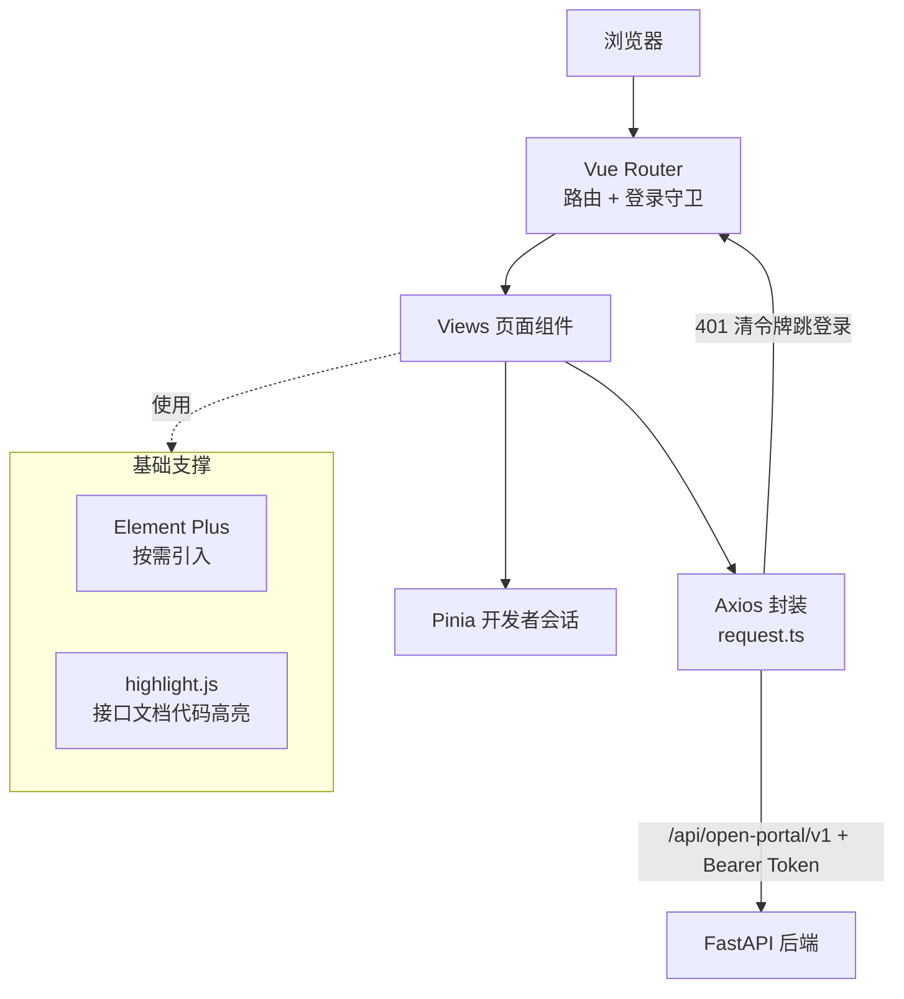
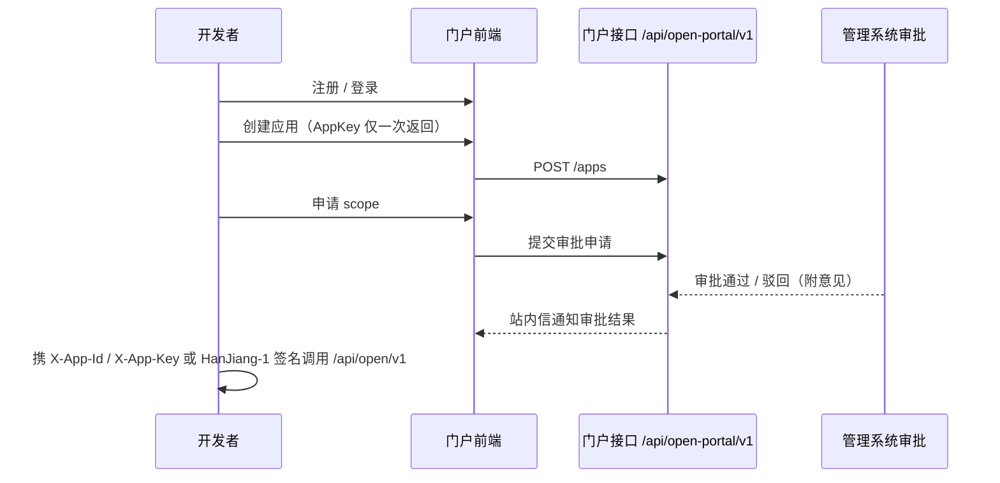

[English](README.en.md) | 中文

# 汉江开放平台门户前端（HanJiang Open Portal）

汉江开放平台门户前端是 [汉江（HanJiang）全栈快速开发平台](https://github.com/cross-lang/x-HanJiang) 的开发者门户，基于 Vue 3 + TypeScript + Vite + Element Plus 构建，面向外部开发者提供应用接入、开放能力文档与认证指引的一站式入口，配套 FastAPI 后端使用。


## 📖 项目简介

汉江开放平台门户面向外部开发者，与后端 `/api/open-portal/v1` 接口体系（开发者会话 JWT + Redis 登录态）配套，是平台「管理系统 / 开放 API / 开放平台门户」三端中的门户端：开发者注册 / 登录 / 找回密码、应用管理（创建 / scope 申请 / AppKey 轮换 / 审批跟踪）、开放能力文档、认证与授权文档、站内信与个人中心。生产构建产物由仓库根部的 Nginx 托管在 `/portal/` 子路径（与管理系统同域部署），开发态通过 Vite 代理免跨域联调。

**核心功能：**

- **开发者账号**：注册 / 登录（有状态会话：JWT + Redis 登录态，登出 / 改密后旧令牌立即失效）、忘记密码 / 重置密码、资料维护
- **应用管理**：创建应用（AppId 自动生成 + AppKey 仅创建时返回一次）、编辑 / 删除（软删）、scope 申请与调整、AppKey 轮换、审批状态与意见跟踪（未通过审批的应用无法调用开放接口）
- **开放能力文档**：内置 18 个开放接口的能力目录（健康管理 / 应用信息 / 用户管理 / 角色管理 / 文件管理），逐接口展示请求头、Query / Body 参数、响应字段与示例、cURL 调用示例（HanJiang-1 HMAC 签名模式）
- **认证与授权文档**：鉴权模式（明文 / 签名 / 混合）、HanJiang-1 签名算法与防重放说明、通用请求参数、网关鉴权错误码
- **站内信**：右上角铃铛未读数角标（15s 轮询）、消息列表、单条已读 / 全部已读
- **个人中心**：开发者资料、认证状态、修改密码
- **代码高亮**：接口文档代码块基于 highlight.js 渲染

## 🚀 快速开始

### ⚙️ 1. 环境要求

| 系统 | 要求 |
|------|------|
| **Windows / Linux / macOS** | Node.js ≥ 18、npm ≥ 9 |

### 📥 2. 项目代码克隆

```bash
git clone https://github.com/cross-lang/x-HanJiang.git
cd x-HanJiang/web/open_portal
```

### 📦 3. 依赖同步安装

```bash
npm install
```

### 🔑 4. 环境配置

本项目无需前端侧配置文件，开发接口地址在 `vite.config.ts` 中维护（代理目标默认 `http://127.0.0.1:8000`）；生产环境由 Nginx 反代 `/api` 到后端，同源访问，无跨域问题。

### ▶️ 5. 服务启动

**方式一：本地开发热重载（推荐）**

```bash
npm run dev        # http://localhost:5174
```

开发态 `base=/`，直接访问根路径。Vite 自动将 `/api/`、`/docs`、`/redoc`、`/openapi.json` 代理到后端 `http://127.0.0.1:8000`（`/api/` 代理额外注入 `X-Real-IP: 127.0.0.1`，模拟生产 Nginx 行为），开发时无需处理跨域。

> 门户开发端口为 **5174**（与管理系统前端 5173 区分）；`/api/` 代理带尾部斜杠，仅代理真实接口路径，避免吞掉 `/api-docs` 等以 `/api` 开头的前端路由。

**方式二：Docker 容器部署**

本前端随仓库根 `docker-compose.yml` 的 nginx 服务构建部署（多阶段构建：npm build → Nginx 托管于 `/portal/` 子路径），无需单独部署：

```bash
# 在仓库根目录执行
docker compose up -d --build
# 访问 http://localhost/portal/（nginx 统一 80 入口）
```

**方式三（可选）：生产构建 + 静态预览**

```bash
npm run build      # vue-tsc 类型检查 + Vite 打包（生产 base=/portal/），产物输出 dist/
npm run preview    # 本地预览构建产物，访问 http://localhost:4173/portal/
```

### ⌨️ 6. 常用工程命令

```bash
npm run dev          # 开发热重载
npm run build        # 生产构建（含 vue-tsc 类型检查）
npm run preview      # 本地预览构建产物
npm run typecheck    # 类型检查（vue-tsc --noEmit）
npm run lint         # ESLint 检查
npm run lint:fix     # ESLint 自动修复
npm run format       # Prettier 格式化
npm run format:check # Prettier 格式检查
```

### 📚 7. 使用方法示例

```bash
# 1. 启动后端（默认 8000，见 server/README.md）与本前端
npm run dev
# 2. 浏览器访问 http://localhost:5174，注册开发者账号并登录
# 3. 进入「我的应用」创建应用：AppId 自动生成，
#    AppKey 仅创建时返回一次，务必妥善保存
# 4. 申请所需 scope，等待管理系统审批；审批结果通过站内信通知
# 5. 审批通过后，在「开放能力」查看接口文档与 cURL 示例，
#    使用 X-App-Id / X-App-Key（或 HanJiang-1 签名）调用开放接口
```

### ❓ 8. 常见问题排查

| 问题 | 可能原因 | 解决方案 |
|------|----------|----------|
| 端口 5174 被占用 | 其他进程占用 | Vite 自动 +1 换端口，或修改 `vite.config.ts` 的 `server.port` |
| 接口 401 后跳回登录页 | 会话过期 | 重新登录即可（Axios 拦截器自动处理） |
| 开放接口调用被拒 | 应用未审批通过 / 签名参数错误 | 在管理系统完成应用与 scope 审批；对照「认证与授权」文档检查签名 |
| AppKey 丢失 | AppKey 仅创建时返回一次 | 在「我的应用」执行 AppKey 轮换后使用新密钥 |
| `npm install` 缓慢 | 网络波动 | 使用国内镜像：`npm config set registry https://registry.npmmirror.com` |
| 构建报类型错误 | `vue-tsc` 检查失败 | 按 `npm run typecheck` 输出修复后再构建 |

## 📁 项目结构

```
open_portal/
├── src/
│   ├── api/                # 门户接口封装（统一挂 /api/open-portal/v1 前缀）
│   │   ├── request.ts      #   Axios 实例（baseURL /api/open-portal/v1，拦截器、统一错误处理）
│   │   ├── auth.ts         #   注册 / 登录 / 刷新 / 登出 / 改密
│   │   ├── developer.ts    #   开发者资料与认证
│   │   ├── apps.ts         #   应用 CRUD / scope 申请 / 密钥轮换
│   │   ├── scopes.ts       #   scope 目录
│   │   └── messages.ts     #   站内信（未读数 / 列表 / 已读）
│   ├── components/         # 通用组件
│   │   ├── GroupCheckboxPanel.vue # scope 分组勾选面板
│   │   ├── NotificationBell.vue   # 顶栏通知铃铛（未读数角标）
│   │   ├── SecretResultDialog.vue # AppKey 一次性展示弹窗
│   │   ├── CodeBlock.vue          # 代码块（highlight.js 高亮 + 复制）
│   │   ├── AuthAnchorNav.vue      # 认证文档锚点导航
│   │   ├── GlobalSearch.vue       # 顶栏全局搜索
│   │   └── PageHead.vue           # 页面标题头
│   ├── composables/
│   │   └── useScopeCatalog.ts     # scope 目录数据
│   ├── data/
│   │   └── capability.ts   # 开放能力接口目录（18 个开放接口，与 /api/open/v1 一一对应）
│   ├── plugins/icons.ts    # Element Plus 图标注册
│   ├── router/index.ts     # 路由配置 + 登录守卫（公共路径：登录 / 注册 / 找回密码 / 重置密码）
│   ├── stores/developer.ts # 开发者会话状态（Pinia）
│   ├── styles/             # 全局样式（global / auth-guide / utilities）
│   ├── types/              # TypeScript 类型定义
│   ├── utils/
│   │   ├── storage.ts      # 令牌存取（localStorage）
│   │   └── format.ts       # 格式化工具
│   ├── views/              # 页面组件（按模块分目录）
│   │   ├── login/ register/ forgot-password/ reset-password/ # 账号相关
│   │   ├── layout/         # 布局（顶栏 / 侧边栏 / 主区域）
│   │   ├── home/           # 首页（开放能力模块总览 + 我的应用概览）
│   │   ├── apps/           # 应用管理（CRUD / scope 申请 / 审批记录）
│   │   ├── capability/     # 开放能力文档（模块 → 接口三级菜单）
│   │   ├── auth/           # 认证与授权文档（模式 / 签名 / 通用参数 / 错误码）
│   │   └── profile/        # 个人中心
│   ├── App.vue             # 根组件
│   └── main.ts             # 入口
├── index.html
├── vite.config.ts          # 端口 5174、生产 base=/portal/、后端代理、Element Plus 按需引入、构建分包
├── package.json
├── tsconfig.json           # TypeScript 配置
└── tsconfig.node.json
```

## 🏗️ 系统架构

### 🏗️ 分层架构与数据流



### 🔄 应用接入与审批流程



### 🧩 关键技术组件说明

| 组件 | 职责 |
|------|------|
| `api/request.ts` | Axios 实例：`baseURL=/api/open-portal/v1`，请求拦截注入 Bearer Token，401 清令牌跳登录，其他错误统一 `ElMessage` 提示 |
| `router/index.ts` | 路由 + 全局守卫：未登录仅放行登录 / 注册 / 找回密码 / 重置密码；登录后自动拉取开发者资料 |
| `stores/developer.ts` | Pinia 开发者会话态（令牌 / 资料） |
| `data/capability.ts` | 18 个开放接口的能力目录，驱动「开放能力」三级菜单文档 |
| `vite.config.ts` | 端口 5174、生产 base=`/portal/`、四前缀代理（`/api/` 注入 X-Real-IP）、vendor / element-plus 分包 |
| `NotificationBell.vue` | 站内信未读数轮询（15s）与角标 |
| `CodeBlock.vue` | 接口示例代码 highlight.js 高亮渲染 |
| `GlobalSearch.vue` | 顶栏全局搜索 |

## 🛠️ 技术栈

| 分类            | 技术                                             |
| --------------- | ------------------------------------------------ |
| **框架**        | Vue 3.5（Composition API）                       |
| **语言**        | TypeScript 5.7                                   |
| **构建工具**    | Vite 6（生产 base=`/portal/`）                   |
| **UI 组件库**   | Element Plus 2.9（unplugin 按需引入）+ icons-vue |
| **状态管理**    | Pinia（开发者会话状态）                          |
| **路由**        | Vue Router 4（含登录守卫）                       |
| **HTTP 客户端** | Axios 1.7（统一封装）                            |
| **代码高亮**    | highlight.js 11                                  |
| **代码质量**    | ESLint + Prettier + vue-tsc                      |

## 🔌 API 文档说明

本项目为纯前端，不对外提供 API；涉及两类后端接口，前缀与鉴权方式严格隔离：

| 类型     | 前缀                   | 鉴权方式                                                                     |
| -------- | ---------------------- | ---------------------------------------------------------------------------- |
| 门户接口 | `/api/open-portal/v1`  | 开发者会话 JWT（`Authorization: Bearer <access_token>`，存于 localStorage）  |
| 开放接口 | `/api/open/v1`         | `X-App-Id` / `X-App-Key`（明文）或 HanJiang-1 HMAC 签名；门户内仅提供文档与调用示例，实际调用来自开发者应用 |

- 统一响应包裹：`{ code, message, data, timestamp, request_id }`
- 分页结构：`data: { items, total, page, page_size, total_pages }`
- 应用创建后进入管理端审批流（`approval_status = pending`），审批通过后方可调用开放接口
- 应用与 scope 申请、审批结果通过开发者站内信通知

> 后端接口依赖全量清单见 [API_DEPENDENCIES.md](./API_DEPENDENCIES.md)。

### 📦 请求封装约定

- `src/api/request.ts` 创建 Axios 实例，`baseURL` 为 `/api/open-portal/v1`，超时 10s
- **请求拦截器**：自动从 `localStorage` 读取令牌并注入 `Authorization: Bearer <token>`
- **响应拦截器**：401 清除令牌并跳转登录页（未登录场景静默处理）；其他错误统一弹出 `ElMessage` 提示
- 泛型方法 `get / post / put / patch / delete` 返回完整包裹体 `ApiResponse<T>`，调用方经 `res.data` 取业务数据
- 开放接口（`/api/open/v1`）不由门户直接调用：「开放能力」页的 cURL 示例由 `data/capability.ts` 生成

## 🧭 页面与路由

| 路由                         | 页面       | 说明                                                          |
| ---------------------------- | ---------- | ------------------------------------------------------------- |
| `/login`                     | 登录页     | 开发者登录                                                    |
| `/register`                  | 注册页     | 注册开发者账号                                                |
| `/forgot-password`           | 忘记密码   | 自助找回密码                                                  |
| `/reset-password`            | 重置密码   | 设置新密码                                                    |
| `/`（`/home`）               | 布局页     | 侧边栏 + 顶栏（通知铃铛、全局搜索）                           |
| `/home`                      | 首页       | 开放能力模块总览 + 我的应用概览                               |
| `/apps`                      | 应用管理   | 应用 CRUD + scope 申请 + AppKey 轮换 + 审批状态与记录         |
| `/capability/:module/:apiId` | 开放能力   | 接口级文档（请求头 / 参数 / 响应 / cURL 示例）                |
| `/capability/:module`        | —          | 模块路由，自动重定向到该模块首个接口                          |
| `/api-docs`                  | —          | 兼容旧路径，重定向到 `/capability/user/user-create`           |
| `/auth/modes`                | 鉴权模式   | 明文 / 签名 / 混合三种接入模式说明                            |
| `/auth/signature`            | 签名算法   | HanJiang-1 签名构造与防重放说明                               |
| `/auth/params`               | 通用参数   | 公共请求头与响应结构                                          |
| `/auth/errors`               | 网关错误码 | 开放接口鉴权错误码说明                                        |
| `/profile`                   | 个人中心   | 资料维护 / 认证申请 / 修改密码                                |

## 🔀 后端代理（开发环境）

`vite.config.ts` 中配置了以下代理（`/api/` 代理额外注入 `X-Real-IP: 127.0.0.1`，模拟生产 Nginx 注入真实客户端 IP 的行为——后端 `get_client_ip` 只认该头）：

| 前缀            | 目标                  |
| --------------- | --------------------- |
| `/api/`         | http://127.0.0.1:8000 |
| `/docs`         | http://127.0.0.1:8000 |
| `/redoc`        | http://127.0.0.1:8000 |
| `/openapi.json` | http://127.0.0.1:8000 |

## 🤝 联调说明

- 开发前需先启动后端服务（参考 [server/README.md](../../server/README.md)），默认端口 `8000`
- 门户使用独立的开发者账号体系，与管理系统用户体系隔离（开发者表 + 开发者会话登录态）
- 门户开发端口为 5174，与管理系统前端（5173）互不冲突，可同时启动联调
- 生产构建后由仓库根的 Nginx（[web/nginx.conf](../nginx.conf)）统一托管：`/portal/` 指向本前端产物（构建 base=`/portal/`）、`/api/` 反代后端并注入 `X-Real-IP`
- 应用需在管理系统完成审批后方可调用开放接口

## 🗄️ 存储配置说明

本前端为纯静态 SPA，不持久化任何业务数据；开发者会话令牌存于浏览器 `localStorage`，服务端登录态由 Redis 管理（登出 / 改密 / 刷新令牌后旧令牌立即失效）。

## 📄 许可证

本项目基于 [MIT License](../../LICENSE) 开源。

## 📚 参考资料

| 技术 | 官方文档 |
|------|----------|
| Vue 3 | https://vuejs.org/ |
| TypeScript | https://www.typescriptlang.org/docs/ |
| Vite | https://vite.dev/ |
| Element Plus | https://element-plus.org/ |
| Pinia | https://pinia.vuejs.org/ |
| Vue Router | https://router.vuejs.org/ |
| Axios | https://axios-http.com/docs/intro |
| highlight.js | https://highlightjs.org/ |
| ESLint | https://eslint.org/docs/latest/ |
| Prettier | https://prettier.io/docs/ |

## 📮 联系方式

- **作者**：John Young（夜雨诗来）
- **邮箱**：john.young@foxmail.com
- **Gitee**：https://gitee.com/yeyushilai
- **GitHub**：https://github.com/yeyushilai
- **项目地址**：https://github.com/cross-lang/x-HanJiang
